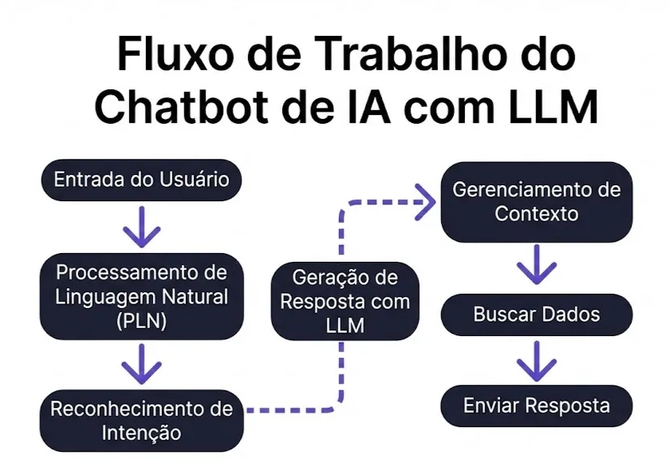

# Introdução à Inteligência Artificial

> **Última atualização:** Fevereiro 2026  
> **Nível:** Iniciante  
> **Tempo de leitura:** ~20 minutos

---

## Introdução

Bem-vindo ao mundo da Inteligência Artificial! Este é o primeiro passo de uma jornada pelo universo da IA, onde você descobrirá como as máquinas podem aprender, raciocinar e até tomar decisões.

Neste guia, vamos explorar os conceitos fundamentais da Inteligência Artificial, entender como ela funciona e desvendar as relações entre IA, Machine Learning e Deep Learning de uma forma simples e acessível.

---

## O que é Inteligência Artificial?

Inteligência Artificial (IA) é um campo da ciência da computação dedicado a criar sistemas capazes de realizar tarefas que normalmente exigiriam inteligência humana. Pense nela como a capacidade de ensinar máquinas a "pensar" e tomar decisões de forma semelhante aos humanos, mas usando algoritmos e dados.

### Conceitos Básicos

**Inteligência Artificial é** o **campo mais amplo**. Refere-se à capacidade de **máquinas simularem a inteligência humana**, ou seja, realizarem tarefas que normalmente exigiriam inteligência humana, como:

- Tomar decisões
- Reconhecer padrões
- Traduzir idiomas
- Jogar xadrez ou dirigir carros

> 💡 **Nota:** A IA **engloba todas as técnicas e métodos** para fazer máquinas "pensarem".

---

## Como a IA Funciona

Para entender como a IA funciona, vou usar uma analogia: imagine que você está ensinando uma criança a identificar frutas.

### Analogia: Aprendendo a Reconhecer Frutas

**Aprendizado Humano:** Você mostra várias maçãs para a criança, explicando "isso é uma maçã - é redonda, vermelha ou verde, tem cabinho". Depois de ver muitos exemplos, a criança aprende a reconhecer maçãs sozinha.

**Aprendizado de Máquina (Machine Learning):** Funciona de forma similar. Você alimenta o computador com milhares de imagens de maçãs rotuladas como "maçã". O algoritmo analisa padrões - cores, formas, texturas - e cria um modelo matemático. Quando recebe uma nova imagem, ele compara com esses padrões aprendidos e identifica se é uma maçã ou não.

---

## Inteligência Artificial, Machine Learning e Deep Learning

Entender a diferença entre esses três conceitos é fundamental para sua jornada no mundo da IA.

### Inteligência Artificial (IA)

**Inteligência Artificial é** o **campo mais amplo**. Refere-se à capacidade de **máquinas simularem a inteligência humana**.

### Machine Learning (Aprendizado de Máquina)

**Aprendizado de Máquina é** uma **subárea da IA**. Em vez de programar cada passo que a máquina deve seguir, no ML:

- A máquina **aprende com dados**.
- Ela **identifica padrões** e **melhora automaticamente** com a experiência, sem ser reprogramada.

> 💡 **Exemplo:** Um algoritmo que aprende a reconhecer e-mails como spam com base em exemplos.

### Deep Learning (Aprendizado Profundo)

**Já o Deep Learning é** uma **subárea dentro do Machine Learning**, inspirada no funcionamento do cérebro humano, utilizando **redes neurais artificiais profundas**.

- Usa **grandes volumes de dados** e **muito poder computacional**.
- É o que permite, por exemplo:
  - Reconhecimento facial no celular
  - Traduções automáticas com alta precisão
  - Geração de texto (como o ChatGPT)

### Hierarquia dos Conceitos

```
Inteligência Artificial
 └── Machine Learning
      └── Deep Learning
```

Cada nível é um refinamento do anterior. Ou seja:

- **Todo Deep Learning é Machine Learning.**
- **Todo Machine Learning é uma forma de Inteligência Artificial.**
- Mas nem toda IA usa Machine Learning, e nem todo ML usa Deep Learning.

---

## Por que aprender a utilizar IA?

A Inteligência Artificial (IA) se baseia na capacidade de os dispositivos pensarem como seres humanos, conseguindo aprender, perceber, raciocinar, decidir e deliberar de forma racional e inteligente.  
Essa tecnologia **permite uma maior automação em processos e redução de custos, além de maior comodidade.**

A IA tem o potencial de transformar a maneira como realizamos uma série de tarefas, economizando inúmeras horas de esforço humano.

Se você for capaz de detalhar uma tarefa em etapas claras e lógicas, a IA pode assumir essa tarefa por você — seja escrevendo textos, gerando código, criando imagens, analisando dados ou automatizando partes do seu trabalho.

Para executar modelos de IA localmente, uma opção prática é o `LM Studio` (`https://lmstudio.ai/`), que permite rodar modelos em seu próprio computador.

A IA está presente em diversos aspectos do nosso dia a dia:

- **Assistentes Virtuais:** Alexa, Siri, Google Assistant
- **Recomendações:** Netflix, Spotify, YouTube
- **Reconhecimento de Imagem:** Filtros do Instagram, desbloqueio facial
- **Tradução Automática:** Google Tradutor, DeepL
- **Carros Autônomos:** Tesla, Waymo
- **Saúde:** Diagnóstico de doenças, descoberta de medicamentos
- **Finanças:** Detecção de fraudes, análise de crédito

---

## Os Principais Componentes da IA Moderna

A IA moderna geralmente envolve três elementos fundamentais:

**Dados:** São o "combustível" da IA. Quanto mais dados de qualidade o sistema recebe, melhor ele aprende.  
Exemplo: para treinar um sistema de reconhecimento de voz, são necessárias milhares de horas de áudio com transcrições.

**Algoritmos:** São as "receitas" matemáticas que processam os dados. Existem diferentes tipos, como redes neurais, árvores de decisão, modelos probabilísticos e muitos outros. Cada um é adequado para diferentes tipos de problemas.

**Poder Computacional:** IA moderna requer computadores potentes para processar enormes quantidades de dados e realizar trilhões de cálculos, muitas vezes utilizando GPUs ou TPUs.

---

## Tipos de IA

**IA Estreita (ou Fraca):**  
É especializada em uma tarefa específica. Exemplos:

- Algoritmo que recomenda filmes na Netflix
- Assistente de voz do seu celular
- Sistema que detecta fraudes bancárias

Essa é a IA que existe hoje e está presente no nosso dia a dia.

**IA Geral (ou Forte):**  
Seria uma IA com capacidades cognitivas semelhantes às humanas, capaz de aprender e executar qualquer tarefa intelectual.  
Ainda é um conceito teórico e tema de pesquisa — não existe na prática hoje.

---

## Como as Redes Neurais Funcionam

As redes neurais são uma das técnicas mais populares de IA atualmente. Elas são compostas por "neurônios" artificiais organizados em camadas.

**Camada de Entrada:** Recebe os dados brutos (como pixels de uma imagem ou palavras convertidas em números).

**Camadas Intermediárias (ocultas):** Processam a informação, identificando padrões cada vez mais complexos.  
Nas primeiras camadas, podem ser detectadas bordas simples; nas seguintes, formas mais complexas; e assim por diante.

**Camada de Saída:** Produz o resultado final (por exemplo, "isso é um gato" ou "isso é um cachorro", ou ainda a próxima palavra de um texto).

Durante o treinamento, a rede faz previsões, compara com as respostas corretas, calcula o erro e ajusta seus parâmetros internos para melhorar. Esse processo se repete milhares ou milhões de vezes até que a rede fique precisa.

---

## Exemplos Práticos de Utilização

**Saúde:** Sistemas de IA analisam exames médicos como raios-X e ressonâncias magnéticas para detectar doenças como câncer, às vezes com precisão superior à de médicos humanos. A IA também ajuda a descobrir novos medicamentos, analisando milhões de compostos químicos em questão de dias.

**Transporte:** Carros autônomos usam IA para "enxergar" o ambiente através de câmeras e sensores, identificar pedestres, outros veículos e sinais de trânsito, e tomar decisões de direção em tempo real.

**Assistentes Virtuais:** Alexa, Siri e Google Assistant usam IA para entender sua voz, interpretar o que você quer e responder de forma natural. Eles melhoram com o tempo, aprendendo seus hábitos e preferências.

**Redes Sociais:** Algoritmos de IA decidem quais posts você vê no seu feed, sugerem amigos, detectam conteúdo impróprio e identificam rostos em fotos automaticamente.

**Comércio Eletrônico:** Plataformas como Amazon utilizam IA para recomendar produtos com base no seu histórico de compras e navegação, prever demanda e otimizar logística.

**Atendimento ao Cliente:** Chatbots respondem perguntas comuns automaticamente, disponíveis 24 horas por dia, reduzindo o tempo de espera.

**Segurança:** Sistemas de reconhecimento facial em aeroportos, detecção de fraudes em transações bancárias e identificação de ameaças cibernéticas.

**Entretenimento:** Netflix e Spotify usam IA para recomendar filmes e músicas. Jogos usam IA para criar oponentes que se adaptam ao seu estilo de jogo.

**Agricultura:** Drones com IA monitoram plantações, identificam pragas e doenças, otimizam irrigação e preveem colheitas.

**Tradução:** Ferramentas como Google Tradutor usam redes neurais para traduzir textos entre idiomas, capturando nuances e contexto melhor que métodos antigos.

---

## Limitações e Desafios da IA

Apesar dos avanços impressionantes, a IA atual tem limitações importantes:

- Pode ser **tendenciosa** se os dados de treinamento contiverem preconceitos.
- Não entende verdadeiramente o contexto como humanos fazem — trabalha com padrões estatísticos.
- Pode ser enganada por pequenas alterações nos dados (adversarial attacks).
- Levanta questões éticas sobre **privacidade, segurança, transparência** e **impacto no mercado de trabalho**.

Por isso, além de aprender a usar IA, é importante desenvolver um olhar crítico sobre seus usos e impactos.

---

## Fluxo de Trabalho de um Chatbot de IA com LLM

Um chatbot moderno baseado em modelos de linguagem em larga escala (LLMs) segue, em geral, o seguinte fluxo:

1. **Entrada do Usuário:** A pessoa envia uma mensagem em linguagem natural.
2. **Processamento de Linguagem Natural (PLN):** O texto é analisado e transformado em uma representação que o modelo consegue entender.
3. **Reconhecimento de Intenção:** O sistema identifica qual é o objetivo do usuário (perguntar algo, pedir uma ação, solicitar um resumo, etc.).
4. **Gerenciamento de Contexto:** O histórico da conversa e outras informações relevantes são organizados para que o modelo responda de forma coerente.
5. **Busca de Dados (opcional):** Se necessário, o sistema consulta bases de dados, APIs ou documentos externos.
6. **Geração de Resposta com LLM:** O modelo de linguagem gera uma resposta em texto, prevendo token a token.
7. **Envio da Resposta:** A resposta final é entregue ao usuário no chat.

Você pode representar esse fluxo visualmente usando uma imagem semelhante à abaixo (a ser adicionada na pasta de imagens):

---

## LLM (Large Language Models)

LLMs (Large Language Models, ou Modelos de Linguagem em Larga Escala) **são sistemas de inteligência artificial baseados em redes neurais de aprendizado profundo (deep learning) treinados com volumes massivos de dados textuais**.

Eles compreendem, processam e geram linguagem natural, prevendo sequências de palavras. São aplicados em:

- Chatbots e assistentes virtuais
- Tradução automática
- Resumo de textos
- Geração de textos criativos
- Geração e explicação de código

**Exemplos de LLMs Populares:**

- **GPT (OpenAI):** Utilizado no ChatGPT.
- **PaLM e BERT (Google):** Modelos focados em raciocínio e compreensão de linguagem.
- **Llama (Meta):** Modelo de linguagem de código aberto.

---

## PLN (Processamento de Linguagem Natural)

O Processamento de Linguagem Natural (PLN) é uma área da inteligência artificial dedicada à compreensão e ao processamento da linguagem humana por meio de sistemas computacionais.

O objetivo central do PLN é capacitar máquinas a **compreenderem, interpretarem e gerarem linguagem humana** de forma precisa e contextualmente relevante.

Por meio de técnicas de PLN, sistemas de IA podem executar tarefas como:

- Tradução automática
- Análise de sentimentos
- Geração de resumos
- Classificação de textos
- Extração de informações importantes em documentos longos

Assistentes virtuais como Siri e Alexa utilizam extensivamente o PLN para compreender e processar as solicitações dos usuários.



Para entender mais, uma boa referência é o artigo da Elastic sobre **[PLN vs LLMs](https://www.elastic.co/pt/blog/nlp-vs-llms)**.

---

## Tokens em Modelos de Linguagem

No contexto da IA, especialmente em PLN, um **token** é uma unidade individual de informação ou dado.  
Ao processar texto, um token pode ser:

- Uma palavra
- Parte de uma palavra
- Um caractere especial

Os tokens são fundamentais porque definem como os modelos de linguagem processam e geram texto. Eles também impactam diretamente os **custos das APIs de IA**, já que a maioria dos serviços cobra pela quantidade de tokens processados (entrada + saída).

Por exemplo, a frase `Inteligência Artificial é incrível` pode ser dividida em aproximadamente 6–8 tokens, dependendo do modelo.

É importante notar que diferentes modelos de IA utilizam **sistemas de tokenização distintos**, o que pode gerar variações na quantidade de tokens para o mesmo texto.  
Em idiomas não ingleses, como o português, a tokenização tende a ser menos eficiente, resultando em **mais tokens por palavra**.

As IAs **preveem o próximo token na sequência** baseando-se nos tokens anteriores. Esse processo probabilístico é o que permite aos LLMs gerar textos coerentes e contextualmente relevantes, apesar de não "compreenderem" verdadeiramente o significado como humanos fazem.

Também é importante lembrar que termos como "**pensar**", "**cérebro**" e "**neurônio**" são apenas **analogias** para facilitar a compreensão.  
Esses modelos não pensam de verdade — são funções matemáticas complexas que aprendem padrões em grandes conjuntos de dados.

---

## Recursos Adicionais

### Para Aprender Mais

- 📚 **Livros:**
  - [Inteligência Artificial: Uma Abordagem Moderna](https://www.amazon.com.br/Intelig%C3%AAncia-Artificial-Peter-Norvig/dp/8535237011) - Stuart Russell & Peter Norvig
  - [Inteligência Artificial para Todos](https://www.coursera.org/learn/ai-for-everyone) - Andrew Ng
- 🎓 **Cursos:**
  - [Introdução à IA](https://www.elementsofai.com/br) - Elements of AI - Iniciante (Gratuito)
  - [Machine Learning](https://www.coursera.org/learn/machine-learning) - Andrew Ng, Stanford - Intermediário
- 📹 **Vídeos:**
  - [O que é Inteligência Artificial?](https://www.youtube.com/watch?v=mJeNghZXtMo) - Código Fonte TV
- 📰 **Artigos:**
  - [A Brief History of Artificial Intelligence](https://hai.stanford.edu/news/brief-history-artificial-intelligence) - Stanford HAI

---

## Exercícios Práticos

1. **Compreender a Hierarquia:** Desenhe um diagrama mostrando a relação entre IA, ML e DL, adicionando exemplos específicos em cada categoria.
   - Dica: Use o exemplo deste artigo como base e adicione suas próprias observações.

---

## Perguntas Frequentes

<details>
<summary><strong>Qual a diferença entre IA forte e IA fraca?</strong></summary>

**IA Fraca (Narrow AI):** É projetada para tarefas específicas, como reconhecimento de voz ou recomendação de filmes. É a IA que usamos hoje.

**IA Forte (General AI):** Seria uma IA com inteligência geral comparável à humana, capaz de aprender e realizar qualquer tarefa intelectual. Ainda não existe.

</details>

<details>
<summary><strong>Preciso saber programar para estudar IA?</strong></summary>

Para entender os conceitos básicos de IA, não é necessário saber programar. Porém, para trabalhar diretamente com desenvolvimento de IA, conhecimentos em Python e matemática (estatística, álgebra linear) são importantes.

</details>

<details>
<summary><strong>Qual a relação entre IA e dados?</strong></summary>

Dados são o "combustível" da IA moderna, especialmente para Machine Learning e Deep Learning. Quanto mais dados de qualidade disponíveis, melhor o modelo pode aprender e fazer previsões precisas.

</details>

---

## Resumo

> **💡 Pontos-chave:**
>
> - IA é o campo amplo que visa simular inteligência humana em máquinas
> - Machine Learning é uma subárea da IA onde máquinas aprendem com dados
> - Deep Learning é uma subárea do ML que usa redes neurais profundas
> - A IA está presente em muitas aplicações do nosso cotidiano
> - Todo DL é ML, e todo ML é IA, mas o inverso não é verdadeiro

---

## Próximos Passos

Agora que você entende os conceitos básicos de IA, continue sua jornada:

- [Prompt Engineering](../02-engenharia-de-prompt/README.md)
- [Explorando Recursos e Ferramentas de IA](../recursos/README.md)

---

**Contribuições:** Este conteúdo foi criado para a comunidade. Se encontrar erros ou tiver sugestões, por favor, abra uma issue ou pull request.

[← Voltar ao Índice](../../README.md)
