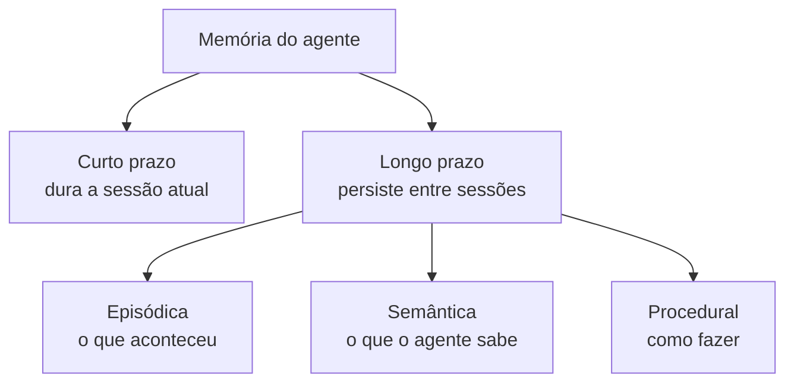

# Memória de Agentes

## Por que memória importa

Um modelo de linguagem, sozinho, não lembra de nada. Cada chamada à API é independente: se você perguntou seu nome numa mensagem e pede para repeti-lo na seguinte, o modelo só acerta porque o texto anterior foi reenviado junto. Tire esse histórico e ele "esquece".

Um agente precisa de mais do que isso. Ele executa tarefas em vários passos, consulta ferramentas, às vezes volta a falar com o mesmo usuário dias depois. Sem um jeito de guardar e recuperar informação, cada execução começa do zero: o agente repete perguntas que já foram respondidas, refaz buscas que já tinha feito e não aprende com o que deu errado antes.

Memória é um dos pilares de um agente, ao lado do raciocínio (visto em [Paradigma ReAct](/labs/ai/agents/02-react/)) e do [uso de ferramentas](/labs/ai/agents/03-ferramentas/). Ela costuma ser dividida em dois grandes grupos pelo tempo que a informação sobrevive: curto prazo e longo prazo.

Um jeito rápido de fixar: a de curto prazo cuida do presente, a semântica guarda o que o agente sabe, a episódica lembra o que ele viveu e a procedural sabe como ele age.

## Memória de curto prazo

É o contexto imediato da tarefa que está rodando agora. Entra aqui o histórico da conversa atual, os pensamentos e observações do ciclo ReAct, as saídas das ferramentas que o agente chamou e o estado do que ele está tentando fazer.

Na prática, essa memória é a própria janela de contexto do modelo: tudo que cabe no prompt daquela chamada. É rápida de acessar, porque já está ali na frente do modelo, mas tem um teto. Cada modelo aceita um número máximo de tokens (dezenas ou centenas de milhares), e quando a conversa cresce demais alguma coisa precisa sair. Ver [Tokens](/labs/ai/llm/03-tokens/) para entender esse limite.

Quando a sessão termina, a memória de curto prazo some. Se o agente for acionado de novo mais tarde, ele não tem como saber o que aconteceu antes, a menos que aquilo tenha sido salvo em algum lugar mais permanente.

## Memória de longo prazo

É o conhecimento que continua disponível depois que a sessão acaba. Fica guardado fora do modelo, em algum tipo de armazenamento externo, e o agente busca de lá o que for relevante antes de agir.

A literatura sobre agentes costuma separar a memória de longo prazo em três tipos, emprestando nomes da psicologia cognitiva. Eles não são pastas fechadas, um sistema real mistura os três, mas a divisão ajuda a decidir o que guardar e como.

### Memória episódica

Guarda o que aconteceu: interações passadas, decisões que o agente tomou e o resultado delas. É o "diário" do agente.

Um agente de suporte com memória episódica lembra que o cliente X abriu um chamado sobre cobrança na semana passada e como aquilo foi resolvido. Um agente de código lembra que já tentou uma abordagem para aquele bug e ela não funcionou, então tenta outra.

### Memória semântica

Guarda fatos estáveis que valem em qualquer conversa, não presos a um evento específico. Entram aqui preferências e restrições do usuário, mas também conceitos do domínio, regras de negócio e detalhes do projeto em que o agente trabalha.

"O usuário mora em Fortaleza", "prefere respostas curtas", "trabalha com backend em Node", "o prazo de reembolso da empresa é de 7 dias". São coisas que o agente pode assumir como verdade da próxima vez, sem perguntar de novo.

### Memória procedural

Guarda como executar tarefas: rotinas e sequências de passos, políticas, prompts e skills que o agente reaproveita. Em vez de raciocinar do zero toda vez, ele aplica um procedimento que já deu certo.

Pense num agente que gera relatórios semanais. A primeira vez ele descobre o passo a passo (buscar dados, agregar, formatar, enviar). Com memória procedural, ele salva esse fluxo e nas próximas semanas só executa. As [Agent Skills](/labs/ai/agents/08-agent-skills/) são uma forma concreta desse tipo de memória: um procedimento escrito uma vez e carregado quando a tarefa aparece.

## Onde a memória de longo prazo fica guardada

Memória de longo prazo é, no fim das contas, um banco de dados que o agente consulta. As opções mais comuns:

- **Vector stores** (como Chroma, Pinecone, pgvector): guardam trechos de texto junto com seus [embeddings](/labs/ai/llm/05-context-engineering-e-rag/) e permitem buscar por similaridade de significado, não por palavra exata. É o formato mais usado para memória episódica.
- **Bancos de grafo**: guardam entidades (pessoas, lugares, projetos) e as relações entre elas. Servem bem quando o agente precisa conectar informações espalhadas, "quem é o gerente do projeto que o cliente X mencionou".
- **Tabelas e perfis de usuário**: um registro estruturado simples, chave e valor, para a memória semântica mais direta (preferências, configurações).
- **Resumos persistidos**: em vez de guardar a conversa inteira, o agente salva um resumo dela e recupera esse resumo na próxima sessão.

Existem bibliotecas que empacotam tudo isso, como o Mem0, que combina vetores, grafo e chave-valor num serviço só de memória.

## Memória e RAG

Se você leu [Context Engineering e RAG](/labs/ai/llm/05-context-engineering-e-rag/), a mecânica aqui é a mesma: buscar informação relevante numa base externa e injetar no prompt antes de gerar a resposta. Memória de longo prazo é, em boa parte, RAG apontado para o histórico do próprio agente em vez de uma base de documentos.

A diferença está no que cada uma resolve. RAG "clássico" traz conhecimento de fora (documentação, artigos, base de produtos). Memória traz o que o próprio agente viveu e aprendeu. Um agente completo usa os dois: RAG para saber sobre o mundo, memória para saber sobre o usuário e sobre si mesmo.

## O que faz funcionar

- **Decidir o que guardar.** Salvar cada mensagem vira lixo acumulado que atrapalha a busca. Um bom sistema filtra: guarda fatos e decisões, descarta conversa fiada.
- **Resumir em vez de empilhar.** Conforme o histórico cresce, condensar blocos antigos num resumo mantém a informação sem estourar o contexto.
- **Recuperar só o relevante.** Trazer memória demais para o prompt tem o mesmo efeito de trazer de menos: o modelo se perde. A busca precisa ser específica para a tarefa atual.
- **Cuidar da memória errada.** Uma preferência que mudou, um fato que ficou desatualizado, uma decisão registrada com o contexto errado. Memória incorreta faz o agente errar com confiança, o que é pior do que ele admitir que não sabe. Vale ter como revisar e apagar entradas.

## Referências

- [Memória para Agentes de IA (lição 13)](https://github.com/microsoft/ai-agents-for-beginners/blob/main/translations/pt-PT/13-agent-memory/README.md) - Microsoft, pt-PT
- [Como Funciona a Memória de Agentes de IA (e Como Testá-la via API)](https://dev.to/lucas_ferreira/como-funciona-a-memoria-de-agentes-de-ia-e-como-testa-la-via-api-1h99) - Lucas Ferreira, pt-BR
- [Types of AI Agent Memory: Episodic, Semantic, Procedural and More](https://atlan.com/know/types-of-ai-agent-memory/) - Atlan, en
- [LLM Powered Autonomous Agents](https://lilianweng.github.io/posts/2023-06-23-agent/) - Lilian Weng, en
