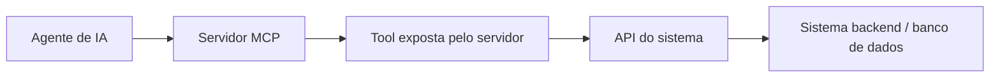
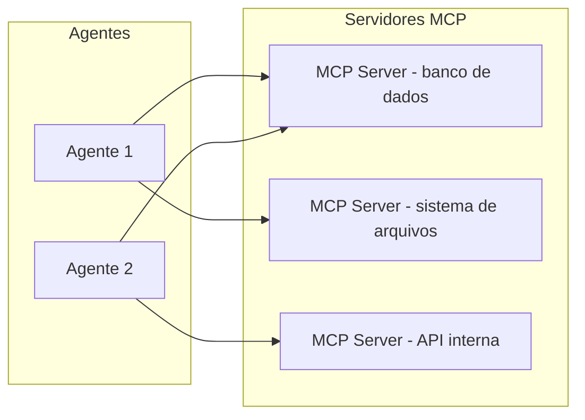
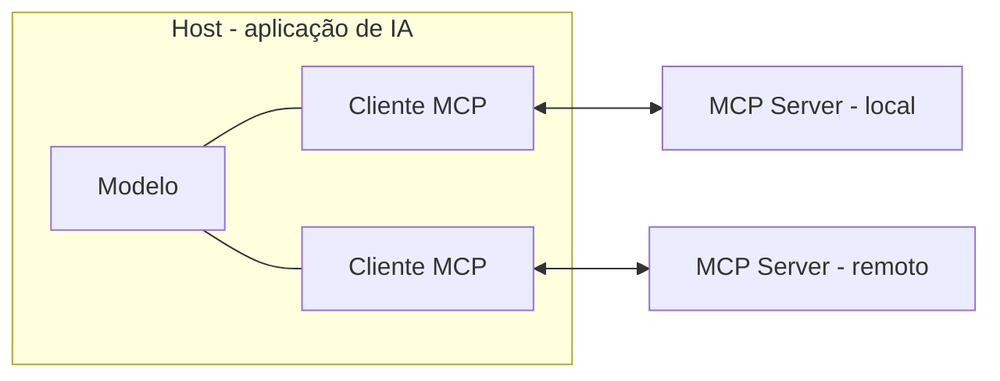

# Model Context Protocol (MCP)

## O que é o MCP

O **Model Context Protocol (MCP)** é um padrão aberto que define uma forma única de uma aplicação de IA se conectar a fontes de dados e ferramentas externas. Foi publicado pela Anthropic no fim de 2024 e, desde dezembro de 2025, é governado pela **Agentic AI Foundation (AAIF)**, sob a Linux Foundation - deixou de ser coisa de um fornecedor só para virar um padrão aberto de mercado.

A analogia que a documentação oficial usa é a do **USB-C**: antes dele, cada aparelho tinha seu próprio conector e seu próprio cabo. O USB-C definiu um encaixe único, e a partir daí qualquer periférico conversa com qualquer computador pelo mesmo cabo. O MCP faz esse papel para agentes: em vez de cada aplicação de IA inventar seu próprio jeito de plugar um banco de dados, um sistema de arquivos ou uma API, todas passam a falar o mesmo protocolo.

Na prática, o MCP padroniza três coisas: como o agente **descobre** o que uma fonte externa oferece, como ele **chama** essas capacidades e como o resultado **volta** para o modelo. Nada disso exige que o código do agente conheça os detalhes de cada integração.

## MCP vs API: qual a diferença

Antes de entrar na arquitetura do protocolo, vale resolver uma confusão comum: MCP e API não são a mesma coisa, e um não substitui o outro.

Uma **API** é um contrato fixo entre dois programas. O desenvolvedor define de antemão quais endpoints existem, que parâmetros cada um espera e em que formato a resposta volta. Um site que consulta uma API de pagamento, um app que fala com o backend, um serviço que chama outro: em todos os casos, quem integrou já sabia exatamente o que ia chamar antes de escrever o código.

O MCP resolve um problema diferente: como uma aplicação de IA **descobre** o que existe para usar, em vez de vir com isso hardcoded. Um agente conectado a um servidor MCP consegue perguntar "quais ferramentas você tem?" e receber a lista na hora (é o que a seção anterior chamou de descoberta de capacidades), sem que ninguém tenha escrito antes um `if` para cada ferramenta possível.

Isso não faz do MCP um substituto de API - na prática ele costuma rodar **em cima** de APIs já existentes. Um servidor MCP que expõe uma tool `buscar_pedido`, por exemplo, provavelmente está chamando a API REST do sistema de pedidos por dentro; o MCP só padroniza como o agente descobre e aciona essa tool, sem precisar conhecer a API original.

| Pergunta                                                                                              | Puxa para |
| ----------------------------------------------------------------------------------------------------- | --------- |
| Preciso de uma integração previsível, definida de antemão entre dois sistemas?                        | API       |
| Um agente de IA precisa descobrir e usar várias ferramentas sem integração feita à mão para cada uma? | MCP       |

Numa arquitetura de produção típica, as duas camadas convivem:



O agente fala MCP com o servidor, o servidor traduz aquilo numa chamada de API comum, e a API fala com o sistema de sempre. Cada camada resolve um problema diferente: previsibilidade entre software (API) e descoberta dinâmica para um agente (MCP).

## O problema que o MCP resolve

Cada ferramenta vista em [Uso de Ferramentas](/labs/ai/agents/03-ferramentas/) até aqui foi descrita e conectada na mão, dentro do próprio código do agente. Isso funciona bem para um agente só, mas não escala: com vários agentes e várias ferramentas (banco de dados, sistema de arquivos, APIs internas), cada combinação agente-ferramenta vira uma integração separada para manter.

O **Model Context Protocol (MCP)**, criado pela Anthropic e hoje adotado por várias plataformas de IA, resolve isso padronizando como agentes descobrem e chamam ferramentas externas: um protocolo comum em vez de uma integração feita sob medida para cada par agente-ferramenta.

## Como o MCP se encaixa



Um **MCP server** expõe um conjunto de ferramentas, e também recursos e prompts, seguindo o protocolo. Qualquer agente compatível com MCP consegue se conectar a ele e descobrir automaticamente o que está disponível, sem código de integração escrito à mão para cada ferramenta.

## A arquitetura: host, cliente e servidor

O MCP organiza a comunicação em três papéis:

- **Host:** a aplicação de IA com a qual a pessoa interage - Claude Desktop, um editor com IA, Claude Code ou um agente próprio. É o host que gerencia o modelo e decide quando acionar recursos externos.
- **Cliente (MCP client):** um componente dentro do host que mantém uma conexão dedicada com um servidor. Cada servidor conectado tem o seu próprio cliente: a relação é de um para um.
- **Servidor (MCP server):** um programa que expõe ferramentas, dados e prompts seguindo o protocolo. Pode rodar localmente, na mesma máquina do host, ou remotamente, acessível por rede.



Essa divisão é o que garante o desacoplamento: o host não precisa saber o que existe dentro de cada servidor, e o servidor não precisa saber qual modelo está do outro lado. Os dois só precisam concordar com o protocolo.

Cliente e servidor trocam mensagens no formato **JSON-RPC 2.0**, um padrão simples de chamada de procedimento em JSON, com requisições, respostas e notificações. Essas mensagens viajam por um **transporte**, e o MCP define dois:

- **stdio:** o servidor roda como um processo local e conversa pela entrada e saída padrão. É o transporte usado para ferramentas que rodam na própria máquina.
- **HTTP streamable:** o servidor é um serviço acessível por rede, usado para servidores remotos e compartilhados.

Ao se conectar, cliente e servidor fazem um **handshake**: trocam a versão do protocolo e anunciam o que cada lado suporta (a chamada negociação de capacidades). Só depois disso o cliente pede a lista de ferramentas, recursos e prompts e passa a poder usá-los.

## As peças do protocolo

- **Tools:** funções que o agente pode chamar, o mesmo conceito de ferramenta visto antes, só que descrito de forma padronizada
- **Resources:** dados que o servidor expõe para leitura, como arquivos ou registros de um banco
- **Prompts:** modelos de prompt reutilizáveis que o servidor disponibiliza para quem se conecta a ele

## Hands-on: criando um MCP server

No [Hands-on: Agente SecretarIA](/labs/ai/agents/05-hands-on-secretaria/), as ferramentas de agenda (`getEvents`, `checkAvailability`, `scheduleEvent`) foram declaradas na mão e passadas direto para o modelo, dentro do `secretaria.js`. Quem quisesse essas mesmas ferramentas em outro agente teria que copiar o código.

Com MCP, a ideia é publicar essas ferramentas uma vez, num servidor, e deixar qualquer cliente se conectar. Um servidor com o mesmo contrato das ferramentas da SecretarIA, usando o SDK Python oficial (`mcp`):

```python
from mcp.server.fastmcp import FastMCP

servidor = FastMCP("agenda-server")

@servidor.tool()
def get_events(date: str) -> list:
    """Retorna os eventos do calendário para um determinado dia (yyyy-mm-dd)"""
    return buscar_eventos(date)

@servidor.tool()
def check_availability(date: str, time: str) -> str:
    """Verifica se um horário (HH:MM) está livre na agenda de um dia"""
    return "Livre" if horario_livre(date, time) else "Ocupado"

@servidor.tool()
def schedule_event(title: str, date: str, time: str) -> str:
    """Marca um novo evento na agenda"""
    criar_evento(title, date, time)
    return "Evento adicionado com sucesso!"

if __name__ == "__main__":
    servidor.run()
```

O nome, os parâmetros e a descrição de cada `@servidor.tool()` cumprem o mesmo papel do objeto `declaration` que a SecretarIA montava em JavaScript: são o catálogo que o cliente lê para decidir o que chamar. A diferença é que agora esse catálogo é servido pelo protocolo, não embutido no código do agente.

Repare também que o servidor está em Python e a SecretarIA está em JavaScript, e isso não é problema: MCP é um protocolo, então cliente e servidor não precisam compartilhar linguagem. Um agente compatível (Claude Desktop, Claude Code ou um agente próprio) se conecta a esse servidor e usa `get_events` e `schedule_event` sem reimplementar nada.

Depois de rodando, o servidor conversa com o cliente por um transporte (geralmente `stdio` para uso local, ou HTTP para servidores remotos), trocando mensagens no formato do protocolo para listar as ferramentas disponíveis e executar as chamadas.

## Referências

- [Introduction](https://modelcontextprotocol.io/introduction) - Model Context Protocol (documentação oficial), en
- [Architecture overview](https://modelcontextprotocol.io/docs/learn/architecture) - Model Context Protocol (documentação oficial), en
- [Build an MCP server](https://modelcontextprotocol.io/quickstart/server) - Model Context Protocol (documentação oficial), en
- [Introducing the Model Context Protocol](https://www.anthropic.com/news/model-context-protocol) - Anthropic, en
- [MCP vs API: How are they different?](https://www.scalekit.com/blog/mcp-vs-apis-how-are-they-different) - Scalekit, en
