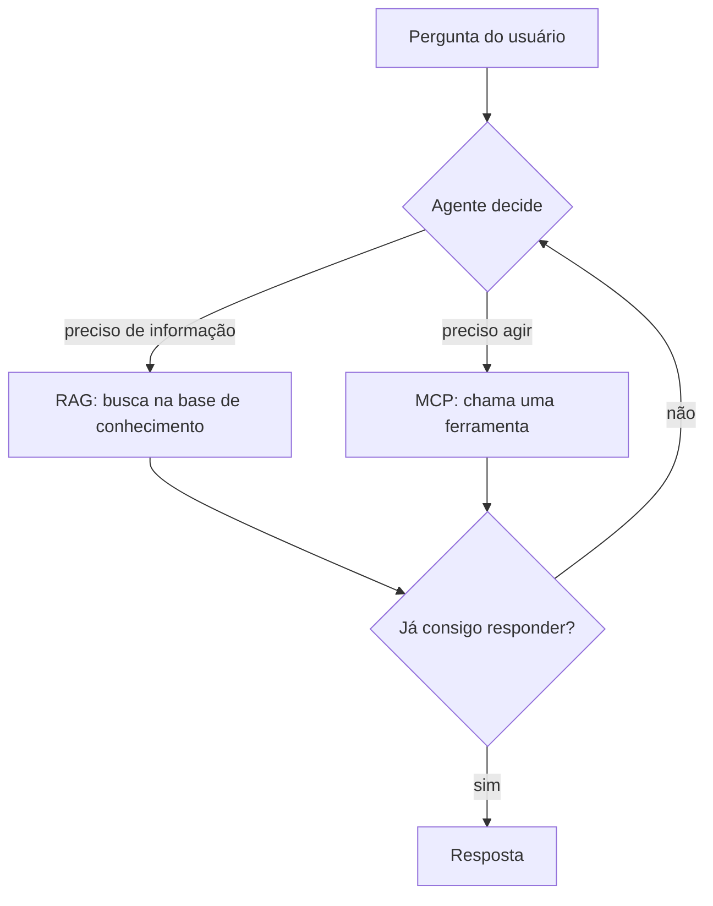

# MCP, RAG e Agentes: quem faz o quê

## Por que esses três se confundem

MCP, RAG e agente aparecem juntos em quase todo texto sobre IA aplicada, e é comum ver os três lado a lado como se você tivesse que escolher um. Não tem. Eles resolvem problemas diferentes e, na maioria dos sistemas reais, trabalham juntos.

A forma mais rápida de separar os três é pensar no que cada um entrega para o modelo:

- **RAG** dá **conhecimento**: informação que o modelo não tem de cabeça.
- **MCP** dá **acesso**: um jeito padronizado de se conectar a ferramentas e sistemas externos.
- **Agente** dá **autonomia**: a capacidade de decidir o próximo passo e agir sozinho.

As três próximas seções são um resumo de um parágrafo de cada conceito, com link para as notas que entram em detalhe. Se você já leu essas notas, pode pular direto para a tabela comparativa.

## RAG em uma frase

RAG (Retrieval-Augmented Generation) é a técnica de buscar trechos relevantes numa base de dados antes de o modelo gerar a resposta, em vez de depender só do que ele aprendeu no treinamento. O texto da pergunta vira um vetor, esse vetor é comparado com os documentos já indexados, e só os trechos mais parecidos entram no prompt.

Serve para três problemas: falta de contexto sobre dados privados, alucinação (o modelo inventa uma resposta plausível) e desatualização (o treinamento tem data de corte). O que RAG não faz é executar ações, ele só recupera informação para o modelo ler.

O fluxo básico e as variações mais elaboradas estão em [Context Engineering e RAG](/labs/ai/llm/05-context-engineering-e-rag/) e [Arquiteturas de RAG](/labs/ai/llm/06-arquiteturas-de-rag/).

## MCP em uma frase

O Model Context Protocol (MCP) é um protocolo aberto, criado pela Anthropic, que padroniza como um modelo ou agente se conecta a ferramentas e fontes de dados externas. Em vez de escrever uma integração sob medida para cada par agente-ferramenta, você fala uma língua só: um servidor MCP expõe suas capacidades e qualquer cliente compatível se conecta e descobre o que está disponível.

Um servidor MCP expõe três tipos de coisa: **tools** (funções que o agente pode chamar), **resources** (dados para leitura, como arquivos ou registros) e **prompts** (modelos de prompt reutilizáveis). A arquitetura tem três papéis: o **host** (a aplicação, como o Claude Desktop ou uma IDE), o **client** (que mantém uma conexão com um servidor) e o **server** em si.

MCP é uma interface de conexão, não uma técnica de recuperação nem um sistema autônomo. Os detalhes, incluindo um hands-on de servidor, estão em [Model Context Protocol (MCP)](/labs/ai/agents/06-mcp/).

## Agente em uma frase

Um agente usa um LLM como raciocinador para perceber uma situação, decidir o que fazer e executar essa ação em um ciclo que se repete até o objetivo ser alcançado. É o que separa um agente de um chatbot: o chatbot responde e para, o agente segue agindo (busca, consulta, executa, observa o resultado, decide o próximo passo).

O agente é a peça que orquestra. RAG e MCP não são concorrentes dele, são recursos que ele usa: o agente decide quando buscar conhecimento e quando acionar uma ferramenta.

A definição completa está em [O que são agentes de IA](/labs/ai/agents/01-o-que-e/), e a discussão sobre quando você precisa mesmo de autonomia está em [Workflow ou Agente?](/labs/ai/agents/11-workflow-ou-agente/).

## A tabela que desfaz a confusão

Cada um dos três responde uma pergunta diferente sobre a mesma tarefa:

| Peça   | Pergunta que responde             | O que entrega | Natureza                         |
| ------ | --------------------------------- | ------------- | -------------------------------- |
| RAG    | O que o modelo precisa saber?     | Conhecimento  | Técnica de recuperação           |
| MCP    | O que ele pode acessar e invocar? | Acesso        | Protocolo de conexão             |
| Agente | O que fazer a seguir?             | Autonomia     | Sistema que decide e age em loop |

RAG e MCP, em especial, não competem. RAG puxa texto de um índice vetorial que você montou antes, normalmente sobre uma base de conteúdo mais estável (uma coleção de documentos, uma base de conhecimento). MCP chama ferramentas e APIs na hora, o que serve bem para dados que mudam o tempo todo (o saldo de uma conta, os eventos da agenda de hoje). Um mesmo agente pode usar os dois na mesma tarefa.

## Como os três se combinam num sistema real

Numa arquitetura completa, o agente fica no centro. O RAG entra como uma das fontes de contexto que ele consulta, e o MCP é a camada padronizada por onde ele aciona ferramentas.

Um exemplo concreto: um assistente interno que responde dúvidas sobre a documentação da empresa e também marca reuniões. Quando alguém pergunta "qual a política de reembolso?", o agente usa RAG para buscar o trecho certo do manual. Quando alguém pede "agenda 30 minutos com o time de produto amanhã", o agente usa uma ferramenta de calendário exposta por um servidor MCP. É o agente que decide, a cada mensagem, qual caminho seguir.

Quando o próprio agente controla como e quando buscar, em vez de seguir um pipeline fixo de recuperação, o RAG passa a ser chamado de **Agentic RAG**, o degrau mais alto descrito em [Arquiteturas de RAG](/labs/ai/llm/06-arquiteturas-de-rag/).

## O que o "vs" esconde

Apresentar os três como uma disputa esconde o que acontece quando você junta MCP e RAG num agente.

O problema de recuperação não some, ele muda de lugar. Com RAG, a dificuldade é escolher os trechos certos de documento para colocar no contexto. Com vários servidores MCP conectados, a dificuldade vira escolher a ferramenta certa entre dezenas ou centenas disponíveis. Cada ferramenta tem uma descrição em JSON que ocupa espaço no contexto, e com uma centena delas isso já são milhares de tokens gastos só em catálogo, antes mesmo de o usuário digitar qualquer coisa. Filtrar demais e o agente perde uma ferramenta de que precisava, o que parece o modelo sendo burro, não uma falha de seleção.

Uma prática que ajuda a depurar isso: registrar quais ferramentas estavam no contexto em cada passo. Sem esse log, um erro de "a ferramenta certa nem estava disponível" fica indistinguível de um erro de raciocínio.

Tem também a questão de identidade. Quando um servidor MCP integra com Gmail ou Slack, a chamada precisa carregar quem é o usuário que está pedindo a ação. Uma conta de integração compartilhada, igual para todo mundo, quebra o controle de quem pode fazer o quê.

## Quando você precisa de cada um

Nem toda tarefa precisa dos três. Um guia rápido:

- **Só RAG**, com uma chamada de LLM comum: perguntas e respostas sobre uma base de documentos que não muda muito, sem nenhuma ação envolvida. Um "chat com seus PDFs" é isso.
- **Só MCP**, com um LLM ou um workflow de passos fixos: você precisa conectar o modelo a sistemas externos de forma padronizada, mas já sabe a sequência de antemão e não precisa que o modelo decida o caminho.
- **Agente** (que pode usar RAG, MCP ou os dois): a tarefa tem vários passos, o caminho muda a cada caso, e é o modelo que precisa decidir o que fazer em tempo de execução.

A recomendação é a mesma de [Workflow ou Agente?](/labs/ai/agents/11-workflow-ou-agente/): comece pela opção mais simples que resolve o problema e só adicione autonomia quando a tarefa realmente exigir.

## Referências

- [Architecture](https://modelcontextprotocol.io/specification/2025-11-25/architecture) - Model Context Protocol (documentação oficial), en
- [RAG vs Agente: qual a diferença e quando usar cada um?](https://www.datahackers.news/p/rag-vs-agente-qual-a-diferen-a-e-quando-usar-cada-um) - Data Hackers, pt-BR
- [Guia da Anthropic para Construir Agentes de IA Eficazes](https://www.robertodiasduarte.com.br/guia-da-anthropic-para-construir-agentes-de-ia-eficazes/) - Roberto Dias Duarte, pt-BR
- [MCP vs RAG: Principais Diferenças e Casos de Uso](https://www.truefoundry.com/blog/mcp-vs-rag) - TrueFoundry, en
- [Code execution with MCP: building more efficient agents](https://www.anthropic.com/engineering/code-execution-with-mcp) - Anthropic Engineering, en
