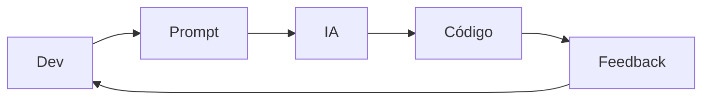
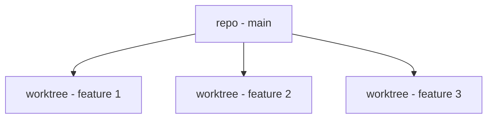
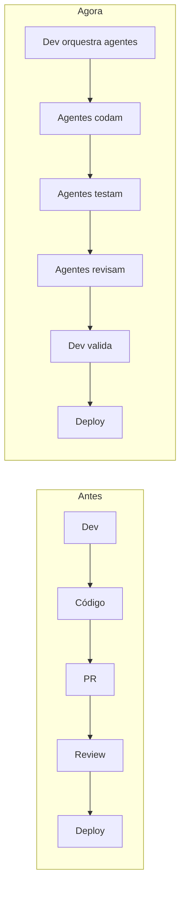
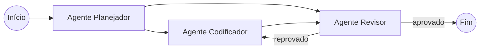

# Sistemas Multi-Agentes

## O que é um sistema multi-agente

Um **sistema multi-agente** é uma forma de organizar o trabalho onde, em vez de um único agente fazer tudo sozinho, várias instâncias de agentes atuam em paralelo, cada uma cuidando de uma parte do problema. É a diferença entre ter uma pessoa fazendo tudo em série e ter um time inteiro trabalhando ao mesmo tempo.

## Como os agentes se coordenam

Quando o trabalho é dividido entre vários agentes, alguém precisa decidir quem faz o quê e juntar os pedaços de volta. Esse arranjo é a **orquestração**, e existem alguns padrões conhecidos:

- **Supervisor/worker:** um agente central recebe o objetivo, distribui subtarefas para agentes especialistas e depois combina os resultados numa resposta única. É o formato mais comum e o mais fácil de raciocinar.
- **Hierárquico:** a mesma ideia, com mais de um nível. Um supervisor coordena outros supervisores, cada um responsável por um domínio. Serve para problemas grandes, com áreas bem distintas.
- **Handoff:** um agente transfere o controle e a responsabilidade para outro e sai de cena, em vez de esperar um retorno. O agente que recebeu assume a próxima parte por conta própria. É o padrão de um atendimento que passa da triagem para o setor certo.
- **Peer-to-peer:** os agentes trocam mensagens diretamente, sem um coordenador central. Dá mais flexibilidade e bem mais chance de virar bagunça, então costuma ser evitado nos primeiros projetos.

A comunicação entre os agentes pode acontecer de duas formas. Uma é por **estado compartilhado**: todos leem e escrevem num mesmo objeto de dados, e é assim que o LangGraph funciona (detalhado mais abaixo). A outra é por **protocolo**: o **A2A** (Agent2Agent, criado pelo Google em 2025 e hoje mantido sob a Linux Foundation) padroniza a conversa entre agentes de origens diferentes, mais ou menos como o [MCP](/labs/ai/agents/06-mcp/) padroniza a conversa entre agente e ferramenta.

Na prática, cada agente compatível com A2A publica um **Agent Card**, um arquivo que descreve o que ele faz, para onde mandar trabalho e quais capacidades ele suporta. Um agente que quer delegar uma tarefa lê o Agent Card do outro, manda a tarefa por uma chamada JSON-RPC 2.0 (o mesmo formato de mensagem que o MCP usa) e acompanha o andamento por um ciclo de vida com estados bem definidos: enviada, em andamento, concluída ou com falha. Isso permite que agentes de frameworks diferentes, feitos por times diferentes, deleguem trabalho entre si sem que um precise conhecer os detalhes internos do outro.

O ponto que mais derruba sistema multi-agente em produção não é o modelo, é a **consistência de contexto**: um agente age com base numa informação que outro já atualizou, e o resultado sai errado sem ninguém perceber na hora.

## Dois paradigmas de desenvolvimento com IA

Existem, basicamente, dois modos de trabalhar com agentes de IA no desenvolvimento de software.

### Desenvolvimento assistido e iterativo

É o modelo mais próximo do que a maioria já usa hoje (Copilot, ChatGPT): o dev conduz, a IA ajuda.

- Desenvolvimento em conjunto com a IA
- Decisões tomadas de forma iterativa
- Alta granularidade, passo a passo
- O dev "assiste" a IA codar
- Baixa paralelização



Esse modelo dá muito controle, mas pouca escala, cada mudança passa pelo dev antes de seguir para a próxima.

### Desenvolvimento paralelo com agentes

É a evolução natural do modelo anterior: em vez de um agente por vez, vários agentes trabalham **simultaneamente**, cada um em uma tarefa.

- Execução simultânea de múltiplas tarefas
- Agentes trabalhando em paralelo
- Observabilidade em tempo real (logs, commits)
- Ambientes isolados para cada agente

## Git Worktree como base do paralelismo

Para vários agentes trabalharem ao mesmo tempo sem pisar um no trabalho do outro, cada um precisa de um ambiente isolado, e é aí que entra o **Git Worktree**: uma funcionalidade do Git que permite ter múltiplas cópias de trabalho do mesmo repositório, cada uma associada a uma branch diferente, ao mesmo tempo.



Cada agente trabalha em uma "cópia isolada" do repositório, o que evita conflitos de arquivos e permite rodar comandos (testes, build) em paralelo sem interferência.

Duas regras importantes sobre worktrees:

- Uma mesma branch **não pode** estar em uso em múltiplos worktrees ao mesmo tempo
- Um worktree cria uma relação explícita entre a pasta de trabalho e a branch associada

Isso resolve, de uma vez, três problemas de desenvolvimento paralelo com agentes: concorrência entre agentes, isolamento de contexto e execução paralela de verdade (não só simulada).

## Impacto no workflow de engenharia

Esse jeito de trabalhar muda o fluxo clássico de desenvolvimento:



Na prática, o desenvolvimento passa a se parecer com um **sistema distribuído de agentes**: o dev deixa de escrever cada linha e passa a orquestrar o que cada agente faz.

## Ambientes e execução

Agentes rodando em paralelo precisam de ambientes claramente separados. Os tipos mais comuns são:

- **Local:** na própria máquina, geralmente usando worktrees
- **Remoto:** em uma máquina ou container dedicado
- **GitHub (CI/CD):** rodando dentro do próprio pipeline de integração contínua

Independente de onde rodam, a regra é a mesma: execução paralela exige separação clara de ambiente, de novo, o motivo pelo qual o Git Worktree aparece tanto nesse tema.

## Observabilidade e controle

Com vários agentes agindo ao mesmo tempo, acompanhar o que está acontecendo deixa de ser opcional. Um sistema multi-agente saudável precisa de:

- Logs de cada agente
- Rastreamento das decisões tomadas (por que o agente escolheu essa ação e não outra)
- Versionamento do contexto usado em cada execução, veja mais em [Gerenciando prompts em produção](/labs/ai/engenharia-de-prompt/02-boas-praticas-e-seguranca/)

Depurar um sistema assim envolve olhar para três coisas juntas: o prompt usado, o contexto disponível naquele momento e a resposta gerada, não só o código final.

## Recomendações práticas

Pensando nos agentes como o **runtime** dos sistemas modernos com IA, onde prompt, contexto e ferramentas viram ação de verdade, algumas recomendações ajudam a colocar isso em prática:

- Comece com desenvolvimento assistido, é o modelo mais simples e controlado
- Evolua para agentes em paralelo conforme a confiança e a maturidade do processo aumentam
- Use RAG para manter o contexto de cada agente atualizado, veja [RAG](/labs/ai/llm/06-context-engineering-e-rag/)
- Versione prompts como versiona código
- Use Git Worktree (ou equivalente) para garantir isolamento real entre agentes rodando em paralelo

## Hands-on: multi-agents com LangGraph

O **LangGraph** é uma biblioteca para orquestrar múltiplos agentes como um grafo de estados: cada agente é um nó, e as conexões entre eles definem para onde o controle vai depois que um agente termina sua parte.



Um exemplo simples de grafo com dois agentes, um que planeja a tarefa e outro que executa:

```python
from langgraph.graph import StateGraph, END

grafo = StateGraph(EstadoCompartilhado)

grafo.add_node("planejador", agente_planejador)
grafo.add_node("executor", agente_executor)

grafo.set_entry_point("planejador")
grafo.add_edge("planejador", "executor")
grafo.add_edge("executor", END)

app = grafo.compile()
resultado = app.invoke({"tarefa": "Implementar endpoint de login"})
```

Cada nó recebe e devolve um **estado compartilhado**, o mesmo dicionário de dados passa de agente para agente, cada um lendo o que precisa e adicionando o que produziu. É essa passagem de estado que substitui a comunicação direta entre agentes: em vez de um agente "conversar" com o outro, todos leem e escrevem no mesmo lugar.

Esse modelo de grafo também permite ciclos, como no exemplo acima em que o revisor pode mandar o trabalho de volta para o codificador, algo bem mais difícil de representar em um pipeline linear simples.

## Referências

- [Agent2Agent (A2A) Protocol Specification](https://a2a-protocol.org/latest/specification/) - A2A Project, en
