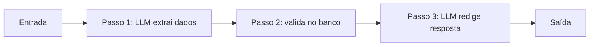
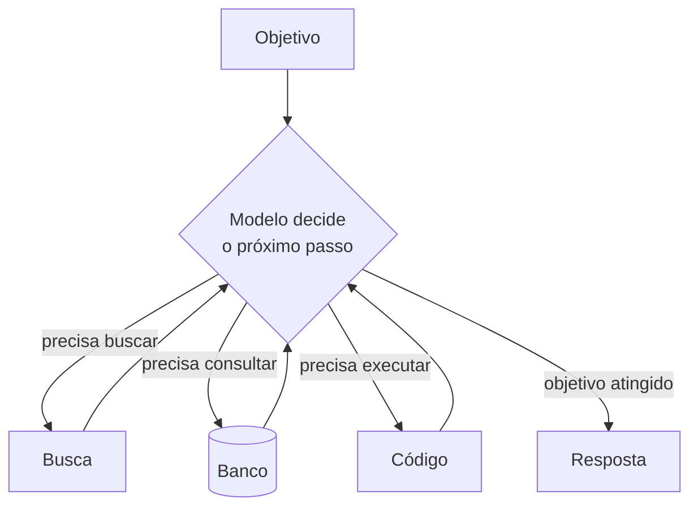

# Workflow ou Agente?

## A autonomia se conquista pelo problema

Depois de ver ferramentas, memória, MCP e frameworks, é fácil querer transformar tudo em agente. Só que a maioria dos sistemas de IA em produção não precisa de um agente, precisa de um **workflow**: uma sequência de passos definida por você, com o LLM entrando em pontos específicos.

A pergunta que separa os dois casos é uma só: **o modelo precisa decidir o próximo passo em tempo de execução, ou você já sabe a sequência de antemão?**

A recomendação da Anthropic no artigo "Building Effective Agents" é começar pelo workflow e só adicionar autonomia quando o caminho de execução realmente não puder ser conhecido antes. Não é uma questão de um ser mais moderno que o outro. Um sistema com autonomia demais para o problema fica caro, lento e difícil de depurar sem ganhar nada em troca. O melhor sistema é o que tem exatamente a autonomia que a tarefa exige.

## O que é um workflow

Num workflow, o LLM e as ferramentas são orquestrados por **caminhos de código predefinidos**. Quem controla a sequência é a sua aplicação, não o modelo.

Características:

- Os passos e a ordem são fixos, e cada passo usa uma ferramenta específica
- A aplicação cuida da validação e do que fazer quando algo falha
- É mais fácil de testar, observar e depurar, porque o caminho é sempre o mesmo
- Risco menor e comportamento previsível

Serve bem para processos repetíveis e bem definidos, onde você consegue desenhar o fluxograma inteiro antes de escrever a primeira linha.

## O que é um agente

Num agente, o modelo **dirige o próprio processo**. Ele decide qual é o próximo passo, escolhe qual ferramenta chamar naquele momento, ajusta o plano conforme avança e reage ao que descobre no meio do caminho.

Essa flexibilidade tem um custo:

- Mais modos de falha e mais variação entre uma execução e outra
- A superfície de avaliação fica muito maior, porque você não sabe de antemão quais caminhos o agente vai tomar
- Erros se acumulam: um passo errado no começo contamina todos os seguintes (isso costuma ser chamado de _compounding errors_)
- Cada rodada extra do loop custa tokens e tempo

Vale a pena quando o problema é complexo, muda a cada caso e não dá para mapear o caminho com antecedência.

## Como decidir

Boas candidatas a **workflow**:

- Processamento de documentos
- ETL e pipelines de dados
- RAG estruturado, com as etapas fixas de buscar, montar contexto e responder (ver [Arquiteturas de RAG](/labs/ai/llm/06-arquiteturas-de-rag/))
- Fluxos de aprovação
- Processos de negócio repetíveis

Boas candidatas a **agente**:

- Pesquisa aberta, sem um roteiro claro
- Planejamento que precisa se adaptar durante a execução
- Problemas que exigem combinar várias ferramentas de um jeito que muda a cada caso
- Tarefas de longo horizonte, com muitos passos encadeados
- Qualquer situação em que o caminho de execução é desconhecido

Antes de escolher qualquer um dos dois, considere se você precisa mesmo de um sistema com vários passos. Muitas vezes uma única chamada de LLM, com um bom contexto e alguns exemplos, já resolve o problema.

## Padrões de workflow

Workflow não quer dizer "uma chamada de LLM atrás da outra em linha reta". Existem alguns padrões conhecidos, catalogados pela Anthropic:

- **Prompt chaining:** chamadas em sequência, cada uma processando a saída da anterior. Bom quando a tarefa se divide em etapas limpas (rascunhar, depois revisar, depois formatar)
- **Routing:** uma primeira chamada classifica a entrada e manda para o fluxo especializado certo. Um suporte que separa "dúvida de cobrança" de "problema técnico" antes de responder
- **Parallelization:** várias chamadas rodando ao mesmo tempo, com as respostas agregadas no final. Útil para revisar um texto sob vários critérios de uma vez
- **Orchestrator-workers:** um LLM central quebra a tarefa e distribui subtarefas para outros LLMs. É o mesmo desenho do padrão supervisor/worker visto em [Sistemas Multi-Agentes](/labs/ai/agents/10-multi-agents/)
- **Evaluator-optimizer:** um LLM gera uma resposta, outro avalia e devolve feedback, e isso repete até ficar bom

O ponto em comum: em todos eles, é o seu código que decide o que acontece depois, não o modelo.

Esses padrões olham para como você compõe as chamadas de LLM. Uma outra forma de organizar o assunto é pela forma do loop de execução do agente, do mais simples (uma chamada só) ao mais controlado (com uma etapa de verificação antes de agir), o tema de [Padrões de execução de agentes](/labs/ai/agents/13-padroes-de-execucao/).

## O que não muda

Escolher workflow ou agente é decisão de arquitetura, mas as duas rodam sobre a mesma base quando vão para produção: permissões de ferramenta bem restritas, aprovação humana nas ações de risco, observabilidade, avaliação automatizada, estado durável com caminho de recuperação e controles de segurança.

Esse é o assunto de [Agentes em Produção](/labs/ai/agents/14-agentes-em-producao/), e vale tanto para um workflow simples quanto para o agente mais autônomo.

## Referências

- [Building Effective AI Agents](https://www.anthropic.com/engineering/building-effective-agents) - Anthropic Engineering, en
- [Guia da Anthropic para Construir Agentes de IA Eficazes](https://www.robertodiasduarte.com.br/guia-da-anthropic-para-construir-agentes-de-ia-eficazes/) - Roberto Dias Duarte, pt-BR
- [Workflows vs Agentes em Inteligência Artificial: Entenda as Diferenças](https://www.robertodiasduarte.com.br/workflows-vs-agentes-em-inteligencia-artificial-entenda-as-diferencas/) - Roberto Dias Duarte, pt-BR
