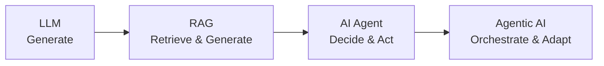
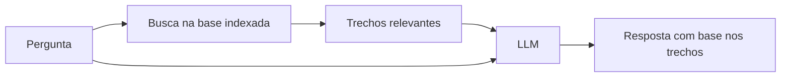
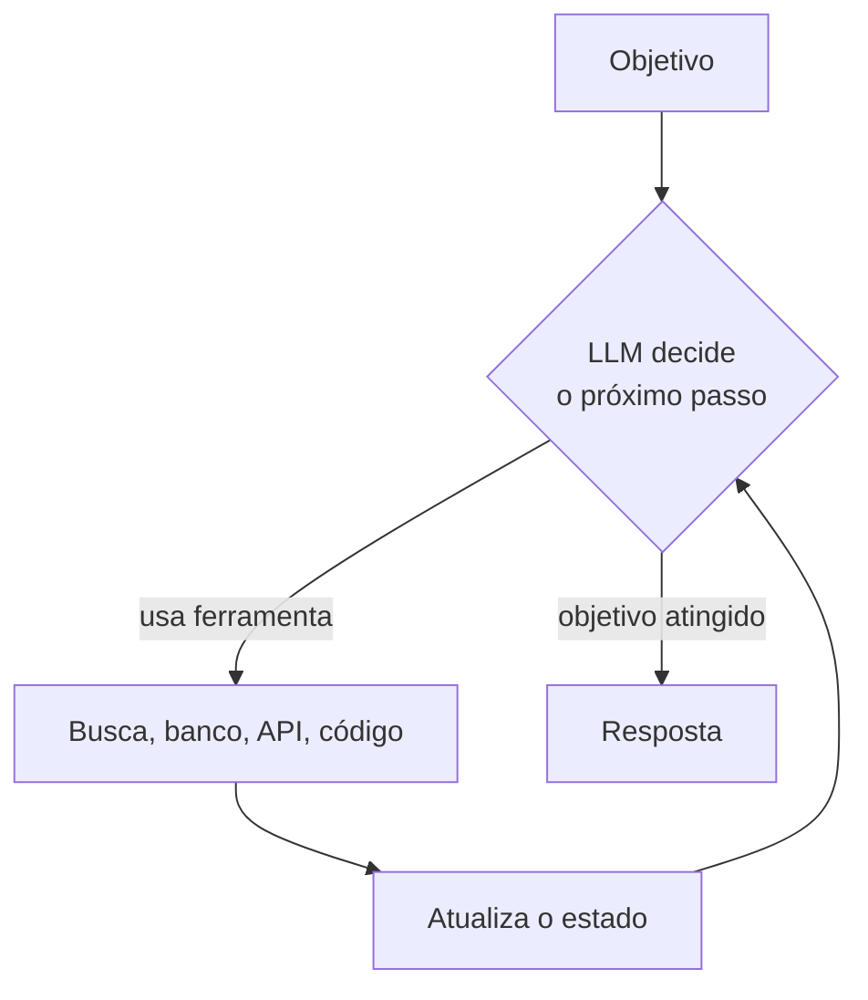
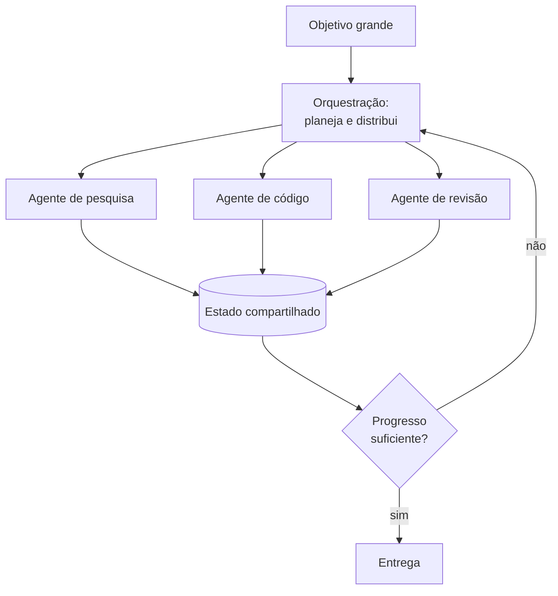
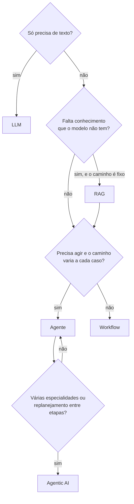

# LLM, RAG, Agente e Agentic AI: qual a diferença?

## Uma escada de capacidades

Os quatro termos aparecem misturados em posts, apresentações e vagas, e muita gente usa um no lugar do outro. Dá para separá-los olhando para **o que o sistema faz com a sua pergunta**. Cada degrau adiciona uma capacidade ao anterior:

Duas ressalvas para não levar a escada ao pé da letra:

- Ela é uma progressão **conceitual**, não uma obrigação. Um agente pode existir sem RAG, e um RAG pode ser só uma etapa dentro de um agente.
- O bloco de construção comum a tudo isso é o que a Anthropic chama de _augmented LLM_: um LLM com acesso a recuperação de dados (retrieval), ferramentas e memória. RAG, agentes e sistemas agênticos são formas diferentes de usar essas três peças.

## LLM: Generate

O LLM puro recebe um texto e devolve um texto. A resposta vem dos parâmetros que ele aprendeu no treinamento, do prompt e do contexto que você colocou na conversa. Só isso.

- Não consulta dados novos: o conhecimento parou na data do treinamento
- Não executa nada no mundo: não consulta banco, não chama API, não envia e-mail
- Pode inventar com muita confiança (alucinação), porque não tem como checar a resposta em nenhuma fonte

Serve bem para redigir, resumir, traduzir, explicar conceitos gerais e transformar texto. Quando a resposta depende de um dado que o modelo não viu, ele começa a chutar. A base está em [O que são LLMs](/labs/ai/llm/01-o-que-sao-llms/).

## RAG: Retrieve & Generate

No RAG, antes de gerar, o sistema **busca** trechos relevantes numa base de conhecimento indexada (documentos, wiki, tickets) e entrega esses trechos ao LLM junto com a pergunta. O modelo passa a responder com base no que foi recuperado.

Ganha-se resposta atualizada e ancorada em fontes que você controla, sem retreinar o modelo. Mas tem uma pegadinha importante: **recuperar não é o mesmo que acertar**. Se a busca traz o trecho errado, desatualizado ou incompleto, o LLM responde com segurança em cima de um material ruim. A qualidade do RAG depende da qualidade da recuperação.

O fluxo do RAG é fixo: sempre busca, sempre gera. Ele não decide sozinho se precisa buscar de novo nem tenta outra estratégia. Os detalhes estão em [Context Engineering e RAG](/labs/ai/llm/05-context-engineering-e-rag/) e [Arquiteturas de RAG](/labs/ai/llm/06-arquiteturas-de-rag/).

## AI Agent: Decide & Act

Um agente junta o LLM com **instruções**, **estado da tarefa** e **ferramentas externas**, e trabalha em direção a um objetivo por rodadas: decide o próximo passo, executa, olha o resultado e decide de novo.

A diferença para o RAG é quem controla o fluxo. No RAG, o seu código define a sequência. No agente, o **modelo** escolhe, a cada volta, o que fazer, e a busca em uma base de conhecimento vira só uma das ferramentas disponíveis. É por isso que agente consegue agir (abrir ticket, rodar teste, enviar mensagem), e não só responder.

O preço é previsibilidade: mais variação entre execuções, mais custo por tarefa e mais formas de falhar. O ciclo está em [Paradigma ReAct](/labs/ai/agents/02-react/), as ferramentas em [Ferramentas](/labs/ai/agents/03-ferramentas/) e o estado em [Memória de Agentes](/labs/ai/agents/04-memoria/).

## Agentic AI: Orchestrate & Adapt

Quando um objetivo é grande demais para uma unidade só, entra a camada de cima: coordenar **vários agentes e workflows**, manter um **estado compartilhado**, avaliar o progresso e **replanejar** quando algo não sai como esperado.

Um exemplo é um sistema que recebe "migre este serviço para a nova versão do framework": um agente lê o código, outro altera, outro roda os testes, e o orquestrador percebe que os testes falharam e replaneja a ordem das mudanças. Cada agente é um "agente" do degrau anterior. A novidade está na coordenação. A organização desses times está em [Sistemas Multi-Agentes](/labs/ai/agents/10-multi-agents/).

Uma observação sobre o termo: **"Agentic AI" não tem definição padronizada**. A separação usada aqui (agente = unidade que resolve uma tarefa, agentic AI = camada que orquestra vários) segue a taxonomia de Sapkota et al., que faz essa distinção. Fora dela, muita gente usa "agêntico" como adjetivo para qualquer sistema com alguma autonomia, inclusive um agente sozinho. Ao ler um artigo ou uma vaga, vale conferir qual sentido o autor está usando.

## Tabela comparativa

|                       | LLM                           | RAG                                              | AI Agent                                             | Agentic AI                                          |
| --------------------- | ----------------------------- | ------------------------------------------------ | ---------------------------------------------------- | --------------------------------------------------- |
| Verbo central         | Generate                      | Retrieve & Generate                              | Decide & Act                                         | Orchestrate & Adapt                                 |
| O que faz             | Gera texto a partir do prompt | Gera texto com base em trechos recuperados       | Persegue um objetivo em ciclos de decisão e execução | Coordena agentes e workflows para objetivos maiores |
| Quem controla o fluxo | Ninguém, é uma chamada só     | O seu código, fluxo fixo                         | O modelo, a cada volta                               | Um orquestrador, com replanejamento                 |
| Ferramentas           | Nenhuma                       | Busca na base                                    | Várias (APIs, banco, código)                         | As dos agentes, mais as de coordenação              |
| Estado e memória      | Só o contexto da conversa     | Contexto + base indexada                         | Estado da tarefa + memória                           | Estado compartilhado entre agentes                  |
| Autonomia             | Nenhuma                       | Baixa                                            | Média                                                | Alta                                                |
| Risco principal       | Alucinação                    | Recuperação errada                               | Ação errada e erro acumulado                         | Falha de coordenação e superfície de ataque maior   |
| Custo e latência      | Baixos                        | Baixos a médios                                  | Médios a altos                                       | Altos                                               |
| Boa escolha quando    | A tarefa é só texto           | A resposta depende de dados que o modelo não tem | O caminho não dá para prever de antemão              | Há várias etapas e especialidades diferentes        |

### O mesmo cenário nos quatro tipos

Imagine um suporte de uma loja online, e um cliente pergunta "cadê meu pedido?":

- **LLM**: responde de forma genérica como pedidos costumam funcionar, porque não conhece o pedido dele
- **RAG**: busca a política de entregas e o FAQ e responde o prazo típico, mas não sabe o status real daquele pedido
- **AI Agent**: consulta o sistema de pedidos, vê que está atrasado, abre um chamado com a transportadora e avisa o cliente
- **Agentic AI**: além disso, um agente cuida do pedido, outro do reembolso e outro da comunicação, e o orquestrador decide o que priorizar e refaz o plano se a transportadora não responder

## Como escolher o nível certo

A regra prática é subir de degrau só quando o anterior se provar insuficiente, e com uma medição na mão (uma avaliação que mostre onde o degrau atual falha), não por impressão.

Note o desvio pelo **workflow**: muitas vezes o que se precisa é uma sequência definida em código com o LLM em pontos específicos, sem dar autonomia ao modelo. Essa escolha está em [Workflow ou Agente?](/labs/ai/agents/11-workflow-ou-agente/). Sistema com autonomia demais para o problema fica caro, lento e difícil de depurar sem ganhar nada em troca.

## Mais autonomia, mais responsabilidade de segurança

Cada degrau dá mais poder ao sistema, e poder mal controlado vira problema. Quanto mais autonomia, mais coisas precisam estar sob controle:

- **Governança de identidade**: cada agente age em nome de alguém. Ele precisa ter identidade própria, e não usar a credencial de um humano ou uma chave compartilhada
- **Permissões de ferramentas**: dar a cada agente só as ferramentas e os escopos que a tarefa exige (princípio do menor privilégio). Um agente que só lê relatórios não deveria conseguir apagar registros
- **Exposição de dados**: o que entra no contexto pode vazar na resposta ou numa chamada de ferramenta. Dados sensíveis e conteúdo externo não confiável (páginas, e-mails, documentos) merecem cuidado, porque podem carregar instruções maliciosas (prompt injection)
- **Observabilidade**: registrar cada decisão, chamada de ferramenta e mudança de estado. Sem isso, ninguém consegue explicar por que o sistema fez o que fez
- **Supervisão humana**: exigir aprovação em ações de risco ou irreversíveis (pagamento, exclusão, envio externo), o chamado _human-in-the-loop_

A ideia de **Zero Trust** (nunca confiar por padrão, sempre verificar) se aplica bem aqui: cada chamada de ferramenta é autenticada e autorizada individualmente, e a saída de um agente não é tratada como confiável só porque veio de "dentro" do sistema. Em sistemas com vários agentes isso pesa ainda mais, porque um agente comprometido pode contaminar os outros através do estado compartilhado.

Os controles em prática estão em [Agentes em Produção](/labs/ai/agents/14-agentes-em-producao/).

## Referências

- [Building Effective Agents](https://www.anthropic.com/engineering/building-effective-agents) - Anthropic Engineering, en
- [AI Agents vs. Agentic AI: A Conceptual Taxonomy, Applications and Challenges](https://arxiv.org/abs/2505.10468) - Sapkota et al., en, paper
- [What is AI agent orchestration?](https://www.ibm.com/think/topics/ai-agent-orchestration) - IBM, en
- [OWASP GenAI Security Project](https://genai.owasp.org/) - OWASP, en
