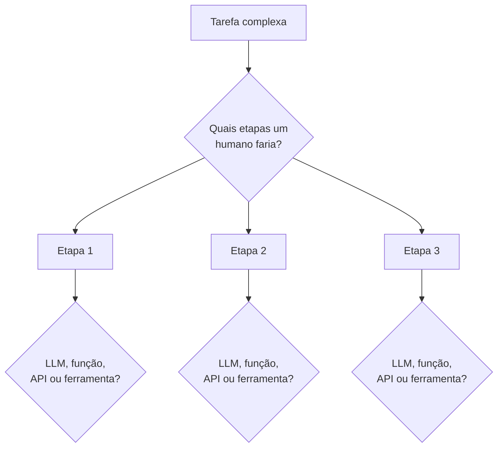
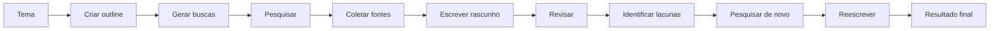
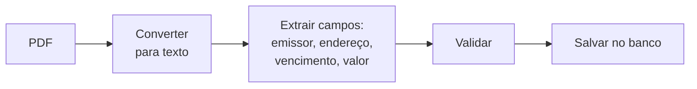
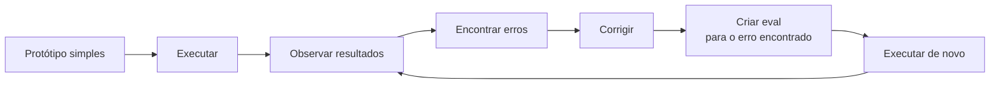

# Decomposição de Tarefas

Depois de decidir entre [workflow ou agente](/labs/ai/agents/11-workflow-ou-agente/), sobra a pergunta mais prática de todas: como transformar uma tarefa em etapas de verdade? Essa habilidade, chamada de **task decomposition** (decomposição de tarefas), é o que separa um sistema que só "joga tudo para o LLM resolver" de um que decompõe o problema em pedaços que cada peça (modelo, função, API, ferramenta) resolve bem.

## Por que decompor a tarefa importa

É tentador pedir tudo numa chamada só: "escreva um artigo sobre X" e esperar o melhor. Só que dividir a mesma tarefa num workflow (planejar, pesquisar, coletar fontes, escrever rascunho, revisar, pesquisar de novo, melhorar, gerar resultado final) costuma produzir um resultado mais elaborado, porque cada etapa dá ao modelo uma chance de fazer uma coisa só e fazer bem, em vez de acertar tudo de primeira.

O ganho de decompor bem pode superar o ganho de trocar de modelo. No benchmark HumanEval (problemas de programação com testes automatizados, o mesmo visto em [Avaliação de LLMs](/labs/ai/llm/06-avaliacao-de-llms/)), Andrew Ng mostrou um exemplo revelador: **GPT-3.5** usado direto, numa única chamada, acerta cerca de **48%** dos problemas. **GPT-4**, o modelo mais forte, usado do mesmo jeito direto, sobe para **67%**. Mas o **GPT-3.5** (o modelo mais fraco dos dois) dentro de um workflow agentic simples, gerando um rascunho, refletindo sobre o próprio código, e testando e corrigindo antes de responder, chega a **95%**, superando o GPT-4 usado sem workflow nenhum. A lição não é "use sempre o modelo mais caro", é "projete melhor o processo em que o modelo trabalha".

## O método: duas perguntas

Decompor uma tarefa não exige nenhuma técnica sofisticada, exige mudar a pergunta que você faz:

- ~~Como faço a IA realizar essa tarefa?~~
- **Quais etapas um humano executaria para realizar essa tarefa?**

Depois de listar as etapas que uma pessoa daria, uma por uma, a segunda pergunta filtra o que cada etapa vira no sistema:

- **Essa etapa pode ser feita por um LLM, uma função determinística, uma API ou alguma ferramenta?**

Etapas que exigem julgamento, linguagem natural ou síntese (escrever, resumir, decidir com base em contexto ambíguo) tendem a virar chamadas de LLM. Etapas que têm uma resposta certa e determinística (consultar um banco, calcular um valor, validar um formato) tendem a virar código comum, sem gastar uma chamada de modelo à toa.

## Exemplo: agente de pesquisa

O caso mais simples de um agente de pesquisa é uma chamada só: `tema → LLM → artigo`. Funciona, mas produz um texto raso, sem fontes reais e sem revisão. Decompondo a mesma tarefa:

Cada seta é uma etapa que pode virar uma chamada de LLM (criar outline, escrever rascunho, revisar), uma ferramenta de busca (pesquisar, ver [Uso de Ferramentas](/labs/ai/agents/03-ferramentas/)) ou uma etapa de recuperação de contexto (coletar fontes, ver [Context Engineering e RAG](/labs/ai/llm/07-context-engineering-e-rag/)). O processo é iterativo: se o rascunho ainda não está bom depois de uma volta, você decompõe de novo a etapa que falhou (por exemplo, "revisar" pode virar "checar fatos" + "checar tom" + "checar estrutura"), em vez de jogar a tarefa inteira de volta para o modelo.

## Mais exemplos de decomposição

A mesma lógica funciona fora de tarefas de escrita. Duas tarefas que parecem simples de descrever escondem várias etapas quando decompostas:

**Atendimento ao cliente** - "responder ao cliente sobre o pedido dele" vira:

Aqui o LLM entra só onde faz sentido: extrair a intenção do e-mail (linguagem natural) e gerar a resposta (linguagem natural de novo). Consultar o banco e enviar o e-mail são chamadas de função comuns, sem ambiguidade nenhuma para pedir a um modelo.

**Processamento de notas fiscais** - um PDF que precisa virar um registro estruturado:

De novo, cada etapa tem um dono natural: converter o PDF é um modelo especializado nisso, extrair campos é onde o LLM ganha por lidar com formatos variados de nota fiscal, validar é regra de negócio determinística, e salvar é uma chamada de banco de dados comum.

## Building blocks disponíveis

Depois de decompor, cada etapa precisa de uma peça que a resolva. O catálogo de peças disponíveis cresce o tempo todo, mas dá para agrupar em duas famílias:

- **Modelos de IA:** LLMs de propósito geral, modelos multimodais (texto e imagem juntos), modelos especializados como reconhecimento de imagem, conversão de PDF para texto ou text-to-speech.
- **Ferramentas:** APIs em geral, busca web, bancos de dados, [RAG](/labs/ai/llm/07-context-engineering-e-rag/), API de e-mail, calendário, API de clima, execução de código.

Boa parte do trabalho de quem constrói um sistema agentic deixa de ser "escrever o prompt perfeito" e vira **identificar quais building blocks já existem e combiná-los na sequência certa** para o problema em mãos. Uma vez decomposta, a tarefa também informa qual [padrão de execução](/labs/ai/agents/14-padroes-de-execucao/) faz sentido para cada etapa: uma etapa isolada e bem definida costuma caber num único passo de LLM (single-shot), enquanto uma etapa que precisa buscar informação e reagir ao que encontra pede um loop de ferramentas.

## Comece simples e itere

Um conselho que vale mais do que parece óbvio: **construa uma versão simples e funcional primeiro**, em vez de passar semanas tentando prever no papel como o workflow ideal deveria ser. Ninguém acerta a decomposição perfeita na primeira tentativa, e o tempo gasto planejando no vácuo raramente compensa o que você aprende rodando uma versão real, mesmo que tosca, contra casos de verdade.

Esse ciclo (rodar, observar, corrigir, medir) é o que conecta decomposição de tarefas à disciplina de avaliação: cada erro que aparece na prática vira um caso de teste novo, o mesmo raciocínio por trás do dataset de avaliação vivo visto em [Avaliação de LLMs](/labs/ai/llm/06-avaliacao-de-llms/) e dos evals de agente em [Agentes em Produção](/labs/ai/agents/15-agentes-em-producao/).

## Referências

- [Four AI Agent Strategies That Improve GPT-4 and GPT-3.5 Performance](https://www.deeplearning.ai/the-batch/how-agents-can-improve-llm-performance) - Andrew Ng, DeepLearning.AI (The Batch), en
