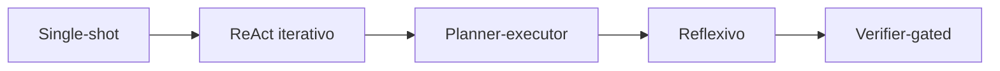
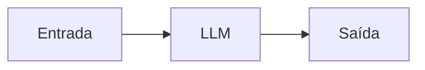
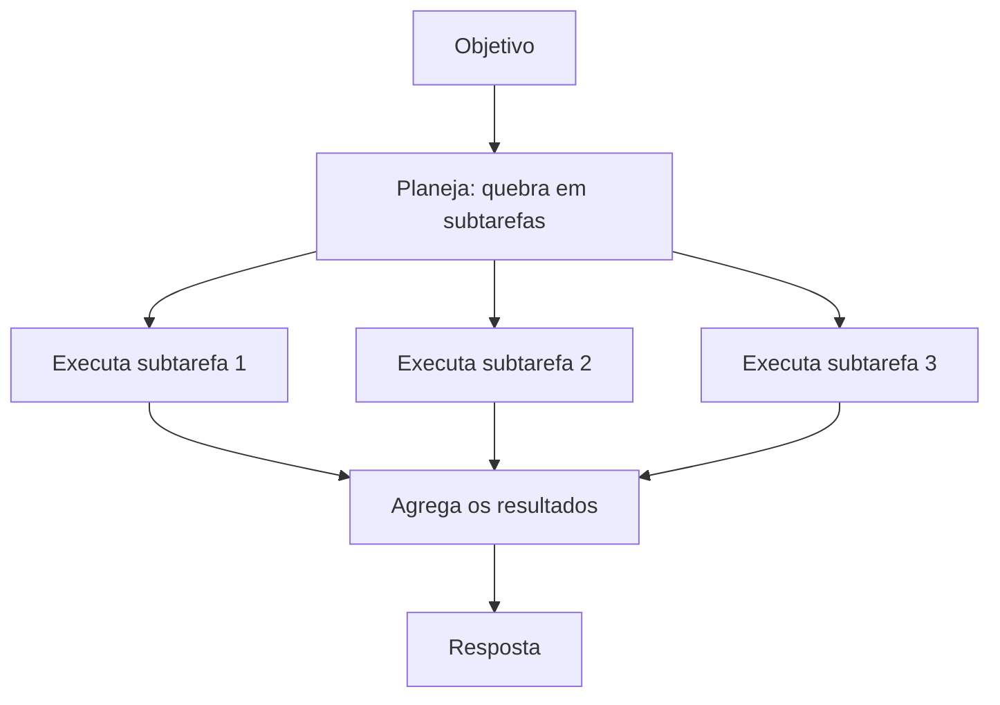
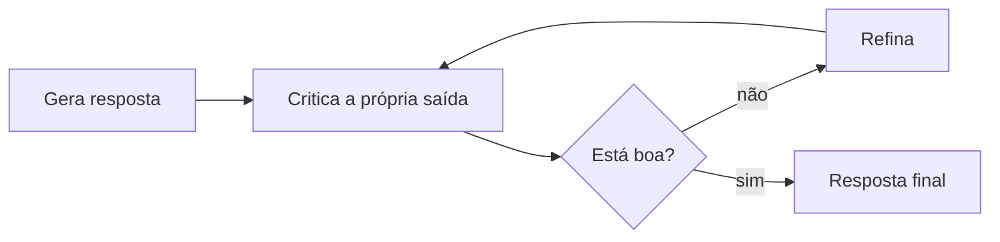
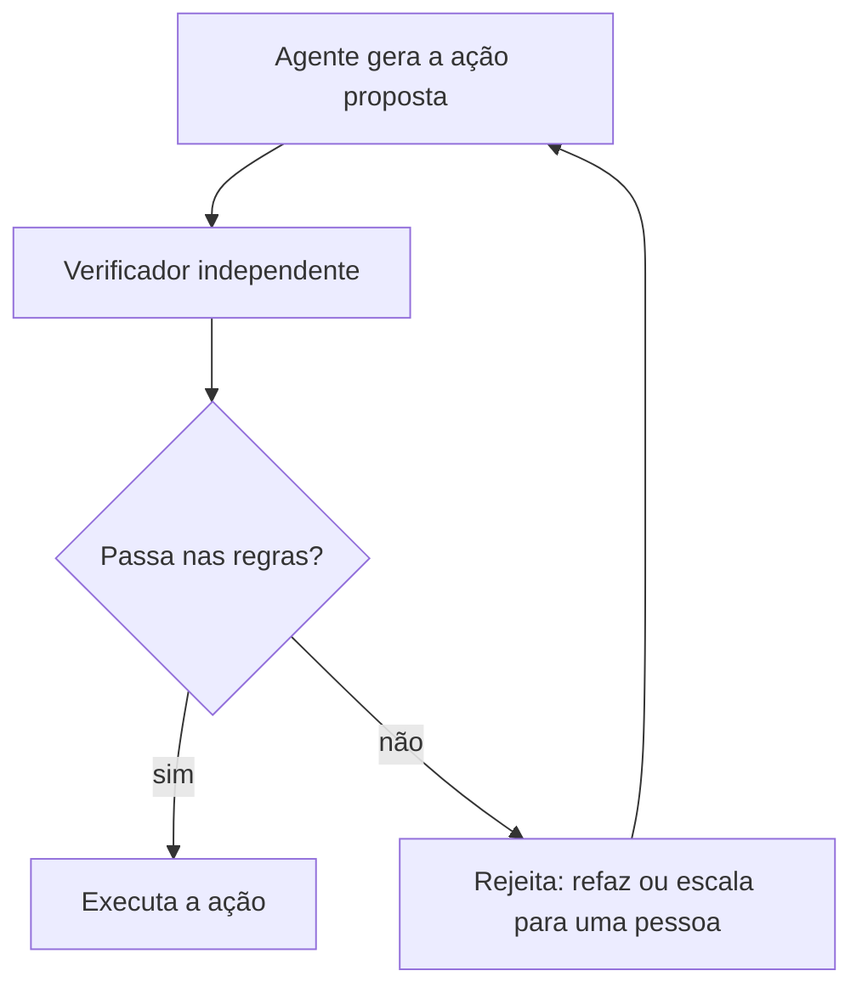

# Padrões de execução de agentes

## O que é um padrão de execução

Construir um agente não é só plugar um LLM em algumas ferramentas. O formato do ciclo de execução, ou seja, quantas vezes o modelo é chamado, o que acontece entre uma chamada e outra e o que pode barrar uma ação, decide quatro coisas do sistema: latência, custo, confiabilidade e quanto de autonomia o agente tem.

Existem cinco formatos que aparecem o tempo todo, e dá para colocá-los numa escala do mais simples ao mais controlado:

Quanto mais para a direita, mais estrutura em volta do modelo: mais passos, mais checagens, mais controle sobre o que sai. Também mais latência e mais custo por tarefa.

Vale separar isso dos padrões de composição de workflow vistos em [Workflow ou Agente?](/labs/ai/agents/11-workflow-ou-agente/). Lá o assunto é como o seu código encadeia chamadas de LLM (em sequência, em paralelo, com roteamento). Aqui o assunto é o formato do ciclo do próprio agente.

## Single-shot: uma chamada só

O formato mais simples: entrada, uma invocação do LLM, saída. Não tem loop de agente, não tem ferramenta, não tem verificação intermediária.

Funciona bem para tarefas que o modelo resolve num passo só: classificar um texto, extrair campos, resumir, converter um formato em outro (transformar uma reclamação de cliente em JSON estruturado, por exemplo). Ganha em latência e custo, e a arquitetura é fácil de testar porque o caminho é sempre o mesmo.

O limite aparece rápido: se a tarefa precisa de informação que o modelo não tem, de várias etapas ou de chamar um sistema externo, single-shot não dá conta. Aí você sobe para o próximo formato.

## ReAct iterativo

O agente alterna raciocínio e ação num loop: decide o próximo passo, executa (chama uma ferramenta, faz uma busca, consulta um banco), observa o resultado e decide de novo, até ter o que precisa para responder.

É o formato por trás da maioria dos agentes de hoje e tem nota própria em [Paradigma ReAct](/labs/ai/agents/02-react/). Serve para tarefas dinâmicas, em que o caminho depende do que cada passo retorna. O custo é maior (cada volta do loop é uma chamada) e o erro de um passo contamina os seguintes.

## Planner-executor

Aqui o agente separa duas coisas que o ReAct mistura: primeiro monta um plano do caminho todo, depois executa cada parte.

Como o plano vem antes, as subtarefas independentes podem rodar em paralelo, e dá para acompanhar o progresso de cada uma. Serve bem para workflows longos e pipelines de pesquisa e análise ("levante os dados, analise cada fonte, monte o resumo"). O risco é o plano inicial estar errado: se o agente não revisa o plano conforme descobre coisas, ele executa o caminho errado até o fim.

Esse formato aparece como padrão supervisor/worker em [Sistemas Multi-Agentes](/labs/ai/agents/10-multi-agents/) e como orchestrator-workers em [Workflow ou Agente?](/labs/ai/agents/11-workflow-ou-agente/).

## Reflexivo: gerar, criticar, refinar

O agente gera uma resposta, critica o próprio trabalho procurando problemas, refina com base nessa crítica, e repete até passar num critério de qualidade.

Ajuda quando a qualidade importa: geração de conteúdo, escrita e revisão de código, respostas que exigem raciocínio mais cuidadoso. Pega erros bobos e melhora a clareza.

Um cuidado: a autocrítica não garante correção factual. O mesmo modelo que errou pode "revisar" e continuar achando que está certo, ou até reforçar o erro. Reflexão melhora a forma mais do que garante o conteúdo. Esse é o mesmo desenho do evaluator-optimizer citado em [Workflow ou Agente?](/labs/ai/agents/11-workflow-ou-agente/), e costuma funcionar melhor quando quem critica tem um sinal externo (resultado de teste, um outro modelo, uma regra) em vez de só a própria opinião.

## Verifier-gated: verificar antes de agir

O agente gera uma ação proposta, mas ela não é executada direto. Antes, uma camada de verificação independente do modelo confere essa ação contra regras determinísticas, schema, políticas ou o estado de um sistema externo. Só se passar é que a ação acontece.

É o formato certo para fluxo de alto risco: pagamento, compliance, autorização, aplicação de política. O exemplo clássico é "só processe o pagamento se o usuário tem permissão, o valor está dentro do limite e o beneficiário é válido", com cada uma dessas condições checada por código, não pelo modelo.

Isso se parece com o guardrail de saída visto em [Agentes em Produção](/labs/ai/agents/14-agentes-em-producao/), mas aqui é um passo nomeado do fluxo, desenhado para barrar a ação.

### O que a verificação precisa para valer de verdade

Um verificador que só devolve "passou" ou "rejeitado" não muda nada sozinho. Para ser um portão de verdade:

- Precisa existir uma camada com autoridade para de fato bloquear a ação, com orçamento e permissões reservados e um caminho de escalonamento para quando ele rejeita. Sem isso, o veredito é correto e a ação acontece do mesmo jeito.
- O que se verifica é a decisão e a consequência dela, não só o texto que o modelo gerou. Essa é a diferença entre validar um formato e governar uma ação.

### Ações que podem ter dado certo mesmo com erro

Um caso chato: o agente chama uma API de pagamento, ela dá timeout, e o agente não sabe se o pagamento passou ou não. Repetir às cegas pode cobrar o cliente duas vezes.

O jeito de lidar:

- Usar uma **idempotency key** na chamada, um identificador único que o serviço externo usa para reconhecer "essa requisição eu já processei" e não repetir o efeito.
- A recuperação (tentar de novo, tratar o timeout) fica no executor.
- Depois do timeout, consultar o estado real no sistema externo (deu certo, está pendente, falhou) e deixar o verificador decidir se o fluxo pode continuar. O sistema externo é a fonte da verdade, não a suposição do agente.

## Combinando os padrões

Na prática esses formatos não vivem isolados. Um sistema de produção mistura vários: um planner distribui subtarefas para executores ReAct, uma memória guarda o estado entre passos (ver [Memória de Agentes](/labs/ai/agents/04-memoria/)), uma etapa reflexiva revisa a saída, um verificador barra as ações de risco, e guardrails e observabilidade cercam tudo.

A tabela ajuda a ver o trade-off:

| Padrão           | Latência e custo | Autonomia     | Melhor para                                 |
| ---------------- | ---------------- | ------------- | ------------------------------------------- |
| Single-shot      | baixo            | nenhuma       | classificar, extrair, resumir, converter    |
| ReAct iterativo  | médio            | média         | usar ferramentas, pesquisa, tarefa dinâmica |
| Planner-executor | médio a alto     | média         | workflow longo, subtarefas independentes    |
| Reflexivo        | alto             | média         | qualidade de conteúdo e de código           |
| Verifier-gated   | alto             | baixa na ação | pagamento, compliance, autorização          |

O princípio que vale para todos é o mesmo de [Workflow ou Agente?](/labs/ai/agents/11-workflow-ou-agente/): não deixe o agente mais autônomo do que o problema exige. Comece pelo padrão mais simples que resolve e só adicione planejamento, iteração, reflexão ou verificação quando o ganho for de fato mensurável.

## Referências

- [Building Effective AI Agents](https://www.anthropic.com/engineering/building-effective-agents) - Anthropic Engineering, en
- [Guia da Anthropic para Construir Agentes de IA Eficazes](https://www.robertodiasduarte.com.br/guia-da-anthropic-para-construir-agentes-de-ia-eficazes/) - Roberto Dias Duarte, pt-BR
- [Workflows vs Agentes em Inteligência Artificial: Entenda as Diferenças](https://www.robertodiasduarte.com.br/workflows-vs-agentes-em-inteligencia-artificial-entenda-as-diferencas/) - Roberto Dias Duarte, pt-BR
- [ReAct: Synergizing Reasoning and Acting in Language Models](https://arxiv.org/abs/2210.03629) - Yao et al., en
- [Reflection Agents](https://www.langchain.com/blog/reflection-agents) - LangChain, en
