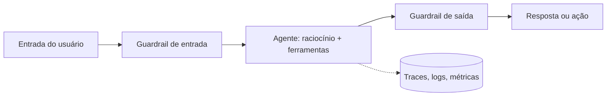
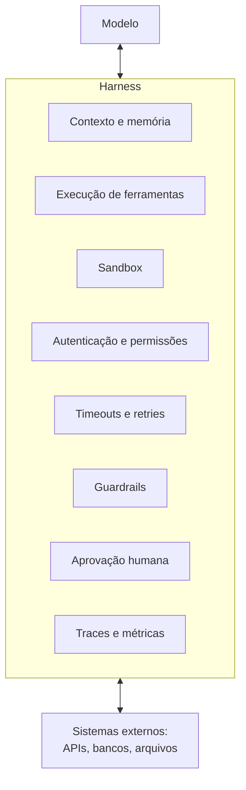

# Agentes em Produção

## O que muda quando o agente sai do protótipo

Um protótipo só precisa mostrar que a ideia funciona uma vez, numa demo controlada. Colocar o mesmo agente em produção é outra história: ele vai receber entradas que você não previu, rodar milhares de vezes, gastar dinheiro a cada chamada e, se tiver acesso a ferramentas de verdade, causar estrago quando errar.

Três frentes ajudam a lidar com isso: **guardrails** (barreiras que filtram o que entra e o que sai), **controle de ações** (limitar o que o agente pode de fato executar) e **observabilidade** (enxergar o que ele fez e por quê). As duas primeiras evitam o problema, a terceira permite descobrir e corrigir quando ele acontece mesmo assim.



## Harness: tudo que envolve o modelo

Quando um agente dá errado em produção, o culpado quase nunca é o modelo. O modelo raciocina bem o bastante na maioria dos casos, e o que falha é o entorno: a ferramenta que travou, o contexto que veio sujo, a permissão que ninguém conferiu, a chamada repetida duas vezes. Esse entorno tem nome: **harness** (em português, algo como "arreio" ou "estrutura de controle"), e a fórmula usada para explicar a ideia é simples: **agente = modelo + harness**.

Harness é tudo que não é o modelo: o código, a configuração e a lógica de execução que dão ao modelo estado, ferramentas, feedback e limites. Um modelo sozinho só gera texto. Ele vira agente quando um harness o coloca num loop, executa as ferramentas que ele pede e impõe regras sobre o que pode acontecer.



Boa parte dessas peças já tem nota própria no lab: montar e priorizar o contexto está em [Context Engineering e RAG](/labs/ai/llm/05-context-engineering-e-rag/), a memória em [Memória de Agentes](/labs/ai/agents/04-memoria/), a integração padronizada com ferramentas em [Model Context Protocol (MCP)](/labs/ai/agents/06-mcp/) e o formato do ciclo (planejar, agir, observar, refletir) em [Padrões de execução de agentes](/labs/ai/agents/13-padroes-de-execucao/). As seções seguintes desta nota cobrem guardrails, escopo, aprovação humana e observabilidade. O que falta explicar é o que sobra: autenticação, timeouts e retries.

### Autenticação e permissões

O agente age em nome de alguém, então precisa de uma identidade e de credenciais. O erro comum é reaproveitar a chave de um desenvolvedor ou uma credencial de administrador "para funcionar logo". O caminho mais seguro é dar ao agente uma identidade própria, com credenciais de curta duração e escopo mínimo, de modo que dê para saber nos logs qual agente fez o quê e revogar o acesso sem derrubar mais nada. As credenciais ficam no harness, e não dentro do prompt, onde o modelo (e qualquer texto malicioso que ele leia) poderia enxergá-las.

### Timeouts

Uma ferramenta lenta ou travada trava o agente inteiro, e o loop continua girando (e cobrando) enquanto espera. Todo passo do loop precisa de um **timeout**: um tempo máximo depois do qual o harness desiste da chamada e devolve ao modelo um erro claro, como "a busca não respondeu em 10 segundos". Com essa mensagem o modelo consegue tentar outra abordagem, em vez de ficar parado. Vale ter também um limite para a execução completa (número máximo de passos e tempo total), para o caso de o agente entrar num ciclo sem fim.

### Retries

Falhas passageiras (rede instável, API sobrecarregada) costumam se resolver tentando de novo, e é o harness que deve fazer isso, sem gastar uma rodada do modelo:

- **Backoff:** esperar um pouco mais a cada nova tentativa (1 s, 2 s, 4 s...), para não martelar um serviço que já está com problemas
- **Limite de tentativas:** duas ou três, no máximo. Depois disso, o erro sobe para o modelo ou para uma pessoa
- **Só repetir o que vale a pena:** um erro de rede merece nova tentativa; um erro de validação ("parâmetro inválido") vai falhar do mesmo jeito e só gasta tempo

Há uma pegadinha séria: repetir uma ação que **altera** algo pode executá-la duas vezes. Se a chamada "cobrar o cliente" estourou o timeout depois de já ter cobrado, o retry cobra de novo. Para isso serve a **idempotência**: a ferramenta recebe uma chave única por operação (`idempotency-key`) e, se a mesma chave chegar de novo, devolve o resultado da primeira execução em vez de refazer o trabalho. Leituras são naturalmente seguras para repetir; escritas só são seguras com idempotência, ou com aprovação humana no meio, como visto em [Human-in-the-loop](#human-in-the-loop).

```python
import time

def chamar_com_retry(ferramenta, args, tentativas=3, timeout=10):
    for n in range(tentativas):
        try:
            return ferramenta(**args, timeout=timeout)
        except TimeoutError:
            if n == tentativas - 1:
                return {"erro": "timeout", "detalhe": f"sem resposta em {timeout}s"}
            time.sleep(2 ** n)  # backoff: 1s, 2s, 4s
```

### Por que o entorno pesa mais que o modelo

O mesmo modelo, com harnesses diferentes, entrega resultados bem diferentes: um agente com contexto enxuto, ferramentas com timeout, retries seguros e uma etapa de aprovação para ações de risco tende a ser bem mais confiável que outro com o mesmo modelo e um loop "solto". Em produção isso vira uma regra prática: quando o agente falha, olhe primeiro para o harness (o que ele viu, qual ferramenta falhou, qual limite estourou) e só depois para o modelo ou o prompt. É para isso que os traces da seção de observabilidade existem.

## Guardrails

Guardrails são checagens que ficam em volta do agente, separadas do modelo. A ideia é não confiar que o modelo vai se comportar: você valida antes e depois, com regras ou com classificadores dedicados.

### Guardrails de entrada

Rodam antes de a mensagem chegar ao modelo:

- validar o formato e o tamanho do que o usuário mandou
- detectar tentativas de **prompt injection** e jailbreak, ou seja, texto que tenta fazer o agente ignorar as próprias regras (o mecanismo está explicado em [Boas Práticas e Segurança em Prompt Engineering](/labs/ai/engenharia-de-prompt/02-boas-praticas-e-seguranca/))
- identificar dados sensíveis (CPF, cartão, senha) e mascarar antes que entrem no contexto

Isso vale principalmente para qualquer conteúdo externo que o agente vá ler: documento enviado, resultado de busca, e-mail. Trate tudo isso como não confiável.

### Guardrails de saída

Rodam depois que o modelo respondeu, antes de a resposta ou a ação seguir adiante:

- moderar conteúdo (linguagem ofensiva, informação que não pode vazar)
- checar se a resposta se sustenta no contexto recuperado, para pegar alucinação
- validar a ação que o agente quer executar: os parâmetros fazem sentido? Está dentro do que ele tem permissão de fazer? Um `deletar_cliente(id=todos)` deveria ser barrado aqui.

## Escopo e isolamento de ações

Guardrail filtra; o controle de ações limita o poder do agente desde o começo:

- **Menor privilégio:** o agente só recebe as ferramentas e as permissões que a tarefa exige. Um agente de consulta não precisa de acesso de escrita ao banco.
- **Sandbox:** quando o agente executa código, isso roda num ambiente isolado, sem acesso à rede interna nem ao sistema de arquivos real.
- **Whitelist:** a lista de APIs e domínios que o agente pode chamar é explícita, não "tudo que não estiver proibido".
- **Rate limit e quota:** um teto de chamadas por minuto e de custo por sessão. Sem isso, um agente que entrou em loop consome sua fatura inteira em minutos.

## Human-in-the-loop

Para ações de risco ou difíceis de desfazer (transferir dinheiro, enviar e-mail para um cliente, apagar dados), o agente não age sozinho: ele para, mostra o que pretende fazer e espera aprovação de uma pessoa.

Vale desenhar também o caminho de volta. Se uma ação passou e estava errada, existe rollback? Um agente em produção precisa de um "estado seguro" para onde voltar quando algo sai do esperado, em vez de seguir em frente.

## Observabilidade e AgentOps

Não dá para melhorar o que você não consegue ver. **AgentOps** é o nome que vem sendo usado para o conjunto de práticas de operar agentes em produção, parecido com o que DevOps fez para software comum.

O centro disso é o **trace**: o registro completo de uma execução, passo a passo. Para cada rodada do agente você quer conseguir olhar depois e ver o raciocínio que ele fez, quais ferramentas chamou e com quais argumentos, quanto custou em tokens, quanto demorou e onde falhou. Ferramentas como LangSmith, Langfuse e Arize existem para coletar e visualizar isso.

Além do trace, duas práticas importam: evals e versionamento.

### Evals

**Evals** são testes automatizados para o agente, o equivalente a teste unitário para código comum. A avaliação olha a sequência inteira de ações do agente, não só o texto final da resposta.

Dois tipos de checagem se complementam:

- **Assertion programática:** uma regra de código que confere um fato objetivo, como validação de schema JSON, checagem de regex num campo ou "a ferramenta X foi chamada com o parâmetro Y". Rápida, barata e sem ambiguidade, mas só serve para o que dá para descrever como regra.
- **LLM-as-judge:** um outro LLM, geralmente menor e mais rápido, recebe a resposta do agente e dá uma nota de qualidade (por exemplo, numa escala de 1 a 5) comparando com o resultado esperado. Cobre casos que uma regra fixa não alcança, como "essa resposta soa natural?", ao custo de ser mais lenta e ter sua própria margem de erro.

Na prática, os evals rodam contra um **dataset dourado**: um conjunto de perguntas representativas (o ideal é começar com pelo menos umas 100), incluindo os casos de borda que já quebraram o agente antes. Toda vez que o prompt muda ou o modelo é trocado, essa suíte roda de novo como teste de regressão, dentro do pipeline de CI/CD, antes de a mudança ir para produção. Quando um caso falha, categorizar o tipo de erro (formatação, alucinação, lógica) ajuda a mirar a correção em vez de ajustar o prompt no escuro.

### Versionamento

Prompt, definição de ferramentas e configuração do agente entram no controle de versão como código. Assim dá para saber qual versão estava rodando quando um problema apareceu e voltar atrás. Isso complementa o versionamento de prompt visto em [engenharia de prompt](/labs/ai/engenharia-de-prompt/02-boas-praticas-e-seguranca/).

Uma prática comum é amostrar uma fração dos traces de produção e revisar de tempos em tempos, para pegar mudança de comportamento (drift) que os testes não capturaram.

## Referências

- [Guardrails: como criar camadas de proteção para seus agentes de IA](https://www.datahackers.news/p/guardrails-como-criar-camadas-de-protecao-para-seus-agentes-de-ia) - Data Hackers, pt-BR
- [O Conceito de AgentOps: Uma Nova Abordagem Para a Observabilidade de Agentes de IA](https://www.cienciaedados.com/o-conceito-de-agentops-uma-nova-abordagem-para-a-observabilidade-de-agentes-de-ia-baseados-em-llms/) - Ciência e Dados, pt-BR
- [Observabilidade de LLMs: Guia para Monitorar Aplicações com IA](https://www.opservices.com.br/observabilidade-llm/) - OpServices, pt-BR
- [Harness engineering for coding agent users](https://martinfowler.com/articles/harness-engineering.html) - Martin Fowler, en
- [The Anatomy of an Agent Harness](https://www.langchain.com/blog/the-anatomy-of-an-agent-harness) - LangChain, en
- [OWASP Top 10 for LLM Applications e Agentic AI Threats](https://genai.owasp.org/) - OWASP, en
- [AI Agent Observability, Tracing & Evaluation with Langfuse](https://langfuse.com/blog/2024-07-ai-agent-observability-with-langfuse) - Langfuse, en
- [Golden dataset evaluation: build and maintain LLM test sets](https://langfuse.com/resources/engineering/golden-dataset-evaluation) - Langfuse, en
