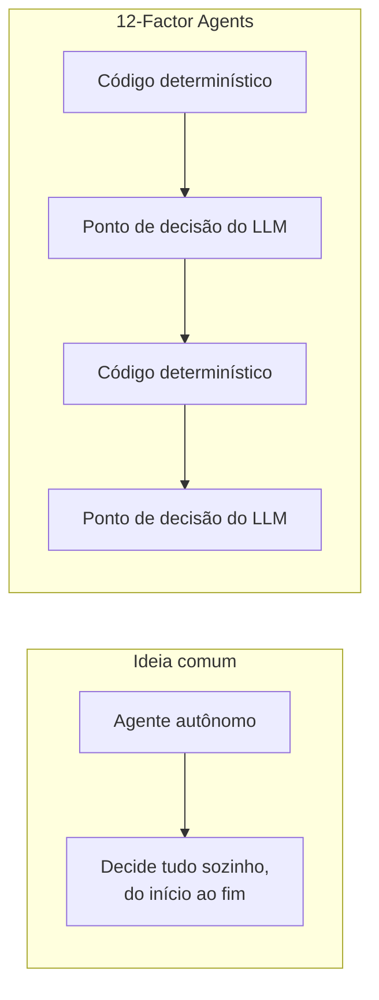

# 12-Factor Agents

## O que é

**12-Factor Agents** é um guia de princípios para construir agentes de IA confiáveis o bastante para chegar a clientes de verdade, publicado por Dex Horthy e a equipe da [HumanLayer](https://humanlayer.dev). O nome é uma referência direta ao [12-Factor App](https://12factor.net/), o guia de boas práticas para aplicações web que a Heroku publicou em 2011: assim como aquele documento não é um framework, mas um conjunto de princípios que qualquer stack pode seguir, o 12-Factor Agents também não é uma biblioteca para instalar. É uma lista do que costuma dar certo (e do que costuma quebrar) em agentes que precisam rodar em produção, não só numa demo.

A motivação por trás do guia é uma observação simples: a maioria dos produtos que se vendem como "agentes de IA autônomos" não é, na prática, um loop autônomo fazendo tudo sozinho. É **código determinístico de sempre, com alguns pontos de decisão de LLM espalhados exatamente onde fazem diferença**. Um agente 100% autônomo, decidindo cada passo sozinho do início ao fim, é frágil: qualquer erro de raciocínio se propaga, e não há como intervir no meio do caminho. A recomendação central do guia é misturar um **agente pequeno e focado** com a arquitetura determinística que você já tem, em vez de reescrever o produto inteiro em cima de um framework de agentes genérico.

Vários dos 12 fatores conversam diretamente com conteúdo que já está no lab: eles dão nome e estrutura a práticas vistas em [Padrões de execução de agentes](/labs/ai/agents/14-padroes-de-execucao/) e em [Agentes em Produção](/labs/ai/agents/15-agentes-em-producao/), então as próximas seções apontam essas conexões em vez de repetir a explicação.

## Os 12 fatores

### 1. Natural Language to Tool Calls

A ponte entre "o modelo escreveu um texto" e "o sistema executou uma ação" precisa ser um passo explícito e auditável: o LLM produz uma saída estruturada (um JSON com o nome da ferramenta e os argumentos), e é o seu código que decide se executa aquilo e como. Nunca interprete texto livre do modelo como comando direto.

### 2. Own your prompts

Não terceirize o prompt para o valor padrão de um framework. O prompt é a parte do sistema que mais afeta comportamento, custo e qualidade, então ele merece o mesmo cuidado (e o mesmo controle de versão) que qualquer outro artefato crítico do código, tema que a nota de [Boas Práticas e Segurança em Prompt Engineering](/labs/ai/engenharia-de-prompt/02-boas-praticas-e-seguranca/) já trata em "Prompt como configuração declarativa".

### 3. Own your context window

Montar o contexto que vai para o modelo é uma decisão de arquitetura, não um detalhe de implementação escondido dentro de uma biblioteca. Cabe a você decidir o que entra, o que fica de fora e em que formato, exatamente o assunto de [Context Engineering](/labs/ai/llm/07-context-engineering-e-rag/).

### 4. Tools are just structured outputs

Uma "ferramenta" não é uma entidade especial e sim um schema: uma estrutura de dados que descreve uma ação possível. O LLM só precisa preencher esse schema corretamente, quem decide o que fazer com o resultado é o código determinístico do lado de fora.

### 5. Unify execution state and business state

O estado de "onde o agente está na execução" (qual passo já rodou, qual observação ele recebeu) e o estado "de negócio" da aplicação (o pedido, o ticket, a conversa) tendem a divergir quando são guardados em lugares separados. Mantê-los unificados evita a situação clássica de um agente achar que está num passo enquanto o sistema já avançou para outro.

### 6. Launch/Pause/Resume com APIs simples

Um agente de produção não roda do início ao fim numa única chamada de função: ele pode ser pausado (esperando uma ferramenta lenta, uma aprovação humana) e retomado depois, às vezes horas ou dias depois. Isso só funciona se o agente conseguir serializar seu estado e continuar de onde parou, em vez de depender de manter um processo vivo o tempo todo.

### 7. Contact humans with tool calls

Pedir a aprovação de uma pessoa não deveria ser um mecanismo especial e paralelo ao resto do agente. Se "perguntar para um humano" é modelado como mais uma tool call, ele entra no mesmo fluxo de pausa e retomada do fator 6, e o agente fica esperando a resposta da mesma forma que esperaria o resultado de qualquer outra ferramenta. É a mesma ideia do [human-in-the-loop](/labs/ai/agents/15-agentes-em-producao/) visto em Agentes em Produção.

### 8. Own your control flow

Não deixe a lógica de "quando parar, quando repetir, quando escalar para outra etapa" inteiramente nas mãos de um framework genérico. Escrever esse controle de fluxo você mesmo dá liberdade para tratar casos específicos do seu produto (um retry diferente aqui, uma condição de parada ali) sem lutar contra as abstrações de uma biblioteca de terceiros.

### 9. Compact errors into context window

Quando uma ferramenta falha, jogar o stack trace inteiro de volta no contexto do modelo desperdiça espaço e atrapalha mais do que ajuda. O ideal é condensar o erro no essencial (o que falhou, por que, o que o modelo pode tentar em seguida) antes de devolver isso como observação, para caber no orçamento de contexto sem virar ruído.

### 10. Small, focused agents

Um agente que tenta fazer tudo (atender, vender, cancelar, dar suporte técnico) acumula ferramentas e regras até virar difícil de prever e de testar. Agentes pequenos, com escopo estreito e bem definido, são mais fáceis de avaliar, de depurar e de combinar depois num sistema maior, o mesmo raciocínio por trás dos [Sistemas Multi-Agentes](/labs/ai/agents/10-multi-agents/).

### 11. Trigger from anywhere, meet users where they are

Um agente não precisa (e geralmente não deveria) só responder dentro de uma janela de chat. Ele pode ser disparado por um webhook, um evento de cron, uma mensagem de e-mail ou uma ação num sistema externo, o gatilho é só mais uma entrada de dados, desde que o agente saiba interpretar de onde ela veio e para onde a resposta deve ir.

### 12. Make your agent a stateless reducer

O núcleo do agente deve se comportar como uma função pura: dado um estado de entrada (o histórico até aquele ponto), ele produz um novo estado de saída, sem guardar segredo nenhum "na memória" do processo entre uma chamada e outra. Esse formato (parecido com um reducer de Redux, para quem já mexeu com front-end) é o que torna os fatores 5 e 6 possíveis: se o estado inteiro está explícito e serializado a cada passo, pausar, retomar ou até rodar o mesmo agente em outra máquina vira trivial.

## Referências

- [12-Factor Agents (repositório oficial)](https://github.com/humanlayer/12-factor-agents) - Dex Horthy / HumanLayer, en
- [12 Factor Agents - Build Reliable LLM Applications](https://www.humanlayer.dev/12-factor-agents) - HumanLayer, en
- [The Twelve-Factor App](https://12factor.net/) - Heroku, en (a metodologia original que inspirou o nome)
