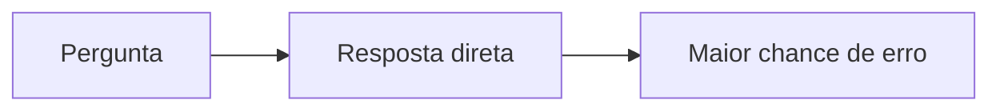
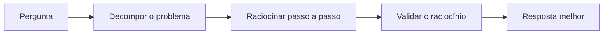

# Engenharia de Prompts

## Prompts

No contexto da IA, especialmente em modelos de linguagem, um **prompt** é uma instrução ou estímulo dado ao sistema para obter uma resposta ou comportamento específico. Geralmente apresentado em forma de texto, o prompt funciona como um gatilho para o modelo de IA, indicando o tipo de informação ou resposta desejada pelo usuário - ou seja, uma espécie de "pergunta" ou "comando" que guia a máquina a gerar respostas.

Prompts podem variar desde perguntas simples, como _"como está o clima hoje?"_, até consultas mais elaboradas. Entretanto, perguntas genéricas tendem a gerar respostas amplas e menos úteis. Para resultados mais precisos e relevantes, recomenda-se fornecer informações específicas, como _"qual é a previsão do tempo em Fortaleza para hoje?"_.

## Prompt de Atuação

Trata-se de uma técnica empregada para **controlar o estilo do texto** gerado por inteligência artificial. Esta abordagem oferece aplicações diversificadas, incluindo o aprimoramento da precisão da IA em tarefas específicas, como a resolução de problemas matemáticos.

A implementação do **Prompting de Atuação** é direta: basta orientar a IA a assumir uma função específica, como _"atuar como crítico de moda"_ ou _"agir como especialista em determinada área"_.

Também conhecida como **Role Prompting**, essa estratégia direciona o modelo a adotar uma perspectiva ou expertise particular, resultando em respostas mais alinhadas ao contexto desejado. Por exemplo, ao solicitar que a IA atue como um professor, as respostas tendem a ser mais didáticas e explicativas.

## Prompt Engineering

**Engenharia de Prompts** é definida como o processo de orientar soluções de inteligência artificial generativa para gerar resultados desejados.

A engenharia de prompts envolve escolher **formatos, frases e símbolos** adequados para orientar a IA, algo especialmente útil para desenvolvedores automatizarem tarefas, explorarem possibilidades e melhorarem a colaboração com o modelo.

### Tipos de técnicas de prompting

| Técnica                       | Descrição                                         |
| ----------------------------- | ------------------------------------------------- |
| **Zero-Shot**                 | Sem exemplos prévios, apenas com instruções       |
| **One-Shot / Few-Shot**       | Fornece alguns exemplos para o modelo seguir      |
| **Chain of Thought (CoT)**    | Raciocínio passo a passo                          |
| **Skeleton of Thought (SoT)** | Estrutura lógica pré-definida                     |
| **Tree of Thought (ToT)**     | Exploração de múltiplos caminhos de raciocínio    |
| **Self-Consistency**          | Execução múltipla para maior confiabilidade       |
| **Directional Stimulus**      | Guia a resposta com comandos direcionais          |
| **ReAct**                     | Combina raciocínio com execução de ações externas |

> **Material complementar:** Para aprofundar, consulte materiais como _Prompt Engineering para Desenvolvedores_ (PDF e cursos disponíveis em diversas plataformas).

### Chain of Thought na prática

Pedir para o modelo "pensar em voz alta" antes de responder muda bastante o resultado. Sem CoT, o modelo tenta acertar a resposta de primeira, o que aumenta a chance de erro em problemas com múltiplas etapas:



Com CoT, o modelo quebra o raciocínio em passos antes de responder:



Um jeito simples de ativar isso na prática é literalmente pedir: _"pense passo a passo antes de responder"_.

## Framework de Prompt

Utilizado por profissionais da área, este framework estrutura-se em **cinco elementos essenciais**: **papel, instruções, perguntas, contexto e exemplos**. Cada componente desempenha uma função estratégica na elaboração do prompt, permitindo compreender não apenas o conteúdo a incluir, mas também **a sequência ideal** de cada elemento para otimizar os resultados gerados por sistemas de inteligência artificial como o ChatGPT.

- **Papel (Role):** Define a persona ou especialização que a IA deve assumir, como "especialista em marketing" ou "professor de matemática".
- **Instruções (Instructions):** Comandos claros e específicos sobre o que você deseja que a IA faça, incluindo formato, tom e estilo da resposta.
- **Perguntas (Questions):** A questão central ou tarefa que você quer que a IA resolva ou responda.
- **Contexto (Context):** Informações relevantes de fundo que ajudam a IA a compreender melhor a situação e gerar respostas mais precisas.
- **Exemplos (Examples):** Amostras concretas do tipo de resposta esperada, especialmente útil em técnicas Few-Shot.

A **sequência dos elementos impacta diretamente o desempenho do modelo**. Questões como _"posicionar a instrução no início do prompt produz o mesmo resultado que posicioná-la no final?"_ são abordadas através de testes práticos e orientações fundamentadas em pesquisas e experiências documentadas.

## Anatomia de um bom prompt: ruim, melhor e ideal

Ver a teoria funcionando ajuda mais do que decorar a lista. Vamos pegar um pedido comum, adaptar um currículo para uma vaga de Analista de Marketing, e refinar o mesmo prompt em três níveis de especificidade.

### Prompt ruim

Um pedido de uma linha, sem contexto, sem critérios e sem formato de saída:

```
Adapte meu currículo para a vaga de Analista de Marketing.
```

O modelo vai responder alguma coisa, mas vai ter que adivinhar o resto. Qual é o currículo? Não há nenhum na conversa. De qual empresa é a vaga, o que vale destacar, em que formato entregar? Sem essas respostas, o resultado costuma ser um texto genérico com dicas de currículo ou, pior, um currículo inventado do zero.

### Prompt melhor

Aqui entram contexto (a empresa e as áreas de experiência) e critérios (linguagem alinhada à vaga e resultados com números):

```
Adapte meu currículo para a vaga de Analista de Marketing na [Nome da Empresa]. Destaque minhas experiências com marketing digital, análise de dados e gestão de campanhas. Use uma linguagem alinhada à descrição da vaga e destaque resultados com números.
```

O salto é grande. Repare no `[Nome da Empresa]`: é um espaço para preencher antes de enviar. Ainda sobra um furo, porém: o modelo só sabe o que está escrito no prompt. Ele não viu o seu currículo nem a descrição da vaga, então "linguagem alinhada à descrição da vaga" é uma instrução que ele não tem como cumprir direito.

### Prompt ideal

O terceiro nível resolve isso anexando o material de referência e organizando as orientações em passos:

Arquivos anexados: `Meu_Curriculo_Atual.pdf`, `Descricao_da_Vaga_Analista_Marketing.pdf`, `Informacoes_Sobre_a_Empresa.pdf`

```
Adapte meu currículo para a vaga de Analista de Marketing com base nos arquivos anexados (meu currículo atual, descrição da vaga e informações sobre a empresa). Siga estas orientações:

- Destaque as experiências e habilidades mais relevantes para os requisitos da vaga.
- Use palavras-chave presentes na descrição da vaga de forma natural.
- Reescreva os pontos do currículo com foco em resultados e impacto, incluindo métricas sempre que possível.
- Ajuste o resumo/perfil para refletir o perfil desejado pela empresa.
- Mantenha um tom profissional, objetivo e alinhado à cultura da empresa.
- Entregue o currículo final em formato pronto para envio (PDF) e uma versão em texto editável.
```

Duas mudanças fazem a diferença aqui. A primeira é o **material de referência**: currículo atual, descrição da vaga e informações da empresa entram como arquivos, então o modelo trabalha com o texto real em vez de uma descrição feita de memória. A segunda é a **estrutura**: o parágrafo corrido vira uma lista de passos, e cada passo cobre uma decisão (o que destacar, quais palavras-chave usar, como escrever os resultados, qual tom, qual formato de entrega). Fica fácil ver o que foi pedido e conferir o que voltou.

### O que muda de um nível para o outro

|                        | Ruim         | Melhor                                             | Ideal                                                                      |
| ---------------------- | ------------ | -------------------------------------------------- | -------------------------------------------------------------------------- |
| Contexto               | nenhum       | empresa e áreas de experiência, escritas no prompt | currículo, vaga e empresa anexados                                         |
| Critérios              | nenhum       | linguagem alinhada à vaga, resultados com números  | palavras-chave, foco em impacto, tom, resumo ajustado ao perfil da empresa |
| Material de referência | nenhum       | descrito no texto                                  | arquivos anexados                                                          |
| Formato de saída       | não definido | não definido                                       | PDF pronto para envio e versão em texto editável                           |

Olhando pelo [Framework de Prompt](#framework-de-prompt): as **instruções** existem nos três níveis, só que cada vez mais detalhadas, e o **contexto** só aparece de verdade no ideal. Os **exemplos** não entram em nenhum (dava para anexar um currículo já adaptado como modelo do resultado esperado). O **papel** também ficou de fora, por exemplo "atue como recrutador da área de marketing", e nem sempre faz falta, mas custa uma linha.

Pelo lado do checklist de [regras de ouro](/labs/ai/engenharia-de-prompt/02-boas-praticas-e-seguranca/), os itens que mais pesam nessa evolução são ter um objetivo claro, separar os inputs (cada arquivo anexado é um bloco), definir o formato de saída e explicitar os critérios.

### Onde até o prompt ideal falha

O prompt ideal pede "métricas sempre que possível", mas não proíbe o modelo de inventar. Se o seu currículo não traz número nenhum, um modelo pode preencher com um "aumentou as vendas em 30%" que soa ótimo e é falso, e num currículo isso vira problema na entrevista. A correção é uma restrição explícita, o último item do checklist ("Incluir restrições"):

```
- Não invente experiências, cargos ou resultados que não estejam no meu currículo. Se faltar um número, deixe o marcador [inserir métrica] para eu preencher.
```

## Prompt de Preparação

O **Prompt de Preparação** é uma técnica avançada em que você primeiro instrui a IA sobre **como deseja que ela se comporte em interações futuras**, estabelecendo regras, formatos e expectativas antes de fazer a pergunta principal.

Essa abordagem é particularmente útil em conversas longas ou quando você precisa que a IA mantenha um padrão consistente ao longo de múltiplas respostas.

**Exemplo:** Você pode preparar a IA dizendo _"Responda sempre de forma concisa, usando bullet points, e cite fontes quando relevante"_ antes de fazer suas perguntas subsequentes.

## Referências

- [Estratégias de design de comandos (Gemini API)](https://ai.google.dev/gemini-api/docs/prompting-strategies?hl=pt-br) - Google AI for Developers, pt-BR
- [Técnicas de engenharia de prompts](https://learn.microsoft.com/pt-br/azure/foundry/openai/concepts/prompt-engineering) - Microsoft Learn, pt-BR
- [Prompting best practices](https://platform.claude.com/docs/en/build-with-claude/prompt-engineering/claude-prompting-best-practices) - Anthropic, en
