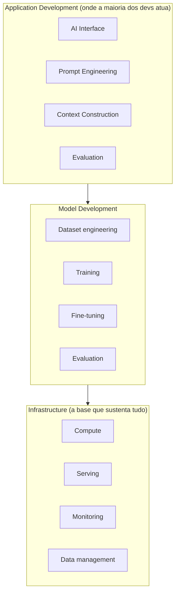
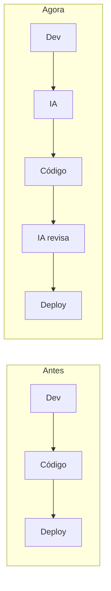

# IA no Desenvolvimento de Software

## As camadas do desenvolvimento com IA

Um jeito útil de organizar mentalmente onde a IA entra no software é pensar em camadas. Software com IA está sendo construído em três camadas, e a maioria dos times de produto atua especificamente na primeira:

- **Application Development:** onde o dev atua diretamente com IA dentro do produto (interface com IA, prompts, construção de contexto, avaliação)
- **Model Development:** responsável por criar e treinar modelos (dataset, treinamento, fine-tuning, avaliação)
- **Infrastructure:** a base que sustenta tudo isso rodando (poder computacional, serving, monitoramento, gestão de dados)

A boa notícia é que a maioria dos devs **não precisa treinar modelo** para trabalhar bem com IA, mas precisa dominar prompt, contexto e avaliação. Esse é o novo skillset do desenvolvimento backend moderno.

## IA como parte do produto

IA deixou de ser só uma ferramenta usada durante o desenvolvimento e virou **parte do próprio produto**. Aplicações tradicionais hoje costumam se encaixar em um destes dois casos:

- Usam IA internamente para entregar uma funcionalidade inteligente
- Ou expõem a IA como o próprio produto

Dentro disso, existem dois tipos de sistema bem diferentes:

1. **Aplicações com IA embutida:** funcionalidades pontuais como autocomplete, recomendação ou análise automática de dados
2. **Agentes de IA:** sistemas autônomos que tomam decisão, executam ações e iteram sozinhos

A diferença entre os dois é importante, veja mais em [O que são agentes de IA](/labs/ai/agents/01-o-que-e/).

## IA como ferramenta no processo de desenvolvimento

Além de aparecer no produto, a IA também mudou o próprio **processo de engenharia**. Alguns usos comuns hoje em dia:

- Análise de problemas e trade-offs
- Apoio à decisão técnica
- Geração de código
- Code review
- Debugging
- Segurança

E a tendência é ir além disso: **codificação por agentes**, **PRs gerados por IA** e **auto-correção de bugs** já são realidade em times mais maduros.

Isso muda o fluxo de trabalho clássico:

## O novo papel do desenvolvedor

Com a IA assumindo parte da execução, o foco do desenvolvedor se desloca para outras responsabilidades:

- Entendimento de domínio
- Arquitetura de soluções
- Integração de sistemas
- Especificação e validação
- Co-autoria com a IA

Em resumo: o dev deixa de ser só executor e passa a ser **orquestrador** do trabalho, tanto o seu quanto o de agentes de IA.

## Pilares do desenvolvimento com IA

Juntando tudo, dá para pensar no desenvolvimento moderno com IA como apoiado em alguns pilares:

- Ferramentas (IDEs, CLIs)
- Prompts
- Modelos e agentes
- Documentação
- Memória
- Ambientes (local, remoto, GitHub)
- MCP Servers (veja mais em [Model Context Protocol](/labs/ai/agents/06-mcp/))
- Skills (veja mais em [Agent Skills](/labs/ai/agents/08-agent-skills/))
- **Workflow**, o centro de tudo

O ponto central aqui não é qual ferramenta você usa, é ter um **workflow bem integrado com IA**: o contexto, por exemplo, virou parte da própria arquitetura do sistema, tema que aparece com mais detalhe em [Context Engineering](/labs/ai/llm/05-context-engineering-e-rag/).
