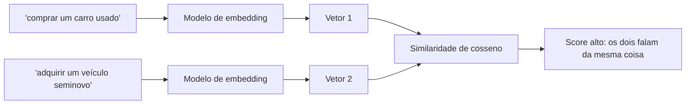

# Embeddings

## O que é um embedding

Um **embedding** é a representação numérica de um texto: uma lista de números (um vetor) que captura o _significado_ daquele texto, não as palavras exatas que ele usa.

Isso já apareceu sem explicação em duas notas anteriores. Em [Context Engineering e RAG](/labs/ai/llm/05-context-engineering-e-rag/), a busca por significado depende de comparar o embedding da pergunta com o embedding de cada documento. Em [Pipeline de RAG em Produção](/labs/ai/llm/08-pipeline-de-rag-em-producao/), cada chunk vira um embedding antes de entrar no índice. Esta nota fecha essa lacuna: o que é esse vetor e por que ele funciona.

A propriedade central é: textos com significado parecido ficam com vetores próximos no espaço vetorial, mesmo usando palavras completamente diferentes. "Comprar um carro usado" e "adquirir um veículo seminovo" viram vetores vizinhos, porque falam da mesma coisa. Uma busca por palavra-chave tradicional (BM25, o mesmo tipo de algoritmo usado por buscadores de site) não pegaria essa relação, já que nenhuma palavra se repete entre as duas frases.

## Como um embedding é gerado

Um **modelo de embedding** é quem faz essa conversão. Ele foi treinado especificamente para transformar texto em vetor, sem gerar texto de volta, diferente de um LLM comum. Alguns exemplos: `text-embedding-3` da OpenAI, os modelos da Voyage AI e modelos abertos disponíveis no Hugging Face.

A **dimensão** do vetor, ou seja, quantos números ele tem, é definida pelo modelo, não pelo tamanho do texto de entrada. Um modelo pode gerar vetores de 384, 768 ou 1536 números, por exemplo, e uma frase de três palavras e um parágrafo inteiro geram vetores da mesma dimensão, só que carregando quantidades diferentes de informação por número.

Dá para gerar embedding em granularidades diferentes:

- **Embedding de palavra:** representa uma palavra isolada. Técnicas mais antigas como Word2Vec e GloVe trabalham nesse nível.
- **Embedding de frase ou parágrafo:** representa um trecho inteiro como um vetor só. É o nível mais usado em busca semântica e RAG.
- **Embedding de documento:** representa um texto inteiro (um artigo, um livro) como um vetor único, útil para comparar documentos entre si.

## Como medir se dois vetores são parecidos

Depois de ter os vetores, falta uma forma de comparar "quão parecidos" eles são. A métrica mais comum é a **similaridade de cosseno**: ela mede o ângulo entre dois vetores, ignorando o tamanho deles. Quanto menor o ângulo, mais parecido o significado.

É exatamente essa comparação que uma busca vetorial faz por baixo dos panos: gera o embedding da pergunta, calcula a similaridade dela contra o embedding de cada documento indexado, e devolve os documentos com maior score. Ver [Arquiteturas de RAG](/labs/ai/llm/06-arquiteturas-de-rag/) para como isso se combina com busca por palavra-chave num pipeline real.

## Referências

- [O que são embeddings vetoriais?](https://www.elastic.co/pt/what-is/vector-embedding) - Elastic, pt-BR
- [Embeddings guide](https://platform.openai.com/docs/guides/embeddings) - OpenAI, en
