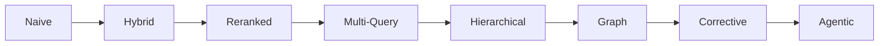
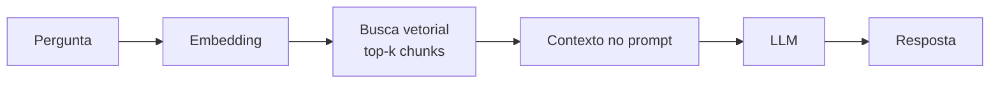
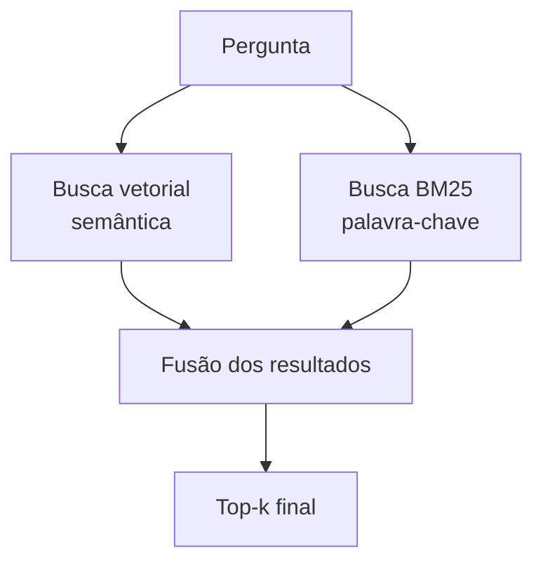
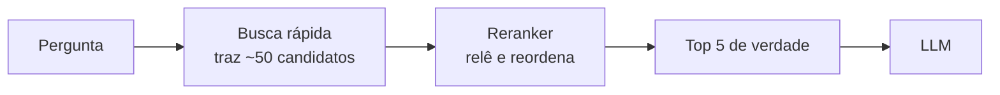
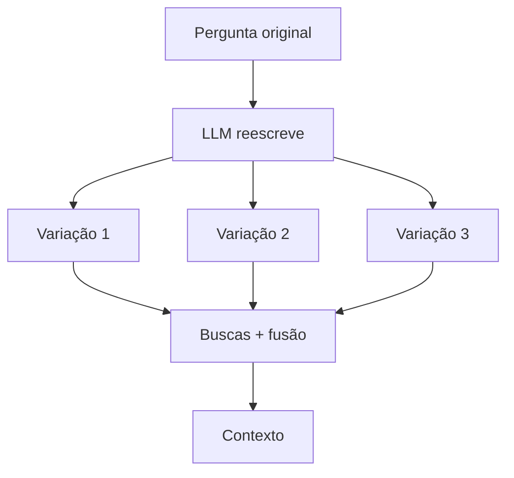
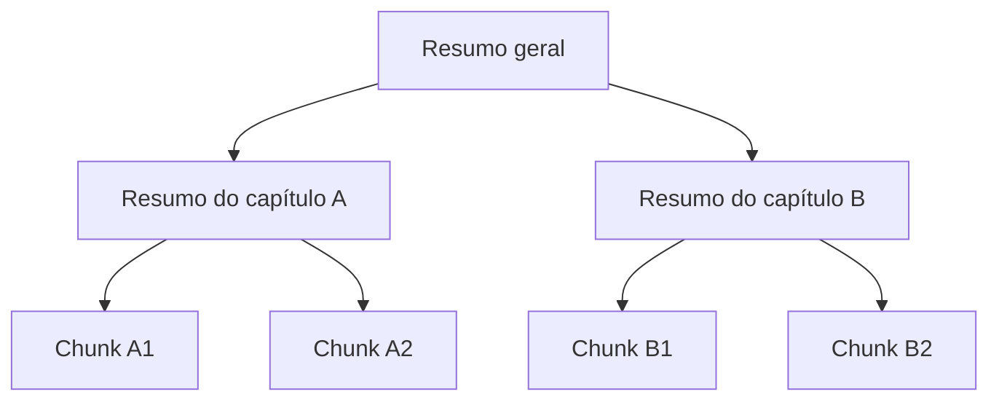
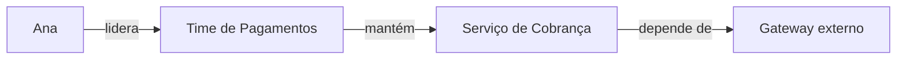
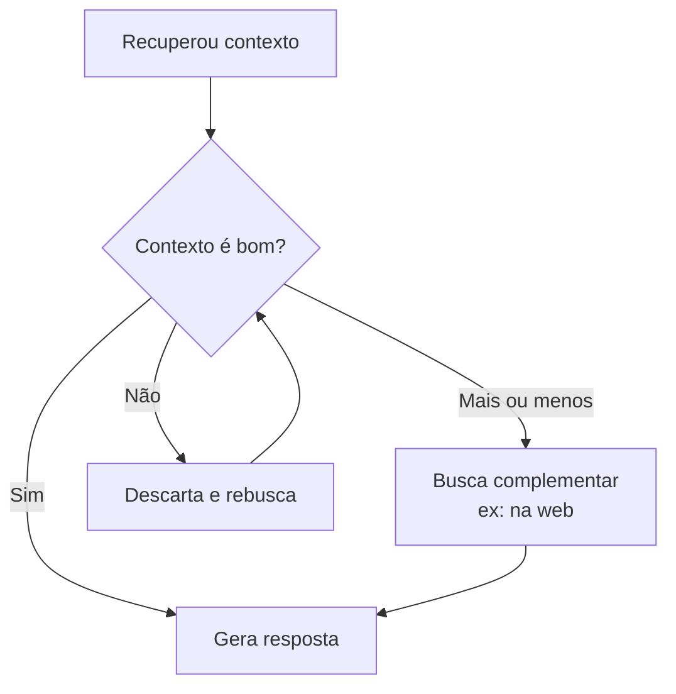
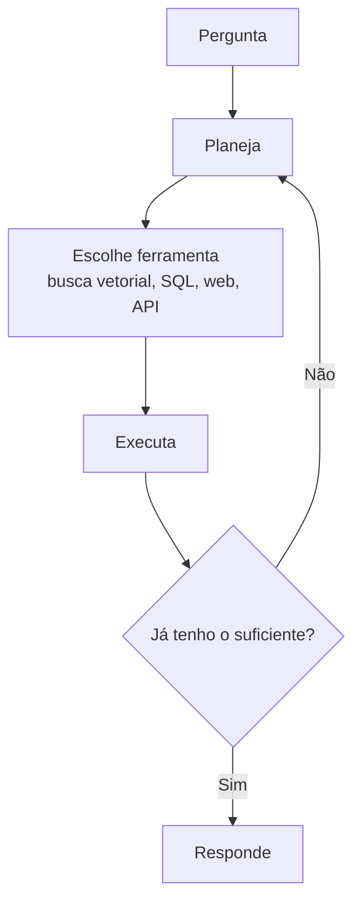

# Arquiteturas de RAG

A nota [Context Engineering e RAG](/labs/ai/llm/04-context-engineering-e-rag/) mostrou o RAG na forma mais simples: transforma a pergunta em vetor, busca os trechos parecidos e joga tudo no prompt. Essa versão resolve os casos fáceis, mas quebra rápido quando a base cresce, quando a pergunta é vaga ou quando a resposta certa está espalhada em vários documentos.

Foi aí que surgiram várias formas de organizar a etapa de busca. Cada uma nasceu para tapar um buraco específico da versão ingênua.

## RAG é um espectro, não uma arquitetura fixa

Não existe "o" jeito de fazer RAG. O que existe é uma escala que vai de "busca e manda pro modelo" até "um agente decide sozinho como e quando buscar".

Quanto mais para a direita, mais controle sobre a qualidade do que é recuperado, e também mais peças para manter, mais latência e mais custo por pergunta.

O conselho prático é começar pela esquerda. Sobe um degrau só quando aparece um problema concreto que o degrau atual não resolve. Montar um pipeline agêntico complexo para responder FAQ de produto é gastar bala de canhão em passarinho.

## Naive RAG

É o ponto de partida, o fluxo "recuperar e depois gerar" sem nenhuma camada extra.

Funciona bem quando a base é pequena, os documentos são homogêneos e as perguntas costumam bater quase palavra por palavra com o texto guardado.

Onde ele começa a falhar:

- A busca vetorial erra quando a pergunta usa termos diferentes dos documentos, ou quando depende de uma sigla, um número de versão ou um nome próprio exato
- Os chunks vêm sem o contexto ao redor, então o modelo recebe um parágrafo solto sem saber de que seção ele veio
- Não há nenhuma verificação: se a busca trouxe lixo, o lixo entra no prompt do mesmo jeito

As arquiteturas seguintes são basicamente respostas a esses três problemas.

## Hybrid RAG

A busca vetorial entende significado, mas é ruim com correspondência exata. A busca por palavra-chave (o velho BM25, o mesmo tipo de algoritmo que um buscador de site usa) é o contrário: acha o termo exato, mas não entende sinônimo.

O Hybrid RAG roda as duas ao mesmo tempo e junta os resultados.

A fusão mais comum é o Reciprocal Rank Fusion: em vez de tentar comparar as pontuações das duas buscas (que estão em escalas diferentes), ele olha só a posição de cada documento em cada lista e soma. Um documento que aparece em segundo lugar na busca vetorial e em quarto na BM25 fica bem colocado no resultado final.

Esse é quase sempre o primeiro upgrade que vale a pena. Custa pouco e resolve o caso chato de "o usuário digitou o código do erro e a busca semântica ignorou".

## Reranked RAG

A busca inicial precisa ser rápida, porque roda sobre a base inteira. Para ser rápida, ela é meio grosseira: compara a pergunta com cada chunk de forma independente.

Um modelo de rerank (um cross-encoder) faz o oposto. Ele lê a pergunta e o chunk juntos, no mesmo passo, e dá uma nota de relevância muito mais precisa. Só que é lento demais para rodar sobre milhares de documentos.

A saída é combinar os dois em duas etapas:

Primeiro a busca barata garante recall alto, ou seja, joga uma rede grande para não deixar de fora o documento certo. Depois o reranker faz a curadoria fina e escolhe os poucos que realmente vão para o prompt.

Ganha em qualidade e ainda ajuda no custo, porque manda menos tokens (e mais bem escolhidos) para o modelo.

## Multi-Query RAG

Quando alguém pergunta "como faço pra parar de receber os e-mails?", a base pode ter a resposta escrita como "cancelar inscrição", "desativar notificações" ou "gerenciar preferências de comunicação". Uma única busca dificilmente cobre todas essas formas.

O Multi-Query RAG pede ao próprio LLM para reescrever a pergunta em três ou quatro variações, roda a busca para cada uma e junta tudo.

Essa técnica também aparece com o nome RAG-Fusion (Multi-Query com Reciprocal Rank Fusion na hora de juntar as listas).

O custo é uma chamada extra de LLM antes de buscar, mais várias buscas em vez de uma. Vale quando as perguntas dos usuários são curtas, informais ou ambíguas. Se elas já vêm bem escritas e específicas, o ganho é pequeno.

## Hierarchical RAG

Chunk pequeno é ótimo para achar o trecho exato, mas ruim para dar o panorama. Chunk grande é o contrário. O RAG hierárquico não escolhe: ele indexa a base em níveis.

A ideia mais conhecida é a do RAPTOR, que agrupa os chunks parecidos, gera um resumo de cada grupo, agrupa os resumos, resume de novo, e assim por diante, formando uma árvore.

Na hora da busca, o sistema pode começar pelos resumos para entender qual parte do documento interessa, e só então descer para os chunks detalhados daquela parte.

Serve bem para documentos longos e estruturados, tipo um manual técnico de 300 páginas ou uma base de contratos, onde a resposta depende de entender a seção antes de ler o parágrafo.

## Graph RAG

Todas as arquiteturas até aqui guardam os documentos como uma pilha de chunks independentes. O Graph RAG troca (ou complementa) esse índice por um grafo de conhecimento: nós são entidades (pessoas, produtos, conceitos) e as arestas são as relações entre elas.

A recuperação vira uma caminhada pelo grafo. Isso destrava dois casos que os outros modelos sofrem:

- **Perguntas multi-hop**, do tipo "qual serviço externo o time da Ana depende?", onde a resposta exige ligar três fatos que estão em documentos diferentes
- **Visão de conjunto**, tipo "resuma os principais temas de reclamação neste trimestre", onde nenhum chunk isolado tem a resposta, ela emerge de juntar muitos

O preço é a construção do grafo. Extrair entidades e relações de um monte de texto é um pré-processamento caro e nem sempre preciso. Costuma valer quando o domínio é muito conectado e as perguntas são analíticas.

O que é um grafo de conhecimento, quando escolher grafo em vez de busca vetorial e como o GraphRAG combina os dois está em [Knowledge Graphs e GraphRAG](/labs/ai/llm/06-knowledge-graphs-e-graphrag/).

## Corrective RAG

As arquiteturas anteriores melhoram a busca, mas ainda confiam cegamente no que ela traz. O Corrective RAG adiciona um passo de conferência antes de gerar a resposta.

Um avaliador (que pode ser outro modelo, menor) classifica os trechos recuperados como relevantes, ambíguos ou irrelevantes. Conforme o resultado, o sistema segue em frente, dispara uma busca extra em outra fonte ou refaz a recuperação com a query ajustada.

Vale citar dois parentes próximos:

- **Self-RAG** treina o modelo para, durante a geração, decidir sozinho quando precisa buscar mais e criticar o próprio rascunho
- **Adaptive RAG** coloca um roteador na entrada: pergunta trivial vai direto pro modelo sem RAG, pergunta média usa RAG simples, pergunta complexa cai num fluxo com mais etapas

É a família certa quando o custo de responder com informação errada é alto, tipo suporte que fala de cobrança ou de política de saúde.

## Agentic RAG

No topo da escala, a recuperação deixa de ser um pipeline fixo. O LLM age como um agente: recebe a pergunta, monta um plano, decide quais fontes consultar, executa as buscas, olha o que voltou e resolve se já pode responder ou se precisa de outra rodada.

Isso permite responder perguntas que misturam fontes ("compare o que o contrato diz com o número que está no banco de dados"), mas herda todos os problemas de agente: pode entrar em loop, gastar muitas chamadas e ficar difícil de depurar quando erra.

Se você ainda não leu, a seção de [Agents](/labs/ai/agents/01-o-que-e/) explica o padrão de agente que está por trás dessa arquitetura.

## Como escolher

Não escolha pela arquitetura mais avançada. Escolha pelo sintoma que você está vendo.

| Sintoma                                              | Arquitetura a testar      |
| ---------------------------------------------------- | ------------------------- |
| A busca ignora códigos, siglas e nomes exatos        | Hybrid RAG                |
| O documento certo é recuperado, mas em posição ruim  | Reranked RAG              |
| Usuários escrevem perguntas curtas e ambíguas        | Multi-Query RAG           |
| Documentos longos, resposta depende da seção         | Hierarchical RAG          |
| Perguntas que ligam fatos de vários documentos       | Graph RAG                 |
| Responder errado sai caro                            | Corrective RAG / Self-RAG |
| A pergunta pode precisar de fontes e passos variados | Agentic RAG               |

Vale lembrar que essas arquiteturas se combinam. Um sistema real de produção costuma ser híbrido com reranking e um passo de correção, não uma única técnica pura. A escala serve para entender o que cada peça adiciona, não para você ter que ficar em um degrau só.

Os trade-offs de latência, custo e complexidade que valem para o RAG básico (visto na nota anterior) só aumentam a cada degrau, então cada camada nova precisa se pagar em qualidade de resposta.
