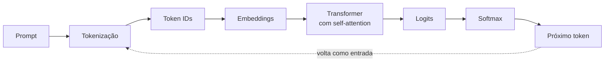

# Como uma LLM gera texto

Quando você manda uma pergunta para um chatbot, a resposta parece sair de uma conversa. Por dentro, o que acontece é bem mais mecânico: o modelo recebe uma sequência de números e calcula, a cada passo, **qual deve ser o próximo token**. Repete isso até a resposta terminar. Conhecer esse caminho, mesmo de forma simplificada, ajuda a entender por que prompts mal organizados dão respostas ruins e por que despejar mais texto no contexto nem sempre resolve.

## O fluxo de inferência

**Inferência** é o momento em que o modelo já treinado é usado para gerar uma resposta (o oposto do treinamento, em que ele aprende). Numa versão simplificada, o caminho de um prompt até a resposta tem estas etapas:



A seta pontilhada é importante: o token escolhido é anexado ao texto e o processo roda de novo para gerar o token seguinte. É por isso que a resposta aparece "digitando" aos poucos.

Saber disso muda a forma de pensar em prompts e contexto. Cada palavra que você coloca na entrada participa do cálculo que decide o próximo token, então informação irrelevante não fica "de lado": ela compete por atenção com a informação útil. Essa ideia reaparece em [Context Engineering](/labs/ai/llm/07-context-engineering-e-rag/).

## Do texto aos embeddings

O modelo não lê letras, ele trabalha com números. As duas primeiras etapas fazem essa conversão:

1. **Tokenização:** o texto é quebrado em tokens (palavras, pedaços de palavras, símbolos). `Inteligência artificial` pode virar algo como `Intelig`, `ência`, ` artificial`. Detalhes em [Tokens em Modelos de Linguagem](/labs/ai/llm/03-tokens/).
2. **Token IDs:** cada token tem um número fixo no vocabulário do modelo. O texto vira uma lista de inteiros, como `[9906, 1917, ...]`.

Um número solto não diz nada sobre o significado. Por isso, cada ID é trocado por um **embedding**: um vetor (uma lista longa de números decimais) que representa o token num espaço onde palavras de sentido parecido ficam próximas. Esse vetor é a entrada real do Transformer. A nota de [Embeddings](/labs/ai/llm/04-embeddings/) explica como esses vetores são gerados e comparados.

Um detalhe que ajuda: o embedding de um token sozinho é o mesmo em qualquer frase. A palavra "manga" (fruta) e "manga" (da camisa) começam com o mesmo vetor. Quem resolve a ambiguidade, olhando para o resto da frase, é a etapa seguinte.

## Transformer e self-attention

O **Transformer** é a arquitetura por trás dos LLMs modernos, apresentada no artigo *Attention Is All You Need* (2017). Ele empilha várias camadas, e o ingrediente central de cada camada é o mecanismo de **self-attention** (autoatenção).

### O papel da atenção

A ideia é simples: para entender um token, o modelo olha para os outros tokens da sequência e decide **quanto cada um importa** naquele momento. Na frase "O banco aprovou o empréstimo porque **ele** tinha limite", a atenção ajuda o modelo a ligar "ele" a "banco". Depois de passar por muitas camadas, o vetor de cada token deixa de ser genérico e passa a carregar o significado dentro daquele contexto.

### Query, key e value

Para calcular isso, cada token gera três vetores a partir do seu embedding:

- **Query (Q):** a pergunta que o token faz, algo como "que informação eu estou procurando?"
- **Key (K):** o rótulo que cada token oferece, algo como "eu tenho este tipo de informação".
- **Value (V):** o conteúdo que o token entrega se for considerado relevante.

A analogia de uma busca ajuda: a query é o que você digita, as keys são os títulos dos resultados e os values são o conteúdo de cada resultado. O modelo compara a query de um token com as keys de todos os outros, o que gera uma pontuação de relevância para cada par. Essas pontuações passam por uma softmax (que vira pesos somando 1) e servem para misturar os values. Na notação do artigo original:

```text
Attention(Q, K, V) = softmax(Q · Kᵀ / √d_k) · V
```

O `√d_k` só mantém os números numa escala razoável. Nos modelos que geram texto, existe ainda uma **máscara causal**: cada token só enxerga os anteriores, nunca os que ainda não foram gerados.

### Várias cabeças de atenção ao mesmo tempo

Rodar o cálculo de atenção uma vez só limita o que o modelo consegue captar: uma única passada tende a convergir para um tipo de relação (por exemplo, só concordância entre sujeito e verbo). A solução do Transformer é a **multi-head attention** (atenção com várias cabeças): em vez de calcular a atenção uma vez com o embedding inteiro, ele divide o embedding em `N` fatias menores e roda o mesmo cálculo de Q, K e V em paralelo, uma vez por fatia. Cada uma dessas execuções é uma **cabeça de atenção**.

Com embeddings de 512 dimensões e 8 cabeças, por exemplo, cada cabeça trabalha com uma fatia de 64 dimensões. Como cada cabeça treina seus próprios pesos, cada uma acaba se especializando num tipo de relação diferente, uma pode aprender a ligar pronomes ao substantivo que referenciam, outra pode focar em concordância verbal, outra em proximidade sintática. No fim, os resultados de todas as cabeças são concatenados de volta num vetor do tamanho original, e é esse vetor que segue para a próxima camada do Transformer.

### Como o modelo sabe a ordem dos tokens

Existe um problema com o cálculo de atenção descrito até aqui: ele compara cada token com todos os outros, mas não usa a posição de nenhum deles. Se você embaralhasse a ordem das palavras de uma frase, a conta de `Q · Kᵀ` daria o mesmo resultado, só que ordem importa muito para o sentido ("o cachorro mordeu o carteiro" não é "o carteiro mordeu o cachorro"). Por isso o Transformer soma informação de posição ao embedding de cada token antes dele entrar nas camadas de atenção, um passo chamado **positional encoding**.

O artigo original de 2017 resolvia isso com um **encoding senoidal**: cada posição recebe um vetor calculado com funções seno e cosseno em frequências diferentes, sem nenhum parâmetro treinado. Duas posições próximas geram vetores parecidos, e o padrão se repete de forma previsível conforme a sequência cresce.

A maioria dos modelos atuais (Llama, entre outros) usa uma técnica mais recente chamada **RoPE** (Rotary Position Embeddings, proposta por Su et al. em 2021). Em vez de somar um vetor de posição ao embedding, o RoPE **rotaciona** os vetores de query e key por um ângulo que depende da posição do token. A vantagem prática: o produto entre uma query e uma key passa a depender só da **distância relativa** entre os dois tokens, não da posição absoluta de cada um. Isso ajuda o modelo a generalizar para textos mais longos do que ele viu no treino, um dos motivos por trás do aumento das janelas de contexto nos últimos anos.

### Por que o custo cresce com o contexto

Cada token é comparado com todos os anteriores. Dobrar o tamanho do contexto faz o número de comparações crescer perto de quatro vezes (crescimento quadrático). Existem otimizações que reduzem esse custo, mas a intuição permanece: contexto maior é mais caro e lento, e a atenção precisa ser repartida entre mais tokens. Isso se conecta ao problema de qualidade discutido em [Context Engineering](/labs/ai/llm/07-context-engineering-e-rag/).

## Logits e softmax

Depois de passar por todas as camadas, o vetor do **último token** da sequência é projetado sobre o vocabulário inteiro. O resultado são os **logits**: uma pontuação bruta para cada token possível (em vocabulários de dezenas de milhares de tokens, são dezenas de milhares de números). Logits podem ser negativos e não somam nada em particular, então ainda não dá para ler como probabilidade.

A **softmax** resolve isso: transforma os logits numa distribuição de probabilidade, com todos os valores entre 0 e 1 somando 1. Um exemplo com o prompt `O céu está`:

| Token candidato | Logit | Probabilidade após softmax |
| --------------- | ----- | -------------------------- |
| ` azul`         | 6,1   | ~ 70%                      |
| ` nublado`      | 4,8   | ~ 19%                      |
| ` limpo`        | 3,9   | ~ 8%                       |
| ` banana`       | -1,0  | ~ 0,1%                     |

Os números são ilustrativos, mas mostram a lógica: o modelo não "sabe" a resposta, ele atribui probabilidades e escolhe a partir delas.

## Escolhendo o próximo token

Com a distribuição em mãos, falta decidir qual token sai. Sempre pegar o mais provável (**decodificação gulosa**) dá respostas previsíveis e, às vezes, repetitivas. Por isso a escolha costuma envolver sorteio controlado, ajustado por parâmetros de amostragem.

### Temperatura, top-k e top-p

- **Temperatura:** os logits são divididos por ela antes da softmax. Valores baixos (perto de 0) deixam a distribuição "afiada", e o token mais provável quase sempre ganha. Valores altos achatam a distribuição e dão chance a tokens menos prováveis, o que rende respostas mais variadas e também mais arriscadas.
- **Top-k:** só os `k` tokens mais prováveis entram no sorteio (por exemplo, `k = 40`).
- **Top-p (nucleus sampling):** entram os tokens mais prováveis até que a soma das probabilidades chegue a `p` (por exemplo, `0,9`). O número de candidatos muda conforme a confiança do modelo.

### O loop autoregressivo

O token sorteado é anexado ao texto, e o fluxo inteiro roda de novo para o próximo token. Esse ciclo é chamado de **autoregressivo**, e só termina quando o modelo emite um token especial de fim de resposta ou atinge o limite de tokens configurado. Uma consequência prática: um erro no meio da resposta influencia todos os tokens seguintes, porque eles são gerados a partir do que já foi escrito.

### Por que a mesma pergunta gera respostas diferentes

Como há sorteio, perguntar duas vezes a mesma coisa pode dar textos diferentes. Com temperatura próxima de 0 a resposta fica bem mais estável, embora nem sempre idêntica, já que detalhes de execução nos servidores também podem provocar pequenas variações.

### Parâmetros de amostragem na prática

Ao consumir um modelo por API, esses parâmetros aparecem como `temperature`, `top_p` e `max_tokens` (o nome exato varia por provedor). Um ponto de partida razoável:

- Tarefas que pedem precisão, como extração de dados, classificação ou geração de código: temperatura baixa.
- Tarefas criativas, como brainstorm e textos livres: temperatura mais alta.
- Mudar temperatura e top-p ao mesmo tempo dificulta entender o efeito de cada um. Ajuste um por vez.

Alguns provedores restringem ou ignoram esses parâmetros em certos modelos, então vale conferir a documentação do provedor usado.

## Referências

- [Transformer Explainer](https://poloclub.github.io/transformer-explainer/) - Georgia Tech (Polo Club), en. Ferramenta interativa que mostra tokenização, atenção, logits e temperatura num GPT-2 rodando no navegador.
- [Transformer Explainer: Learning LLM Transformers with Interactive Visual Explanation and Experimentation](https://arxiv.org/pdf/2408.04619) - Cho et al., en
- [Attention Is All You Need](https://arxiv.org/abs/1706.03762) - Vaswani et al., en
- [RoFormer: Enhanced Transformer with Rotary Position Embedding](https://arxiv.org/abs/2104.09864) - Su et al., en
