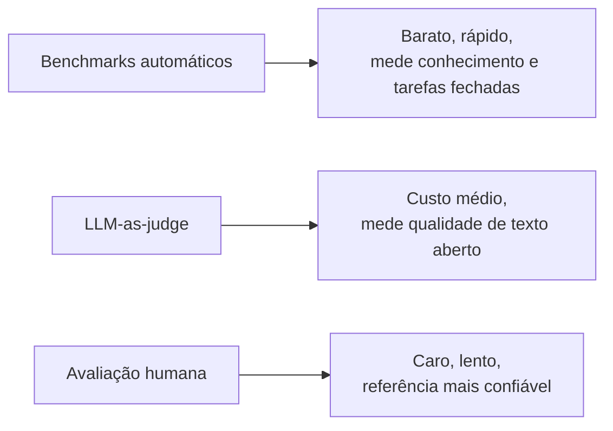

# Avaliação de LLMs

Depois de treinar (ou escolher) um modelo, sobra a pergunta prática: ele é bom o suficiente? "Bom" para uma LLM não é uma nota única, é um conjunto de medidas diferentes, cada uma respondendo a uma pergunta específica: o modelo sabe fatos? Escreve código que funciona? Responde do jeito que um humano prefere? Avaliar é medir cada uma dessas dimensões, de preferência antes de colocar o modelo em produção e de novo sempre que ele mudar.

## Por que avaliar

Trocar de modelo, ajustar um prompt ou aplicar fine-tuning muda o comportamento do sistema, às vezes de um jeito que só aparece em casos específicos. Sem uma forma de medir isso, a avaliação vira "parece que ficou melhor", o que não escala e não pega regressões. Um conjunto de avaliação serve como um teste de regressão para comportamento de linguagem: roda a versão nova contra o mesmo conjunto de perguntas e compara com a versão antiga antes de subir para produção.

Existem três famílias de método, cada uma com um custo e uma precisão diferentes:

## Benchmarks automáticos

Um benchmark é um conjunto fixo de perguntas com gabarito, e a nota sai comparando a resposta do modelo com esse gabarito, sem intervenção humana. Dois dos mais citados:

- **MMLU** (Massive Multitask Language Understanding): 57 matérias diferentes, de direito a medicina a matemática, em formato de múltipla escolha. Mede conhecimento geral e raciocínio básico.
- **HumanEval**: 164 problemas de programação em Python, cada um com testes automatizados. A métrica usada é o **pass@k**: a chance de pelo menos uma entre `k` respostas geradas passar em todos os testes. `pass@1` mede acerto na primeira tentativa; `pass@10` dá ao modelo dez chances.

Um cuidado importante: modelos recentes já **saturam** benchmarks antigos. O MMLU, por exemplo, tem modelos passando de 88% de acerto, o que deixa pouca margem para diferenciar um modelo bom de um ótimo. Quando isso acontece, a comunidade migra para benchmarks mais difíceis (como o GPQA, com perguntas de nível de doutorado) ou específicos do domínio que importa para o seu caso de uso. Vale desconfiar de qualquer comparação de modelos feita só com um benchmark saturado.

## Como montar um dataset de avaliação

Os benchmarks públicos vistos acima medem conhecimento geral e tarefas fechadas, mas não dizem nada sobre o caso de uso específico da sua aplicação. Um assistente que responde sobre a política de reembolso de uma empresa não aparece em nenhum benchmark público, a única forma de saber se ele funciona bem é montar um conjunto de avaliação próprio, às vezes chamado de **golden dataset**.

### De onde tirar os exemplos

- **Casos reais de produção**: perguntas que usuários de verdade fizeram, coletadas dos logs da aplicação (anonimizando qualquer dado sensível)
- **Casos de erro conhecidos**: toda vez que alguém encontra uma resposta errada, esse caso vira um item novo no dataset, do mesmo jeito que um teste de regressão nasce de um bug encontrado
- **Casos escritos à mão**: perguntas criadas para cobrir tópicos, níveis de dificuldade e formulações que os logs ainda não têm, incluindo casos difíceis de propósito

### O que cada exemplo precisa ter

- **Entrada**: a pergunta ou prompt exato que vai ser mandado ao modelo
- **Resposta esperada ou critério de aceitação**: nem toda tarefa tem uma resposta única correta, então às vezes o item traz um critério ("a resposta deve citar o prazo de 7 dias e não pode prometer reembolso automático") em vez de um texto fixo para comparar
- **Categoria e dificuldade**: marcar que tipo de caso é aquele (fácil, difícil, edge case) ajuda a filtrar e entender depois onde o modelo costuma falhar

### Tamanho para começar

Não é preciso um dataset gigante para começar a medir algo. Um conjunto pequeno, de 20 a 50 exemplos bem escolhidos cobrindo os comportamentos mais importantes, já pega regressões óbvias antes de subir uma mudança. Esse conjunto cresce com o tempo, geralmente até algumas centenas de itens, para refletir melhor a distribuição real de perguntas em produção.

### Manter o dataset vivo

Um dataset de avaliação não é estático:

- Toda falha real encontrada em produção vira um item novo
- Rótulos e critérios são revisados quando a política ou o comportamento esperado muda
- Casos que testam um comportamento removido de propósito saem do conjunto
- O dataset fica sob controle de versão, com histórico de mudanças, como qualquer outro artefato de teste do sistema

Rodar esse conjunto antes de qualquer mudança de modelo, prompt ou fine-tuning é o que transforma "parece que melhorou" numa comparação objetiva entre a versão antiga e a nova, o mesmo princípio de teste de regressão visto na introdução desta nota.

## LLM-as-judge

Boa parte do que uma LLM faz não tem gabarito único: resumir um texto, responder uma pergunta aberta ou manter um tom de conversa não é múltipla escolha. Para esses casos, virou comum usar **outra LLM como avaliadora**: você manda a pergunta, a resposta do modelo testado e um critério de julgamento, e o juiz devolve uma nota ou uma escolha entre duas respostas.

Funciona surpreendentemente bem: em testes do projeto MT-Bench, um juiz forte (como o GPT-4 na época do paper) concordou com avaliadores humanos em mais de 80% dos casos, taxa parecida com a concordância entre dois humanos avaliando a mesma resposta. A vantagem é o custo, LLM-as-judge sai centenas de vezes mais barato que contratar avaliadores humanos para o mesmo volume de perguntas.

O método tem limitações conhecidas: o juiz tende a preferir respostas mais longas, favorece o estilo do próprio modelo que o gerou e pode ser manipulado por um texto que "parece" convincente sem estar correto. Por isso costuma vir acompanhado de uma amostra de checagem humana, para calibrar se o juiz está julgando direito.

## Avaliação humana e arenas

A forma mais confiável (e mais cara) de avaliar é colocar pessoas de verdade lendo e comparando respostas. O formato mais usado hoje é o de **arena**: duas respostas de modelos diferentes aparecem lado a lado, sem identificação, e quem avalia escolhe qual prefere.

O **Chatbot Arena**, mantido pelo LMSYS (o mesmo grupo por trás do RouteLLM, visto em [Model Routing](/labs/ai/llm/12-model-routing/)), é o exemplo mais conhecido: milhares de votos anônimos alimentam um ranking calculado por **Elo**, o mesmo sistema de pontuação usado no xadrez, em que cada vitória ou derrota ajusta a posição relativa dos modelos no ranking. Como o ranking vem de preferência humana real em conversas variadas, ele costuma refletir melhor "qual modelo as pessoas preferem usar" do que um benchmark de múltipla escolha.

## Como combinar os métodos

Nenhum método sozinho conta a história toda. Um caminho comum na prática:

- Usar **benchmarks automáticos** para checagens rápidas e frequentes (a cada mudança de prompt ou modelo), porque rodam em minutos e sem custo de avaliador
- Usar **LLM-as-judge** para avaliar qualidade de texto aberto em volume, com uma amostra revisada por humano de tempos em tempos para calibrar o juiz
- Reservar **avaliação humana** para decisões grandes (trocar de modelo em produção, validar uma mudança de fine-tuning) ou para os casos em que o LLM-as-judge mostrou baixa confiança

O ponto comum com a avaliação de retrieval vista em [Pipeline de RAG em Produção](/labs/ai/llm/10-pipeline-de-rag-em-producao/) é o mesmo: métrica automática pega a maioria dos problemas rápido, mas uma amostra revisada por humano continua sendo necessária para pegar o que a métrica não enxerga.

## Referências

- [30 LLM evaluation benchmarks and how they work](https://www.evidentlyai.com/llm-guide/llm-benchmarks) - Evidently AI, en
- [Judging LLM-as-a-Judge with MT-Bench and Chatbot Arena](https://arxiv.org/abs/2306.05685) - Zheng et al. (LMSYS/UC Berkeley), en
- [Golden Dataset: Role In Custom LLM Evals](https://arize.com/resource/golden-dataset/) - Arize AI, en
