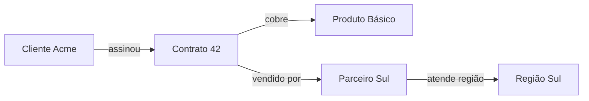
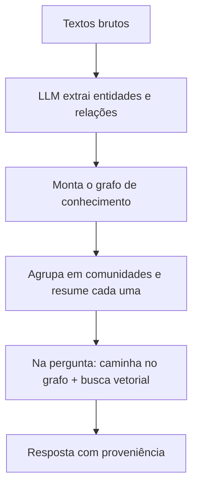

# Knowledge Graphs e GraphRAG

## RAG ou Graph? Comece pelo problema

Essa dúvida aparece muito: "vou usar RAG ou um grafo?". Ela começa errada. A pergunta certa é qual problema você está tentando resolver, e cada tipo de problema pede um tipo de busca diferente.

- Se você quer saber **o que os documentos dizem** sobre um assunto, RAG por busca vetorial resolve. É o caso do [RAG clássico](/labs/ai/llm/04-context-engineering-e-rag/): a pergunta vira um vetor, o sistema acha os trechos mais parecidos e joga no prompt.
- Se você quer saber **como as coisas se relacionam**, quais clientes assinaram quais contratos, que produto depende de qual fornecedor, um knowledge graph responde melhor. A informação que interessa não está no texto de um parágrafo, está nas ligações entre as entidades.
- Se você precisa das duas coisas ao mesmo tempo, existe o GraphRAG, que combina as duas formas de busca.

O erro comum é tratar RAG e grafo como concorrentes, como se um fosse substituir o outro. São formas de organizar e recuperar informação que servem para perguntas diferentes, e num sistema grande é normal ter as duas.

## O que é um knowledge graph

Um **knowledge graph** (grafo de conhecimento) é uma forma de guardar informação em que o que importa são as conexões. Ele tem dois elementos:

- **Nós**: as entidades. Pessoas, produtos, contratos, times, processos, cidades, qualquer "coisa" do seu domínio.
- **Arestas**: as relações entre essas entidades. "assinou", "trabalha em", "depende de", "é fornecedor de".

A unidade básica é a **tripla**, no formato sujeito, predicado, objeto (essa é a ideia do modelo RDF, um padrão da W3C para representar esse tipo de dado). Cada tripla é um fato:

```
(Cliente Acme) --assinou--> (Contrato 42)
(Contrato 42) --cobre--> (Produto Básico)
(Contrato 42) --vendido por--> (Parceiro Sul)
```

Juntando várias triplas, você tem um grafo:



O ponto forte desse formato é que tanto uma pessoa quanto um programa conseguem "andar" pelas ligações e tirar conclusões que não estavam escritas em lugar nenhum. Ninguém registrou "o Parceiro Sul tem relação com o Produto Básico", mas dá para chegar nisso seguindo o caminho Acme, Contrato 42, Produto Básico e Parceiro Sul.

Grafos de conhecimento não nasceram com a IA generativa. Motores de busca, sistemas de recomendação, antifraude e integração de dados de sistemas diferentes já usam esse modelo há anos.

## O que muda em relação ao RAG vetorial

O RAG por busca vetorial recupera trechos de texto por **proximidade semântica**: ele acha os pedaços de documento que "falam parecido" com a pergunta. Isso funciona muito bem para perguntas do tipo "o que a política de reembolso diz sobre produtos digitais?".

Onde esse modelo tropeça:

- **Perguntas multi-hop**, que exigem ligar fatos que estão em documentos separados. "Qual parceiro atende a região do cliente que assinou o contrato com maior valor?" não é uma frase que está escrita em nenhum chunk, a resposta se monta pulando de um fato para o outro.
- **Visão de conjunto**, tipo "quais os temas mais comuns de reclamação neste trimestre?". Nenhum trecho isolado tem essa resposta, ela vem de agregar muitos.

No grafo, a recuperação é uma **caminhada pelas relações**. Você parte de uma entidade e segue as arestas que interessam. O resultado é exato (a relação existe ou não existe, não é uma questão de "parecido") e rastreável: dá para mostrar exatamente quais ligações levaram até a resposta, o que ajuda em auditoria e em confiança no sistema.

| A pergunta é sobre...                        | Melhor caminho  |
| -------------------------------------------- | --------------- |
| O que um texto diz sobre um tema             | RAG vetorial    |
| Como entidades se conectam entre si          | Knowledge graph |
| Ligar fatos de vários documentos (multi-hop) | Knowledge graph |
| Um pouco de cada                             | GraphRAG        |

## GraphRAG: juntando os dois

**GraphRAG** é RAG em que o caminho de recuperação passa por um grafo de conhecimento. O termo foi popularizado pela Microsoft Research, que publicou uma implementação com esse nome em 2024.

O fluxo, de forma simplificada:



Primeiro um LLM lê os documentos e extrai as entidades e as relações, montando o grafo. Esse grafo é agrupado em "comunidades" (conjuntos de nós muito conectados entre si), e cada comunidade ganha um resumo. Na hora da pergunta, o sistema usa tanto a caminhada pelo grafo quanto a busca vetorial tradicional, e ainda pode usar os resumos de comunidade para perguntas de visão geral.

O ganho é responder bem perguntas analíticas e que dependem de conexões, mantendo a proveniência de cada fato usado. Do lado do RAG, esse é o mesmo degrau descrito como Graph RAG em [Arquiteturas de RAG](/labs/ai/llm/05-arquiteturas-de-rag/), só que aqui o foco é o grafo em si, não a escala de arquiteturas de recuperação.

## O custo de manter um grafo

Grafo de conhecimento não sai de graça:

- **Construir o grafo** a partir de texto é um pré-processamento caro. A extração de entidades e relações é feita por LLM ou por modelos de NLP, e erra: cria entidades duplicadas ("Acme", "Acme Ltda", "ACME"), inventa relações, perde outras.
- **Manter o grafo** conforme os dados mudam dá trabalho contínuo. Contrato novo, cliente que trocou de plano, fornecedor que saiu, tudo isso precisa ser refletido.

Por isso a regra prática que costuma aparecer: o grafo só compensa quando a **relação entre as entidades importa mais que a similaridade entre os textos**. Se a sua necessidade é "chat com os PDFs da empresa", RAG vetorial puro é mais barato, mais rápido e suficiente. Se as perguntas são do tipo "quem depende de quê" e "qual o impacto de mexer aqui", aí o grafo se paga.

## Onde isso entra numa arquitetura de IA corporativa

Num sistema de IA de empresa, RAG e grafo raramente aparecem sozinhos. O desenho comum combina:

- **Busca semântica** para recuperar texto por significado
- **Relacionamentos estruturados** (o grafo, ou um banco relacional bem modelado) para as conexões entre entidades
- **LLM** como a peça que interpreta a pergunta e redige a resposta
- **Governança e rastreabilidade**: registro de quais fontes e quais caminhos foram usados, controle de quem pode ver o quê

A ideia por trás disso é que IA corporativa não é só encontrar respostas, é entender contexto, conexões e impacto de uma decisão. E a escolha entre RAG, grafo ou os dois começa pelo problema de negócio que você tem na frente, não pela tecnologia que está em alta.

## Referências

- [O que é um gráfico de conhecimento?](https://www.ibm.com/br-pt/think/topics/knowledge-graph) - IBM, pt-BR
- [IA Generativa - GraphRAG x RAG](https://www.cienciaedados.com/ia-generativa-graphrag-x-rag/) - Ciência e Dados, pt-BR
- [Criar uma base de conhecimento com gráficos do Amazon Neptune](https://docs.aws.amazon.com/pt_br/bedrock/latest/userguide/knowledge-base-build-graphs.html) - AWS (documentação oficial), pt-BR
- [Project GraphRAG](https://www.microsoft.com/en-us/research/project/graphrag/) - Microsoft Research, en
- [GraphRAG: Unlocking LLM discovery on narrative private data](https://www.microsoft.com/en-us/research/blog/graphrag-unlocking-llm-discovery-on-narrative-private-data/) - Microsoft Research, en
