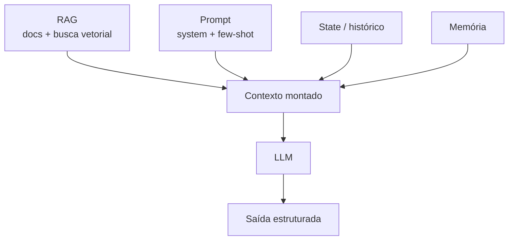
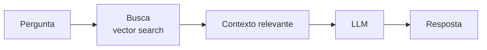
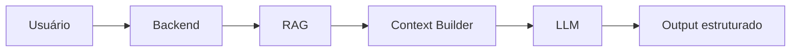

# LLMs

## Context Engineering

Se prompt engineering é sobre **o que escrever** para a IA, **Context Engineering** é sobre **o que colocar à disposição dela** antes de escrever qualquer coisa. É a disciplina de montar, organizar e limitar tudo que o modelo enxerga antes de gerar uma resposta.

O contexto de um LLM em produção normalmente é montado a partir de várias fontes:

- **RAG** (documentos e busca vetorial)
- **Prompt** (instruções de sistema + exemplos few-shot)
- **State / histórico** da conversa
- **Memória** (informações que persistem entre interações)
- **Saída estruturada** (formato esperado, como JSON ou chamadas de ferramenta)

### O limite do contexto

Todo modelo tem uma **janela de contexto finita**, ou seja, um limite de quanto texto ele consegue "enxergar" de uma vez (medido em tokens). Isso força decisões constantes:

- O que **incluir** no contexto?
- O que **remover** por não ser mais relevante?
- O que **resumir** em vez de manter na íntegra?

Um bom Context Engineering pensa em cinco tipos de informação para decidir o que entra no contexto:

1. **O que saber** (fatos, dados relevantes)
2. **Como agir** (instruções, regras)
3. **O que já aconteceu** (histórico da conversa/execução)
4. **O que lembrar** (memória de longo prazo)
5. **Em qual formato responder** (estrutura de saída esperada)

### Context window é capacidade, Context Engineering é qualidade

A janela de contexto diz **quanto cabe**. Ela não diz o quanto o modelo consegue aproveitar do que coube. Uma frase que resume bem a diferença: *context window é capacidade, Context Engineering é qualidade*. Um modelo com janela de 1 milhão de tokens aceita um livro inteiro no prompt, mas isso não garante que vá usar bem cada página.

Boa parte do motivo vem de como o modelo processa a entrada: a [atenção do Transformer](/labs/ai/llm/05-como-uma-llm-gera-texto/) reparte o foco entre todos os tokens, então cada trecho irrelevante que entra no prompt disputa espaço com o que importa.

#### Context rot

**Context rot** ("apodrecimento do contexto") é o nome dado à queda de qualidade das respostas conforme o contexto cresce, mesmo quando a janela está longe de encher. Em um relatório técnico de 2025, a Chroma testou 18 modelos e viu que eles não usam o contexto de forma uniforme: o desempenho fica menos confiável à medida que a entrada aumenta, principalmente quando há trechos parecidos com a resposta certa (distratores) ou quando a pergunta e a informação buscada são semanticamente distantes. O efeito varia de modelo para modelo e de tarefa para tarefa, então vale tratar como uma tendência a medir no seu caso, não como uma lei.

#### Lost in the middle

Um resultado mais antigo, do artigo *Lost in the Middle* (Liu et al., 2024), mostra um padrão parecido com posição: o desempenho costuma ser melhor quando a informação relevante está no **início ou no fim** do contexto, e cai quando ela está **no meio** de um contexto longo. Em perguntas sobre vários documentos, mudar só a posição do documento certo já alterava o resultado.

#### O que fazer com isso

O trabalho de Context Engineering passa a ser escolher, a cada chamada, o que entra:

- **Relevância:** colocar só o que ajuda naquela tarefa. Menos trechos, mas os certos, costuma render mais que "manda tudo".
- **Ruído:** remover conteúdo repetido, resultados de ferramentas já usados e histórico que não influencia mais a resposta.
- **Organização:** deixar instruções e a informação decisiva em posições de destaque (começo ou fim), com estrutura clara (títulos, delimitadores).
- **Resumo e recuperação sob demanda:** resumir o histórico antigo e buscar detalhes com RAG só quando a pergunta exigir, em vez de carregar tudo o tempo todo.

## RAG (Retrieval-Augmented Generation)

**RAG** é uma técnica para **injetar contexto dinâmico e atualizado** em um LLM, buscando informação relevante em uma base de dados externa antes de gerar a resposta, em vez de depender só do que o modelo aprendeu durante o treinamento.

A técnica foi formalizada no artigo _"Retrieval-Augmented Generation for Knowledge-Intensive NLP Tasks"_ (Lewis et al., 2020), e virou um dos padrões mais usados para dar "memória externa" a um LLM.

### De onde vêm os dados

Um sistema de RAG pode buscar informação em fontes bem variadas:

- PDFs
- Páginas web
- Google Docs, Notion e outras ferramentas de documentação
- Bancos de dados internos

### Como funciona o fluxo

Na prática: o texto da pergunta é transformado em um vetor numérico (embedding), esse vetor é comparado com os vetores dos documentos já indexados para achar os trechos mais parecidos semanticamente, e só esses trechos entram no prompt enviado ao LLM.

### Por que isso importa

RAG ajuda a resolver três problemas comuns de LLMs usados sozinhos:

- **Falta de contexto** sobre dados privados ou específicos de um domínio
- **Alucinação**, quando o modelo "inventa" uma resposta plausível mas incorreta
- **Desatualização**, já que o treinamento do modelo tem uma data de corte

### Trade-offs

RAG não é de graça: ele adiciona uma etapa de busca antes da geração, o que aumenta **latência**, **custo** (mais chamadas, mais tokens de contexto) e **complexidade** do sistema (é preciso manter um índice de busca atualizado).

O fluxo mostrado aqui é a versão mais simples. Quando a base cresce ou as perguntas ficam mais difíceis, essa busca ganha camadas extras, o assunto da nota [Arquiteturas de RAG](/labs/ai/llm/08-arquiteturas-de-rag/).

## Arquitetura de um sistema com IA e RAG

Juntando Context Engineering e RAG, uma arquitetura comum de backend com IA fica assim:

O **Context Builder** é a peça que junta tudo: o que veio do RAG, o histórico da conversa, a memória de longo prazo e as instruções do sistema, montando o prompt final que vai para o LLM.

Fine-tuning é a outra forma de mudar o comportamento do modelo, veja a comparação entre os dois em [Fine-Tuning](/labs/ai/llm/11-fine-tuning/).

## Referências

- [Context Rot: How Increasing Input Tokens Impacts LLM Performance](https://www.trychroma.com/research/context-rot) - Chroma, en
- [Lost in the Middle: How Language Models Use Long Contexts](https://aclanthology.org/2024.tacl-1.9/) - Liu et al., TACL 2024, en
