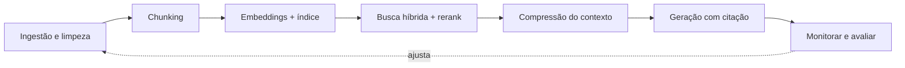

# Pipeline de RAG em Produção

## Da demo para produção

O fluxo mais simples de RAG cabe numa frase: documentos viram embeddings, os embeddings ficam guardados num vector database, e na hora da pergunta o sistema busca os mais parecidos e manda pro LLM. Isso é o suficiente para uma demo, e é exatamente o que a nota [Context Engineering e RAG](/labs/ai/llm/05-context-engineering-e-rag/) mostra na versão mínima.

Colocar isso em produção, respondendo com precisão sobre milhares (ou milhões) de documentos reais, exige bem mais etapas ao redor desse núcleo. O desafio não costuma ser gerar embeddings, isso qualquer biblioteca faz. O difícil é manter a recuperação boa conforme os documentos mudam, o schema dos dados muda e as perguntas dos usuários mudam.

As próximas seções seguem essas etapas na ordem, do dado bruto até o sistema já rodando em produção.

## Ingestão e preparação dos dados

Antes de qualquer busca funcionar, o conteúdo precisa entrar no sistema. As fontes mais comuns num ambiente corporativo são PDFs, páginas de site, bancos de dados internos, APIs de terceiros, SharePoint e CRM, a mesma lista de fontes citada em [Context Engineering e RAG](/labs/ai/llm/05-context-engineering-e-rag/).

O que muda em produção é o que acontece entre "puxar o dado" e "indexar o dado":

- **Limpar**: tirar cabeçalho e rodapé repetido, marcação HTML sobrando, texto duplicado, tabela mal extraída de PDF.
- **Normalizar**: padronizar formato de data, encoding, capitalização, remover espaços e quebras de linha esquisitas.
- **Enriquecer com metadados**: anexar a cada documento informações como data de criação, autor, departamento, versão, nível de confidencialidade. Esses metadados não entram na busca por similaridade, mas viram um filtro poderoso depois (ver "Da busca ao contexto" abaixo).

Pular essa etapa é uma causa comum de RAG que "funciona no notebook e falha em produção": o índice fica cheio de lixo, e lixo bem parecido semanticamente com a pergunta ainda é lixo.

## Chunking: como dividir os documentos

Um documento inteiro raramente cabe (ou faz sentido) como uma unidade só de busca. **Chunking** é dividir o texto em pedaços menores antes de gerar o embedding de cada um.

Algumas estratégias comuns:

- **Tamanho fixo**: corta a cada N caracteres ou tokens. Simples de implementar, mas ignora a estrutura do texto, pode cortar uma frase ao meio.
- **Por sentença ou parágrafo**: respeita as fronteiras naturais do texto, evitando cortes no meio de uma ideia.
- **Semântica**: agrupa sentenças cujos embeddings são parecidos entre si, e só começa um chunk novo quando o assunto muda de verdade. Fica mais preciso, mas custa mais caro (cada sentença passa pelo modelo de embedding antes de decidir onde cortar).

Um detalhe que ajuda bastante: o **overlap**, uma sobreposição entre chunks vizinhos (na prática, os últimos parágrafos de um chunk se repetem no início do próximo). Um overlap de 10% a 20% do tamanho do chunk evita que uma frase importante fique cortada exatamente na fronteira entre dois pedaços.

O tamanho do chunk é um trade-off:

| Chunk pequeno (~128-256 tokens) | Chunk grande (~512-1024 tokens)        |
| ------------------------------- | -------------------------------------- |
| Busca mais precisa, menos ruído | Mais contexto ao redor do trecho       |
| Perde o contexto da vizinhança  | Busca menos precisa (mistura assuntos) |

Um ponto de partida razoável é algo entre 200 e 500 tokens por chunk, com 10% a 20% de overlap, e ajustar a partir daí conforme o tipo de documento. Documentos muito longos e estruturados, como manuais técnicos, se beneficiam de indexar em vários níveis de granularidade ao mesmo tempo, o assunto do Hierarchical RAG em [Arquiteturas de RAG](/labs/ai/llm/06-arquiteturas-de-rag/).

## Da busca ao contexto

Com os chunks indexados, a etapa de busca em produção também ganha camadas que a versão de demo não tem:

- **Reescrever a pergunta** antes de buscar, porque a forma como o usuário escreve nem sempre bate com a forma como o documento está escrito.
- **Busca híbrida**, combinando busca vetorial (semântica) com busca por palavra-chave, para não perder um código de erro ou uma sigla exata que a busca semântica ignora.
- **Filtrar por metadado** (aqueles que a etapa de ingestão anexou) para restringir a busca, por exemplo, só documentos do departamento certo ou só versões atuais, e depois **reranking** para reordenar os candidatos pela relevância real à pergunta.

Cada uma dessas técnicas já tem uma seção própria e mais aprofundada em [Arquiteturas de RAG](/labs/ai/llm/06-arquiteturas-de-rag/) (Hybrid RAG, Reranked RAG e Multi-Query RAG cobrem exatamente isso). Aqui elas entram como etapas do pipeline maior, não como uma explicação nova.

## Compressão do contexto recuperado

Mesmo depois de filtrar e reordenar, os chunks que sobram no top da lista ainda costumam ter trecho sobrando: um parágrafo inteiro quando só uma frase respondia à pergunta, ou um chunk relevante misturado com outro que não é.

A **compressão de contexto** ataca isso: antes de montar o prompt final, cada chunk recuperado passa por uma etapa que extrai só a parte que interessa para aquela pergunta específica (ou descarta o chunk inteiro, se no fim ele não ajuda). O LangChain chama esse componente de "contextual compression retriever", e ele pode usar um LLM pequeno para fazer esse corte ou uma técnica mais simples de filtragem.

O ganho é direto: menos texto ruim ocupando espaço na janela de contexto do LLM, o que deixa espaço para mais chunks realmente úteis e reduz o custo de tokens por pergunta.

## Gerar a resposta com citação da fonte

A última etapa antes de devolver a resposta é gerar o texto final, mas um sistema de produção não entrega só o texto: entrega o texto com a **citação de onde cada informação veio** (o nome do documento, a seção, às vezes o link).

Isso importa por dois motivos práticos. Primeiro, rastreabilidade: se a resposta está errada, dá para saber se o problema foi a busca (trouxe o documento errado) ou a geração (o LLM leu certo e escreveu errado). Segundo, confiança: o usuário consegue clicar e conferir a fonte antes de agir com base na resposta, o que importa muito mais num contexto corporativo do que num chat casual.

## Monitorar e avaliar a qualidade da recuperação

Um pipeline de RAG não para de precisar de atenção depois que entra no ar. Documentos mudam, o schema dos dados muda, os usuários passam a perguntar coisas diferentes do que o time previu no início. Sem medir, fica impossível saber se uma mudança melhorou ou piorou o sistema.

Três métricas cobrem a qualidade da busca (a etapa que costuma ser o gargalo, mais do que a geração em si):

- **Precision@K**: dos K chunks que a busca retornou, quantos são de fato relevantes para a pergunta. Mede ruído: precision baixa significa que o LLM está recebendo lixo junto com o que interessa.
- **Recall@K**: dos chunks relevantes que existem na base, quantos apareceram dentro do top-K retornado. Mede perda: recall baixo significa que a resposta certa nem chegou a competir, porque a busca não trouxe o trecho que continha a informação.
- **MRR (Mean Reciprocal Rank)**: o quão cedo o primeiro chunk relevante aparece no ranking. Isso importa porque o LLM costuma dar mais peso ao que vem no começo do contexto, então um chunk certo na posição 1 vale mais do que o mesmo chunk na posição 8.

Na prática, medir isso pede um conjunto de teste representativo: perguntas reais (ou realistas) com o gabarito de qual chunk deveria responder cada uma. Além das métricas automáticas, vale validar manualmente uma amostra, conferindo se o chunk recuperado de fato contém a informação que responde à pergunta, porque nem toda métrica captura isso direito.

Antes de subir qualquer mudança no pipeline (trocar o modelo de embedding, ajustar o chunking, mexer no filtro ou no reranker) para produção, o ideal é rodar essa avaliação comparando a versão antiga com a nova, como um teste de regressão. Já em produção, o monitoramento continua com latência e feedback direto do usuário (thumbs up/down, uma resposta reformulada), sinais que ajudam a pegar problemas que o conjunto de teste não previu.

## Referências

- [21 Estratégias de Chunking para Otimizar Sistemas RAG](https://www.robertodiasduarte.com.br/21-estrategias-de-chunking-para-otimizar-sistemas-rag/) - Roberto Dias Duarte, pt-BR
- [Otimização de RAG: 5 passos para Retrieval preciso](https://www.robertodiasduarte.com.br/otimizacao-de-rag-5-passos-para-retrieval-preciso/) - Roberto Dias Duarte, pt-BR
- [RAG na Prática: Como Avaliar Retrieval Sem Virar "Achei Que Ficou Bom"](https://dev.to/izaaccomze/rag-na-pratica-como-avaliar-retrieval-sem-virar-achei-que-ficou-bom-3n4) - Izaac Baptista, pt-BR
- [How to do retrieval with contextual compression](https://python.langchain.com/v0.2/docs/how_to/contextual_compression/) - LangChain (documentação oficial), en
