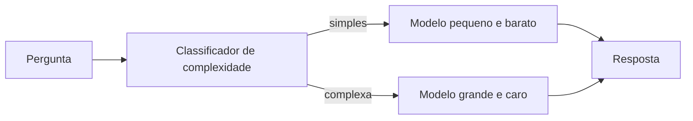

# Model Routing

## O que é model routing

**Model routing** é a camada que recebe a pergunta antes de mandar para um LLM e decide **qual modelo** vai responder. A ideia por trás é simples: nem toda pergunta precisa do modelo mais caro e mais lento disponível. Uma classificação de texto trivial não precisa do mesmo modelo que resolve um problema de raciocínio em várias etapas.

O critério de decisão não é só "qual modelo é mais inteligente": entram também custo por token, latência aceitável para aquele caso de uso e a complexidade real da tarefa. Mandar uma pergunta simples para o modelo mais caro do mercado é gastar dinheiro à toa; mandar uma tarefa complexa para um modelo pequeno demais é arriscar uma resposta ruim.

## Estratégias comuns de roteamento

- **Classificador de complexidade:** um modelo pequeno (ou um classificador dedicado, treinado especificamente para isso) avalia a pergunta e decide o nível: simples, médio ou complexo, mandando para o modelo correspondente a cada nível.
- **Roteamento em cascata:** tenta responder com o modelo mais barato primeiro. Um estimador de qualidade avalia se a resposta ficou boa o bastante; se não ficou, a pergunta escala para um modelo mais caro. É a abordagem descrita no paper FrugalGPT.
- **Roteamento semântico:** agrupa perguntas por tópico ou intenção (usando [embeddings](/labs/ai/llm/04-embeddings/) para medir similaridade) e manda cada grupo para o modelo historicamente melhor naquele tipo de tarefa.

O **RouteLLM**, projeto do LMSYS/UC Berkeley, é um exemplo público dessa ideia: um classificador binário treinado com dados de preferência humana decide, para cada prompt, se vale a pena escalar para um modelo forte ou se um modelo fraco já resolve. Nos benchmarks do próprio projeto, essa estratégia cortou custo em mais de 80% mantendo a maior parte da qualidade do modelo mais caro.

## Trade-offs

Roteamento economiza dinheiro, mas não é de graça: a etapa de classificação (gerar um embedding, rodar um classificador) soma uma latência extra a cada chamada, algo entre dezenas e algumas centenas de milissegundos, dependendo da implementação. Para aplicações muito sensíveis a tempo de resposta, esse custo extra pode anular parte do ganho.

Existem gateways de mercado que já vêm com roteamento pronto entre múltiplos provedores, como o LiteLLM e o OpenRouter, o que evita construir esse classificador do zero.

## Onde o roteamento entra no pipeline

O roteamento acontece depois que o contexto da pergunta já está montado (RAG, histórico de conversa, instruções de sistema) e antes da chamada ao modelo escolhido. Ele é uma peça a mais na arquitetura de produção, ao lado dos guardrails e da observabilidade vistos em [Agentes em Produção](/labs/ai/agents/14-agentes-em-producao/).

## Referências

- [LLM Routing - Orquestrando Modelos de Linguagem Para Eficiência e Escala](https://blog.dsacademy.com.br/llm-routing-orquestrando-modelos-de-linguagem-para-eficiencia-e-escala/) - Data Science Academy, pt-BR
