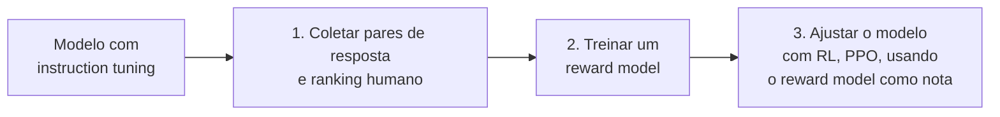

# Fine-Tuning

## O que é fine-tuning

**Fine-tuning** (ajuste fino) é pegar um modelo já treinado e continuar o treinamento dele com um conjunto de dados menor e específico, em vez de treinar um modelo do zero. O modelo sai do processo sabendo tudo que já sabia antes, mais um comportamento novo que os dados de ajuste ensinaram.

A diferença para o [RAG](/labs/ai/llm/07-context-engineering-e-rag/) importa: RAG dá **conhecimento** novo ao modelo, buscando informação externa e colocando no prompt, sem mudar um parâmetro sequer do modelo. Fine-tuning muda o **comportamento** do modelo, de forma permanente, treinando os pesos dele de novo.

## Fine-tuning ou RAG: qual usar

A pergunta certa não é "qual dos dois é melhor", é "qual problema eu tenho":

| Problema                                                                             | Solução            |
| ------------------------------------------------------------------------------------ | ------------------ |
| O modelo não sabe uma informação (desatualizada, privada, específica da empresa)     | RAG                |
| O modelo sabe a informação, mas não segue o formato/tom/domínio de forma consistente | Fine-tuning        |
| As duas coisas ao mesmo tempo                                                        | Os dois combinados |

Uma progressão que costuma funcionar bem: comece com um prompt bem escrito (ver [Engenharia de Prompts](/labs/ai/engenharia-de-prompt/01-engenharia-de-prompts/)), adicione RAG quando o problema for falta de conhecimento, e só recorra a fine-tuning quando um prompt bom e um RAG bem feito ainda não seguram um comportamento consistente. Fine-tuning tem custo de dados, treinamento e manutenção que os outros dois não têm.

Em produção, os dois costumam conviver: o fine-tuning fixa a "interface" (como o modelo responde, em que formato, com que tom), e o RAG cuida do conteúdo que muda com o tempo.

## Full fine-tuning vs PEFT e LoRA

Existem duas formas de fazer o ajuste:

- **Full fine-tuning:** atualiza **todos** os parâmetros do modelo. Exige bastante poder computacional e corre o risco de _esquecimento catastrófico_, quando o modelo perde parte do que sabia antes ao aprender a tarefa nova.
- **PEFT (Parameter-Efficient Fine-Tuning):** uma família de técnicas que atualiza só uma fração pequena dos parâmetros, mantendo o resto do modelo congelado.

Dentro do PEFT, a técnica mais usada hoje é o **LoRA** (Low-Rank Adaptation, criada por pesquisadores da Microsoft em 2021). Em vez de mexer nos pesos originais do modelo, o LoRA insere matrizes pequenas e treináveis ao lado deles. O treinamento ajusta só essas matrizes novas, que juntas têm uma fração do tamanho do modelo inteiro, e o resultado se aproxima da qualidade de um full fine-tuning por um custo bem menor.

Na prática, LoRA (ou variações como QLoRA) é o padrão para a maioria dos times. Full fine-tuning só compensa quando o time já tem um volume grande de dados de treino (a partir de dezenas de milhares de exemplos) e um motivo específico pelo qual PEFT não é suficiente.

## Instruction tuning

**Instruction tuning** é um tipo específico de fine-tuning: o modelo treina com pares de (instrução, resposta esperada), aprendendo a seguir comandos em vez de só completar texto. É esse processo, aplicado sobre um modelo base, que dá origem a um assistente de chat como o ChatGPT.

## Alignment: RLHF e DPO

Instruction tuning ensina o modelo a seguir o formato de instrução e resposta, mas não ensina qual resposta é a **melhor** entre várias que seguem esse formato corretamente. Duas respostas podem estar ambas gramaticalmente corretas e no formato certo, e ainda assim uma ser mais útil, mais segura ou mais alinhada ao que a pessoa realmente queria. Fechar essa lacuna é o papel do **alignment** (alinhamento): ajustar o modelo para preferir as respostas que humanos de fato preferem.

O método que popularizou essa etapa foi o **RLHF** (Reinforcement Learning from Human Feedback), usado pela OpenAI no InstructGPT e depois no ChatGPT. Ele roda em três etapas, sobre um modelo que já passou por instruction tuning:

1. **Coleta de preferências:** o modelo gera várias respostas para a mesma pergunta, e pessoas rankeiam qual é melhor.
2. **Reward model:** esse ranking treina um segundo modelo, cujo único trabalho é prever, dada uma resposta, que nota um humano daria a ela.
3. **Reinforcement learning:** o modelo original é ajustado para maximizar a nota do reward model, geralmente usando o algoritmo **PPO** (Proximal Policy Optimization). Na prática, o modelo "aprende" a gerar respostas que o reward model pontua bem, que por sua vez foi treinado para imitar a preferência humana.

RLHF funciona, mas é caro e instável: treinar e manter um reward model separado, mais um loop de reinforcement learning por cima, consome bastante infraestrutura e pede ajuste fino de hiperparâmetros para não degradar a qualidade do modelo.

Por isso ganhou força o **DPO** (Direct Preference Optimization), que chega num resultado parecido sem precisar de reward model nem de RL. O DPO usa os mesmos pares de resposta (uma preferida, uma rejeitada) e ajusta os pesos do modelo diretamente, com uma função de perda que aumenta a probabilidade da resposta preferida e reduz a da rejeitada. É mais simples de implementar e mais estável de treinar, e por isso virou a escolha de modelos abertos recentes como o Llama 3.

## Referências

- [O que é Fine-Tuning (ajuste fino)](https://www.dio.me/articles/o-que-e-finetuning-ajuste-fino-546bb90ad96b) - Sergio Santos, DIO, pt-BR
- [Fine-tuning guide](https://platform.openai.com/docs/guides/fine-tuning) - OpenAI, en
- [A Survey of Large Language Models](https://arxiv.org/abs/2303.18223) - Zhao et al., en, seção sobre RLHF e alignment
