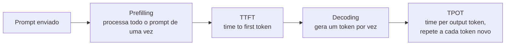

# Otimização de Inferência

Quanto custa e quanto demora para um modelo responder define se uma aplicação de IA é viável. Inferência mais barata torna mais casos de uso financeiramente justificáveis; inferência mais rápida abre espaço para integrar IA em mais lugares, inclusive em interações que precisam de resposta quase instantânea. Por isso a otimização de inferência atraiu tanta gente talentosa: o ganho de eficiência aqui se traduz direto em produto viável ou inviável.

## Métricas de eficiência

Antes de otimizar alguma coisa, é preciso saber o que medir:

- **Latência:** quanto tempo passa entre a pergunta e a resposta (ou parte dela).
- **Throughput:** quantas requisições ou tokens o sistema processa por unidade de tempo, geralmente medido em tokens por segundo.
- **Utilização:** quanto da capacidade do hardware (GPU, principalmente) está sendo usada de fato, em vez de ficar ociosa esperando dado.

Para modelos de linguagem especificamente, latência se divide em duas partes bem diferentes:

- **TTFT (time to first token):** tempo até o primeiro token da resposta aparecer. Inclui o tempo de fila (esperando um slot livre no servidor) mais o tempo de **prefilling**, a passada que processa o prompt inteiro de uma vez. Para um chatbot, um TTFT abaixo de meio segundo costuma ser o limite para parecer responsivo; ferramentas de autocomplete de código pedem algo bem mais rápido, abaixo de 100 milissegundos.
- **TPOT (time per output token):** tempo médio para gerar cada token depois do primeiro, influenciado pela fase de **decoding**, que gera um token por vez, de forma autoregressiva. Na prática, o usuário sente o TPOT como a "velocidade de digitação" do modelo. Uma faixa comum considerada boa fica entre 20 e 50 milissegundos por token.

A latência total de uma resposta é aproximadamente `TTFT + TPOT × (número de tokens gerados - 1)`. Throughput e custo andam juntos: mais throughput geralmente significa mais requisições atendidas pelo mesmo hardware, ou seja, custo menor por requisição.

Existe um trade-off direto entre latência e throughput. Uma forma comum de ganhar throughput é agrupar várias requisições no mesmo lote (batching) antes de processar, mas isso pode aumentar a fila de espera de cada requisição individual, piorando o TTFT. Reduzir latência geralmente custa mais caro (menos aproveitamento do hardware por requisição), e reduzir custo geralmente aumenta a latência aceita.

## Otimização em nível de modelo

Essas técnicas mexem no próprio modelo, o que pode mudar seu comportamento (às vezes de forma imperceptível, às vezes com perda de qualidade mensurável):

- **Quantização:** reduz a precisão numérica dos pesos e das ativações do modelo, por exemplo de 16 bits para 8 ou 4 bits por valor. Isso reduz o tamanho do modelo em memória e a banda necessária para movê-lo, o que acelera a inferência. Bem aplicada, a perda de qualidade é pequena; mal aplicada (bits demais cortados em partes sensíveis do modelo) degrada a resposta.
- **Destilação:** treina um modelo menor (o "aluno") para imitar o comportamento de um modelo maior (o "professor"), como visto em [Engenharia de Datasets](/labs/ai/llm/12-engenharia-de-datasets/). O modelo destilado roda mais rápido e mais barato, ao custo de parte da capacidade do modelo original.
- **Otimização do mecanismo de atenção e KV cache:** como a [atenção do Transformer](/labs/ai/llm/05-como-uma-llm-gera-texto/) compara cada token novo com todos os tokens anteriores, recalcular tudo a cada token gerado seria um desperdício enorme. O **KV cache** guarda os vetores de key e value já calculados para os tokens anteriores, então cada novo token só precisa calcular sua própria atenção contra o que já está em cache, sem refazer o trabalho do zero. O tamanho do KV cache cresce com o tamanho do lote e o comprimento do contexto, e em contextos longos ele passa a dominar o consumo de memória da GPU, o que motivou técnicas específicas de compressão e gerenciamento desse cache.

## Otimização em nível de serviço de inferência

Essas técnicas não mudam o modelo, só a forma como ele é servido:

- **Batching contínuo/dinâmico:** em vez de esperar formar um lote fixo de requisições antes de processar (batching estático, que deixa GPU ociosa esperando o lote encher), o batching contínuo adiciona e remove requisições do lote a cada passo de geração, conforme elas chegam e terminam. Isso mantém a GPU ocupada de forma muito mais eficiente e é uma das otimizações com maior impacto isolado em produção.
- **Tensor parallelism e paralelismo de réplicas:** tensor parallelism divide as camadas do modelo entre várias GPUs, cada uma calculando uma fatia da mesma operação de matriz, útil para caber (e acelerar) modelos grandes demais para uma única GPU. Paralelismo de réplicas simplesmente roda várias cópias completas do modelo em paralelo, cada uma atendendo requisições diferentes, mais simples de implementar e eficaz para reduzir latência sob carga alta, ao custo de mais máquinas.
- **Desacoplamento entre prefill e decode:** como prefilling (processa o prompt inteiro, intensivo em computação) e decoding (gera um token por vez, intensivo em memória) têm perfis de uso de hardware bem diferentes, alguns sistemas de serving separam essas duas fases em máquinas ou processos diferentes, para otimizar cada uma com a configuração certa em vez de uma configuração de compromisso para as duas.
- **Prompt caching:** quando prompts diferentes compartilham um prefixo comum (o mesmo prompt de sistema, o mesmo histórico de conversa até um certo ponto), o cache de prompt guarda o cálculo já feito desse prefixo e reaproveita entre requisições, evitando reprocessar o mesmo texto várias vezes. Isso reduz o TTFT de forma expressiva em conversas de múltiplos turnos ou aplicações que reusam o mesmo prompt de sistema a cada chamada.

## Como escolher a técnica certa

A técnica certa depende da carga de trabalho, não existe otimização universal:

- KV caching importa muito mais para cargas com contexto longo do que para prompts curtos, porque é o comprimento do contexto que faz o cache crescer.
- Prompt caching compensa em cargas com prompts longos e repetidos entre chamadas (system prompt fixo, conversas de múltiplos turnos), e tem pouco efeito em requisições sem nada em comum entre si.
- Se latência baixa importa mais que custo, escalar paralelismo de réplicas ajuda: mais máquinas, cada uma atendendo menos requisições por vez, sobra mais recurso por requisição e a resposta sai mais rápido.

Na maioria dos casos de uso, quatro técnicas costumam trazer o maior retorno: quantização (funciona bem na maioria dos modelos, ganho quase garantido), tensor parallelism (reduz latência e permite servir modelos maiores), paralelismo de réplicas (relativamente simples de implementar) e otimização do mecanismo de atenção (acelera de forma significativa modelos baseados em Transformer). Vale notar que a maioria dos desenvolvedores de aplicação não implementa essas técnicas na mão: usa APIs de modelo que já vêm com essas otimizações embutidas. Entender o que existe por trás ajuda a avaliar a eficiência real de diferentes provedores e a escolher entre eles, o tema de [Model Routing](/labs/ai/llm/14-model-routing/).

## Referências

- [LLM inference latency: TTFT, tokens per second, and what to measure](https://clickhouse.com/resources/engineering/llm-inference-latency) - ClickHouse Engineering, en
- [Key metrics for LLM inference | LLM Inference Handbook](https://handbook.modular.com/llm-inference-basics/llm-inference-metrics/) - Modular, en
- [Taming Throughput-Latency Tradeoff in LLM Inference with Sarathi-Serve](https://arxiv.org/pdf/2403.02310) - Agrawal et al., arXiv, en
