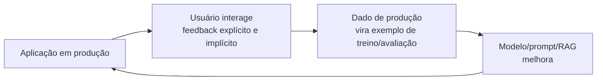

# Feedback do Usuário e Data Flywheel

Um sistema de IA em produção não é estático: ele erra, é corrigido e (se o time montou o pipeline certo) melhora com o tempo a partir do próprio uso. A peça que fecha esse ciclo é o feedback do usuário, e a interface conversacional que a maioria das aplicações de IA usa hoje abre um tipo de sinal que outros produtos não têm com a mesma facilidade.

## Por que a interface conversacional gera um tipo diferente de feedback

Num formulário tradicional, o usuário preenche campos e aperta "enviar", sem espaço para dizer "não, isso não é o que eu queria". Numa conversa com um modelo, o usuário reage naturalmente: reformula a pergunta, corrige o modelo, pede para tentar de novo, ou simplesmente para de responder porque a resposta já resolveu. Cada uma dessas reações carrega informação sobre se a resposta anterior foi boa ou não, mesmo quando o usuário nunca clicou em nenhum botão de avaliação. Aproveitar esse sinal é uma vantagem que produtos baseados em conversa têm sobre interfaces mais rígidas, mas só funciona se a aplicação for desenhada para capturá-lo.

## Feedback explícito vs. implícito

- **Feedback explícito:** o usuário avalia a resposta de propósito. Os formatos mais comuns são botões de thumbs up/down, correção manual do texto gerado, ou edição direta da resposta antes de usá-la. É o sinal mais fácil de interpretar (o usuário disse claramente "isso está certo" ou "isso está errado"), mas também o mais raro: a maioria dos usuários não clica em nada, então mesmo uma taxa de resposta de 5 a 10% já costuma ser considerada boa.
- **Feedback implícito:** o usuário não avalia nada diretamente, mas o comportamento dele sinaliza a mesma coisa. Pedir para "regenerar" a resposta é um sinal forte de insatisfação; copiar a resposta gerada (para um editor de código, um e-mail, um documento) é um sinal forte de que ela serviu; abandonar a conversa no meio pode indicar que a resposta não ajudou, embora também possa significar que o usuário simplesmente já resolveu o problema.

Feedback implícito é mais abundante que o explícito, porque não exige nenhuma ação extra do usuário, mas também é mais ambíguo: exige mais cuidado para interpretar corretamente antes de usar como sinal de treino.

## Design de produto para coletar feedback

Coletar feedback de qualidade não é responsabilidade só de engenharia, é decisão de produto: onde o botão de thumbs down aparece, se ele pede um motivo depois do clique, se dá para editar a resposta direto na interface. Tradicionalmente esse tipo de decisão ficava só com o time de produto, e por isso muitas vezes passava batido para quem constrói a aplicação de IA. Só que como o feedback do usuário é a fonte de dado mais barata para melhorar o modelo continuamente, cada vez mais engenheiros de IA se envolvem nesse desenho, para garantir que o produto colete o dado que o time precisa para iterar.

A regra prática é reduzir o atrito ao máximo: botões visíveis, próximos da resposta, que não exigem nenhum passo extra para o usuário registrar uma reação rápida. Pedir para o usuário preencher um formulário de feedback separado praticamente garante que quase ninguém vai preencher.

## Data flywheel

Todo o feedback coletado só vale alguma coisa se vira dado usável: um caso de erro apontado por um usuário pode virar um item novo no dataset de avaliação (ver [Avaliação de LLMs](/labs/ai/llm/06-avaliacao-de-llms/)), e um conjunto de correções pode virar exemplo de treino para um novo ciclo de [fine-tuning](/labs/ai/llm/11-fine-tuning/). Esse ciclo, produção gerando dado, dado melhorando o sistema, sistema melhor atraindo mais uso e portanto mais dado, é o que se chama de **data flywheel**.

O flywheel não roda sozinho depois de montado uma vez. Ele precisa de manutenção constante: podar dado ruim que entrou no meio do caminho, garantir que áreas com pouco feedback também recebam atenção (senão o modelo só melhora onde já tinha muito uso) e ajustar o que é coletado conforme a aplicação muda. Tratar o flywheel como algo que "se monta uma vez e roda para sempre" é um erro comum que faz muitos times pararem de melhorar depois dos primeiros meses.

## Feedback como responsabilidade compartilhada

O mesmo motivo que traz engenheiros de IA para o desenho de feedback também muda a relação entre engenharia e produto de forma mais ampla: como dado de uso e experiência de produto viraram vantagem competitiva tão importante quanto a qualidade do modelo em si, a engenharia de IA acaba ficando mais próxima do produto do que a engenharia de ML tradicional costumava estar. Decidir onde captar feedback, como fechar o loop com o usuário e o que fazer com o dado coletado deixou de ser só pauta de produto e virou parte do trabalho de quem constrói o sistema.

## Referências

- [Data Flywheel](https://www.nvidia.com/en-gb/glossary/data-flywheel/) - NVIDIA, en
- [The Data Flywheel: Why AI Products Live or Die by User Feedback](https://mrmaheshrajput.medium.com/the-data-flywheel-why-ai-products-live-or-die-by-user-feedback-4ae7aab32d4d) - Mahesh Rajput, en
